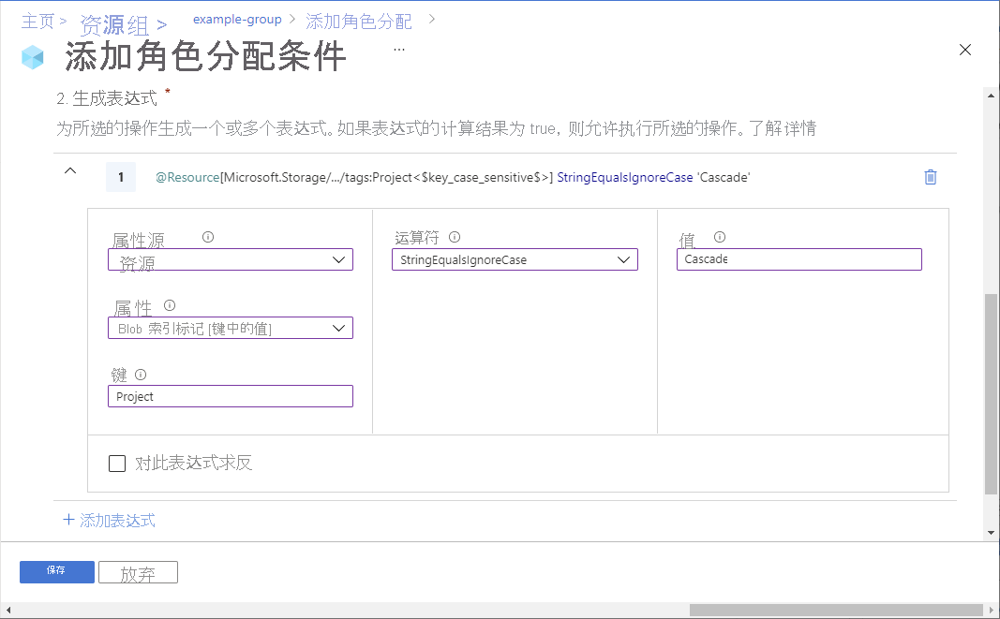

# 使用 Azure 门户添加或编辑 Azure 角色分配条件（预览版）

> [!IMPORTANT]
> Azure ABAC 和 Azure 角色分配条件目前为预览版。
> 此预览版在提供时没有附带服务级别协议，不建议将其用于生产工作负荷。 某些功能可能不受支持或者受限。
> 有关详细信息，请参阅 [Microsoft Azure 预览版补充使用条款](https://azure.microsoft.com/support/legal/preview-supplemental-terms/)。

[Azure 角色分配条件](conditions-overview.md)是一项额外检查，你可选择性地将其添加到角色分配中，从而提供更精细的访问控制。 例如，为了读取对象，你可添加要求对象具有特定标记的条件。 本文介绍如何使用 Azure 门户为角色分配添加、编辑、查看或删除条件。

## 先决条件

有关添加或编辑角色分配条件的先决条件的信息，请参阅[有关条件的先决条件](conditions-prerequisites.md)。

## 步骤 1：确定需要的条件

若要确定所需的条件，请查看[示例 Azure 角色分配条件](../storage/common/storage-auth-abac-examples.md)中的示例。

目前，可将条件添加到具有[存储 blob 数据操作](../storage/common/storage-auth-abac-attributes.md)的内置或自定义角色分配。 其中包括以下内置角色：

- [存储 Blob 数据参与者](built-in-roles.md#storage-blob-data-contributor)
- [存储 Blob 数据所有者](built-in-roles.md#storage-blob-data-owner)
- [存储 Blob 数据读者](built-in-roles.md#storage-blob-data-reader)

## 第 2 步：选择如何添加条件

可以通过两种方法添加条件。 可以在添加新的角色分配时添加条件，也可以向现有角色分配中添加条件。

### 新建角色分配

1. 要[使用 Azure 门户分配 Azure 角色](role-assignments-portal.md)，请遵循以下步骤。

1. 在“条件”选项卡上，单击“添加条件” 。

    如果看不到“条件”选项卡，请确保已选择支持条件的角色。

   

    随即显示“添加角色分配条件”页面。

### 现有的角色分配

1. 在 Azure 门户中，在要添加条件的范围打开“访问控制 (IAM)”。 例如，你可以打开订阅、资源组或资源。

    目前，不能使用 Azure 门户在管理组范围添加、查看、编辑或删除条件添加。

1. 单击“角色分配”选项卡以查看在此范围内的所有角色分配。

1. 查找某个角色分配，其中包含要添加条件的存储数据操作。

1. 在“条件”列中，单击“添加”。 

    如果未看到“添加”链接，请确保查看的范围与角色分配范围相同。

    

    随即显示“添加角色分配条件”页面。

## 步骤 3：查看基础知识

打开“添加角色分配条件”页后，可以查看条件的基础知识。 “角色”指示要将条件添加到的角色。

1. 对于“编辑器类型”选项，保留选中的默认选项“可视化”。 

    添加条件后，可以在“可视化”和“代码”之间进行切换。

1. （可选）如果显示“描述”框，请输入描述。

    根据你选择添加条件的方式，可能不会看到“描述”框。 描述可以帮助你理解和记住条件。

    

## 步骤 4 - 添加操作

1. 在“添加操作”部分，单击“添加操作” 。

    随即会显示“选择操作”窗格。 此窗格是基于角色分配（将作为条件的目标）进行了筛选的数据操作列表。 有关详细信息，请参阅 [Azure 角色分配条件格式和语法](conditions-format.md#actions)。

    

1. 选择要在条件为 true 时允许执行的操作。

    如果针对单个条件选择多个操作，则能为条件选择的属性可能较少，因为这些属性必须在所选操作中可用。

1. 单击“选择”。

    选定的操作将显示在操作列表中。

## 步骤 5：生成表达式

1. 在“生成表达式”部分，单击“添加表达式” 。

    “表达式”部分随即展开。

1. 在“属性源”列表中，选择属性所在的位置。

    - “资源”指示属性在资源上，例如容器名称。
    - “请求”指示属性是操作请求的一部分，如设置 blob 索引标记。

1. 在“属性”列表中，选择表达式左侧的属性。 有关详细信息，请参阅 [Azure 角色分配条件格式和语法](conditions-format.md#attributes)。

    根据所选的属性，框可能会增加以指定其他详细信息。

1. 在“运算符”列表中，选择一个运算符。

1. 在“值”框中，输入表达式右边的值。

    

## 步骤 6：查看和添加条件

1. 向上滚动到“编辑器类型”，然后单击“代码” 。

    条件显示为代码。 可在此代码编辑器中对条件进行更改。 若要返回到可视化编辑器，请单击“可视化”。

    

1. 单击“保存”以将条件添加到角色分配。

## 查看、编辑或删除条件

1. 在 Azure 门户中，针对包含要查看、编辑或删除的条件的角色分配，打开“访问控制 (IAM)”。

1. 单击“角色分配”选项卡并找到角色分配。

1. 在“条件”列中，单击“查看/编辑”。 

    如果未看到“查看/编辑”链接，请确保查看的范围与角色分配范围相同。

    

    随即显示“添加角色分配条件”页面。

1. 使用编辑器查看或编辑条件。

    

1. 完成后，单击“保存”。 要删除整个条件，请单击“删除条件”。 删除条件不会删除角色分配。

## 后续步骤

- [示例 Azure 角色分配条件（预览版）](../storage/common/storage-auth-abac-examples.md)
- [教程：使用 Azure 门户添加角色分配条件来限制对 Blob 的访问（预览）](../storage/common/storage-auth-abac-portal.md)
- [排查 Azure 角色分配条件（预览）](conditions-troubleshoot.md)
