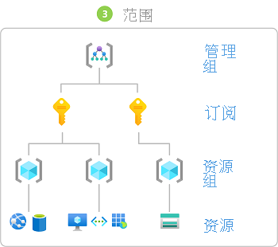
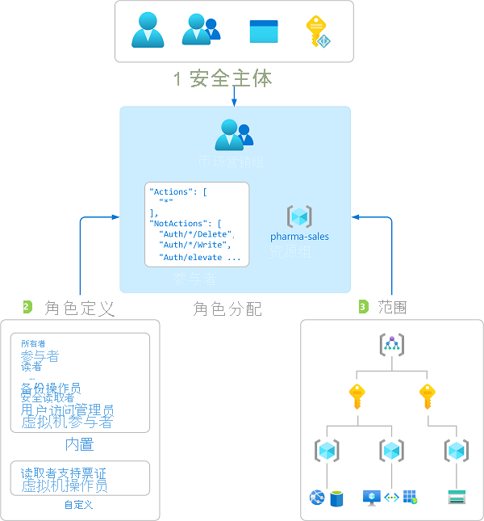

# 什么是 Azure 基于角色的访问控制 (Azure RBAC)？

对于任何使用云的组织而言，云资源的访问权限管理都是一项重要功能。 Azure 基于角色的访问控制 (Azure RBAC) 可帮助你管理谁有权访问 Azure 资源、他们可以对这些资源执行哪些操作以及他们有权访问哪些区域。

Azure RBAC 是在 [Azure 资源管理器](../azure-resource-manager/management/overview.md)基础上构建的授权系统，针对 Azure 资源提供精细的访问权限管理。

此视频提供 Azure RBAC 的快速概述。

>[!VIDEO https://www.youtube.com/embed/Dzhm-garKBM]

## Azure RBAC 有什么用途？

下面是 Azure RBAC 的用途的一些示例：

- 让一个用户管理订阅中的虚拟机，另一个用户管理虚拟网络
- 让 DBA 组管理订阅中的 SQL 数据库
- 让某个用户管理资源组中的所有资源，例如虚拟机、网站和子网
- 允许某个应用程序访问资源组中的所有资源

## Azure RBAC 的工作原理

使用 Azure RBAC 控制资源访问权限的方式是分配 Azure 角色。 这是一个需要理解的重要概念 — 它涉及到如何强制实施权限。 角色分配包含三个要素：安全主体、角色订阅和范围。

### 安全主体

安全主体是一个对象，表示请求访问 Azure 资源的用户、组、服务主体或托管标识。 可以将角色分配给其中任何一个安全主体。

### 角色定义

角色定义是权限的集合。 它通常直接称为“角色”。 角色定义列出可以执行的操作，例如读取、写入和删除。 角色可以是高级别的（例如所有者），也可以是特定的（例如虚拟机读取者）。

Azure 包含多个可用的[内置角色](built-in-roles.md)。 例如，[虚拟机参与者](built-in-roles.md#virtual-machine-contributor)角色允许用户创建和管理虚拟机。 如果内置角色不能满足组织的特定需求，你可以创建自己的 [Azure 自定义角色](custom-roles.md)。

此视频提供内置角色和自定义角色的快速概述。

>[!VIDEO https://www.youtube.com/embed/I1mefHptRgo]

Azure 具有数据操作，通过这些操作可以授予对对象内数据的访问权限。 例如，如果某个用户对某个存储帐户拥有读取数据的访问权限，则该用户可以读取该存储帐户中的 Blob 或消息。

有关详细信息，请参阅[了解 Azure 角色定义](role-definitions.md)。

### 作用域

范围是访问权限适用于的资源集。 分配角色时，可以通过定义范围来进一步限制允许的操作。 若要将某人分配为[网站参与者](built-in-roles.md#website-contributor)，但只针对一个资源组执行此分配，则可使用范围。

在 Azure 中，可在四个级别指定范围：[管理组](../governance/management-groups/overview.md)、订阅、[资源组](../azure-resource-manager/management/overview.md#resource-groups)或资源。 范围采用父子关系结构。 可以在其中任何一个范围级别分配角色。

有关范围的详细信息，请参阅[了解范围](scope-overview.md)。

### 角色分配

角色分配是出于授予访问权限的目的，将角色定义附加到特定范围内的用户、组、服务主体或托管标识的过程。 通过创建角色分配来授予访问权限，通过删除角色分配来撤销访问权限。

下图显示了角色分配的示例。 在此示例中，为“营销”组分配了医药销售资源组的[参与者](built-in-roles.md#contributor)角色。 这意味着，“营销”组中的用户可以在医药销售资源组中创建或管理任何 Azure 资源。 “营销”用户无权访问医药销售资源组外部的资源，除非他们属于另一个角色分配。

可使用 Azure 门户、Azure CLI、Azure PowerShell、Azure SDK 或 REST API 分配角色。

有关详细信息，请参阅[分配 Azure 角色的步骤](role-assignments-steps.md)。

## 组

角色分配对组来说是可传递的，这意味着如果某用户是某个组的成员，而该组属于具有角色分配的另一个组，那么该用户将具有该角色分配中的权限。

## 多角色分配

如果有多个重叠的角色分配，将会发生什么情况？ Azure RBAC 是一个加法模型，因此有效权限是角色分配的总和。 请考虑以下示例，其中在订阅范围内向用户授予了“参与者”角色，并且授予了对资源组的“读者”角色。 “参与者”权限与“读者”权限的总和实际上是订阅的“参与者”角色。 因此，在这种情况下，“读者”角色分配没有任何影响。

## 拒绝分配

以前，Azure RBAC 是一种只能执行允许操作的模型，没有拒绝功能，但 Azure RBAC 现在以有限方式支持拒绝分配。 *拒绝分配* 类似于角色分配，可将一组拒绝操作附加到特定范围内的用户、组、服务主体或托管标识，以便拒绝访问。 角色分配定义了一组允许的操作，而拒绝分配定义了一组不允许的操作。 换而言之，即使角色分配授予用户访问权限，拒绝分配也会阻止用户执行指定的操作。 拒绝分配优先于角色分配。

有关详细信息，请参阅[了解 Azure 拒绝分配](deny-assignments.md)。

## Azure RBAC 如何确定用户是否有权访问资源

下面是 Azure RBAC 用于确定你是否可访问资源的概要步骤。 这些步骤适用于与 Azure RBAC 集成的 Azure 资源管理器或数据平面服务。 如果正在尝试对访问问题进行故障排除，这有助于了解问题。

1. 用户（或服务主体）获取 Azure 资源管理器的令牌。

    令牌包含用户的组成员身份（包括可传递的组成员身份）。

1. 用户使用附加的令牌对 Azure 资源管理器发出 REST API 调用。

1. Azure 资源管理器检索适用于对其执行操作的资源的所有角色分配和拒绝分配。

1. 如果拒绝分配适用，则阻止访问。 否则，评估将继续进行。

1. Azure 资源管理器缩小适用于此用户或其组的角色分配范围，并确定用户针对此资源拥有的角色。

1. Azure 资源管理器确定 API 调用中的操作是否包含在用户针对此资源拥有的角色中。 如果角色包含的 `Actions` 具有通配符 (`*`)，则通过从允许的 `Actions` 中减去 `NotActions` 来计算有效权限。 同样，对任何数据操作执行相同的减法运算。

    `Actions - NotActions = Effective management permissions`

    `DataActions - NotDataActions = Effective data permissions`

1. 如果用户在请求的范围内没有包含该操作的角色，则不允许访问。 否则，将评估任何条件。

1. 如果角色分配包含条件，则对这些条件进行评估。 否则将允许访问。

1. 如果满足条件，则允许访问。 否则将不允许访问。

下图是评估逻辑的摘要。

## 许可要求

[!INCLUDE [Azure AD free license](../../includes/active-directory-free-license.md)]

## 后续步骤

- [使用 Azure 门户分配 Azure 角色](role-assignments-portal.md)
- [了解不同角色](rbac-and-directory-admin-roles.md)
- [云采用框架：Azure 中的资源访问管理](/azure/cloud-adoption-framework/govern/resource-consistency/resource-access-management)
