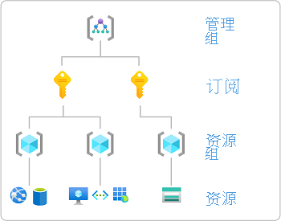
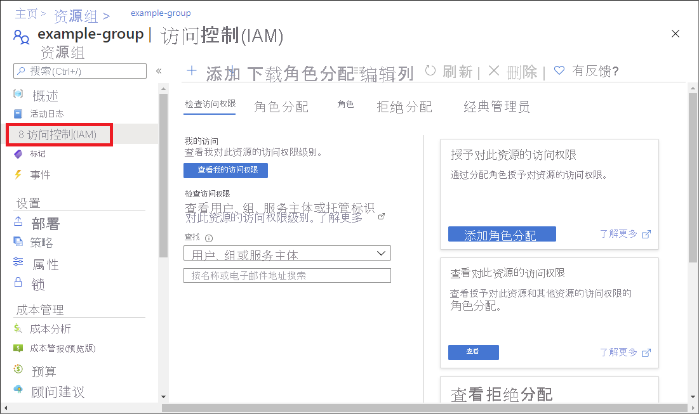

# 使用 Azure 门户分配 Azure 角色

[!INCLUDE [Azure RBAC definition grant access](../../includes/role-based-access-control/definition-grant.md)] 本文介绍如何使用 Azure 门户分配角色。

如果需要在 Azure Active Directory 中分配管理员角色，请参阅[向用户分配 Azure AD 角色](../active-directory/roles/manage-roles-portal.md)。

## 先决条件

[!INCLUDE [Azure role assignment prerequisites](../../includes/role-based-access-control/prerequisites-role-assignments.md)]

## 选择体验

Azure RBAC 具有在当前处于公共预览版的 Azure 门户中分配 Azure 角色的新体验。 若要尝试此新体验，请按照“（预览版）”选项卡上的步骤操作。

#### [Current](#tab/current/)

## 步骤 1：识别所需的范围

[!INCLUDE [Scope for Azure RBAC introduction](../../includes/role-based-access-control/scope-intro.md)] 有关详细信息，请参阅[了解范围](scope-overview.md)。

1. 登录 [Azure 门户](https://portal.azure.com)。

1. 在顶部的“搜索”框中，搜索要授予对其的访问权限的范围。 例如，搜索“管理组”、“订阅”、“资源组”或某个特定资源  。

1. 单击该范围的特定资源。

    下面展示了一个示例资源组。

    

## 步骤 2：打开“添加角色分配”窗格

“访问控制(IAM)”是一个页面，通常用于分配角色以授予对 Azure 资源的访问权限。 该功能也称为标识和访问管理 (IAM)，会显示在 Azure 门户中的多个位置。

1. 单击“访问控制(IAM)”。

    下面显示了资源组的“访问控制(IAM)”页的示例。

    

1. 单击“角色分配”选项卡以查看在此范围内的角色分配。

1. 单击“添加” > “角色分配”。
   如果没有分配角色的权限，则将禁用“添加角色分配”选项。

   

    将打开“添加角色分配”窗格。

   

## 步骤 3：选择合适的角色

1. 在“角色”列表中，搜索或滚动查找要分配的角色。

    为了确定合适的角色，你可以将鼠标指针悬停在信息图标上，以显示角色的说明。 有关更多信息，可以查看 [Azure 内置角色](built-in-roles.md)一文。

   

1. 单击以选择角色。

## 步骤 4：选择需要访问权限的人员

1. 在“将访问权限分配给”列表中，选择要为其分配访问权限的安全主体的类型。

    | 类型 | 说明 |
    | --- | --- |
    | 用户、组或服务主体 | 如果要将角色分配给用户、组或服务主体（应用程序），请选择此类型。 |
    | **用户分配的托管标识** | 如果要将角色分配给[用户分配的托管标识](../active-directory/managed-identities-azure-resources/overview.md)，请选择此类型。 |
    | *系统分配的托管标识* | 如果要将角色分配给[系统分配的托管标识](../active-directory/managed-identities-azure-resources/overview.md)，请选择托管标识所在的 Azure 服务实例。 |

   

1. 如果你选择了用户分配的托管标识或系统分配的托管标识，请选择该托管标识所在的“订阅”。

1. 在“选择”部分，通过输入字符串或滚动浏览列表来搜索安全主体。

   

1. 找到安全主体后，单击以将其选中。

## 步骤 5：分配角色

1. 若要分配角色，请单击“保存”。

   片刻之后，会在所选范围内为安全主体分配角色。

1. 在“角色分配”选项卡上，验证列表是否显示了该角色分配。

    

#### [（预览版）](#tab/preview/)

## 步骤 1：识别所需的范围（预览版）

[!INCLUDE [Scope for Azure RBAC introduction](../../includes/role-based-access-control/scope-intro.md)] 有关详细信息，请参阅[了解范围](scope-overview.md)。

1. 登录 [Azure 门户](https://portal.azure.com)。

1. 在顶部的“搜索”框中，搜索要授予对其的访问权限的范围。 例如，搜索“管理组”、“订阅”、“资源组”或某个特定资源  。

1. 单击该范围的特定资源。

    下面展示了一个示例资源组。

    

## 步骤 2：打开“添加角色分配”页（预览版）

“访问控制(IAM)”是一个页面，通常用于分配角色以授予对 Azure 资源的访问权限。 该功能也称为标识和访问管理 (IAM)，会显示在 Azure 门户中的多个位置。

1. 单击“访问控制(IAM)”。

    下面显示了资源组的“访问控制(IAM)”页的示例。

    

1. 单击“角色分配”选项卡以查看在此范围内的角色分配。

1. 单击“添加” > “添加角色分配(预览)”。

    如果没有分配角色的权限，则将禁用“添加角色分配”选项。

    

    随即打开“添加角色分配”窗格。

## 步骤 3：选择合适的角色（预览版）

1. 在“角色”选项卡上，选择想要使用的角色。

    可以按名称或说明搜索角色。 还可按类型和类别筛选角色。

   

1. 在“详细信息”列中，单击“查看”获取有关角色的更多详细信息 。

   

1. 单击“下一步”。

## 步骤 4：选择需要访问权限的人员（预览版）

1. 在“成员”选项卡上选择“用户、组或服务主体”，将所选角色分配给一个或多个 Azure AD 用户、组或服务主体（应用程序） 。

   

1. 单击“选择成员”。

1. 查找并选择用户、组或服务主体。

    可以在“选择”框中键入，以在目录中搜索显示名称或电子邮件地址。

   

1. 选择“保存”，将用户、组或服务主体添加到“成员”列表中。

1. 若要将所选角色分配给一个或多个托管标识，请选择“托管标识”。

1. 单击“选择成员”。

1. 在“选择托管标识”窗格中，选择该类型是[用户分配的托管标识](../active-directory/managed-identities-azure-resources/overview.md)还是[系统分配的托管标识](../active-directory/managed-identities-azure-resources/overview.md)。

1. 查找并选择托管标识。

    对于系统分配的托管标识，你可以通过 Azure 服务实例选择托管标识。

   

1. 单击“选择”将托管标识添加到“成员”列表中。

1. 在“说明”文本框中，输入此角色分配的可选说明。

    稍后，可以在“角色分配”列表中显示此说明。

1. 单击“下一步”。 

## 步骤 5：（可选）添加条件（预览版）

如果选择了支持条件的角色，将显示“条件(可选)”选项卡，可以选择将条件添加到角色分配中。 [条件](conditions-overview.md)是可选择性地添加到角色分配中的一项额外检查，可提供更精细的访问控制。

目前，可将条件添加到具有[存储 blob 数据操作](conditions-format.md#actions)的内置或自定义角色分配。 其中包括以下内置角色：

- [存储 Blob 数据参与者](built-in-roles.md#storage-blob-data-contributor)
- [存储 Blob 数据所有者](built-in-roles.md#storage-blob-data-owner)
- [存储 Blob 数据读者](built-in-roles.md#storage-blob-data-reader)

1. 如果要根据存储 Blob 属性进一步优化角色分配，请单击“添加条件”。 有关详细信息，请参阅[添加或编辑 Azure 角色分配条件](conditions-role-assignments-portal.md)。

   

1. 单击“下一步”。 

## 步骤 6：分配角色（预览版）

1. 在“查看 + 分配”选项卡上，查看角色分配设置。

   

1. 单击“查看 + 分配”以分配角色。

   片刻之后，会在所选范围内为安全主体分配角色。

    

1. 如果看不到角色分配的说明，请单击“编辑列”以添加“说明”列 。

---

## 后续步骤

- [将用户分配为 Azure 订阅的管理员](role-assignments-portal-subscription-admin.md)
- [删除 Azure 角色分配](role-assignments-remove.md)
- [排查 Azure RBAC 问题](troubleshooting.md)
