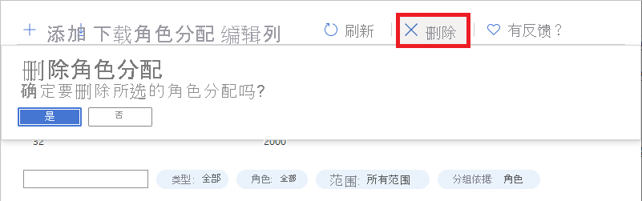

# 使用 Azure 门户添加或删除 Azure 角色分配

[!INCLUDE [Azure RBAC definition grant access](../../includes/role-based-access-control/definition-grant.md)] 本文介绍如何使用 Azure 门户分配角色。

如需在 Azure Active Directory 中分配管理员角色，请参阅[在 Azure Active Directory 中查看和分配管理员角色](../active-directory/roles/manage-roles-portal.md)。

## 先决条件

[!INCLUDE [Azure role assignment prerequisites](../../includes/role-based-access-control/prerequisites-role-assignments.md)]

## 添加角色分配

在 Azure RBAC 中，若要授予对 Azure 资源的访问权限，请添加角色分配。 遵循以下步骤分配角色。 有关步骤的简要概述，请参阅 [添加角色分配的步骤](role-assignments-steps.md)。

### 步骤1：确定所需的范围

[!INCLUDE [Scope for Azure RBAC introduction](../../includes/role-based-access-control/scope-intro.md)]

[!INCLUDE [Scope for Azure RBAC least privilege](../../includes/role-based-access-control/scope-least.md)] 有关作用域的详细信息，请参阅 [了解作用域](scope-overview.md)。

1. 登录 [Azure 门户](https://portal.azure.com)。

1. 在顶部的 "搜索" 框中，搜索要授予访问权限的作用域。 例如，搜索 **管理组**、 **订阅**、 **资源组** 或特定资源。

    

1. 单击该范围的特定资源。

    下面展示了一个示例资源组。

    

### 步骤2：打开 "添加角色分配" 窗格

“访问控制(IAM)”是一个页面，通常用于分配角色以授予对 Azure 资源的访问权限。 它也称为标识和访问管理 (IAM) 并出现在 Azure 门户的多个位置中。

1. 单击“访问控制(IAM)”。

    下面显示了资源组的“访问控制(IAM)”页的示例。

    

1. 单击“角色分配”选项卡以查看在此范围内的角色分配。

1. 单击“添加” > “角色分配”。
   如果没有分配角色的权限，则将禁用“添加角色分配”选项。

   

    此时会打开“添加角色分配”窗格。

   

### 步骤3：选择适当的角色

1. 在 " **角色** " 列表中，搜索或滚动查找要分配的角色。

    为了帮助你确定适当的角色，你可以将鼠标悬停在信息图标上，以显示该角色的说明。 有关其他信息，可以查看 [Azure 内置角色](built-in-roles.md) 一文。

   

1. 单击以选择该角色。

### 步骤4：选择需要访问的人员

1. 在 " **分配访问权限** " 列表中，选择要为其分配访问权限的安全主体的类型。

    | 类型 | 描述 |
    | --- | --- |
    | **用户、组或服务主体** | 如果要将角色分配给用户、组或服务主体 (应用程序) ，请选择此类型。 |
    | **用户分配的托管标识** | 如果要将角色分配给 [用户分配的托管标识](../active-directory/managed-identities-azure-resources/overview.md)，请选择此类型。 |
    | *系统分配的托管标识* | 如果要将角色分配给 [系统分配的托管标识](../active-directory/managed-identities-azure-resources/overview.md)，请选择托管标识所在的 Azure 服务实例。 |

   

1. 如果选择了用户分配的托管标识或系统分配的托管标识，请选择托管标识所在的 **订阅** 。

1. 在 " **选择** " 部分中，通过输入字符串或滚动列表搜索安全主体。

   

1. 找到安全主体后，单击将其选中。

### 步骤5：分配角色

1. 若要分配角色，请单击 " **保存**"。

   片刻之后，会在所选范围内为安全主体分配角色。

1. 在 " **角色分配** " 选项卡上，验证是否在列表中看到角色分配。

    

## 删除角色分配

在 Azure RBAC 中，若要从 Azure 资源删除访问权限，请删除角色分配。 通过以下步骤删除角色分配。

1. 在要删除访问权限的范围（例如管理组、订阅、资源组或资源）内打开“访问控制(IAM)”。

1. 单击“角色分配”选项卡以查看在此范围内的所有角色分配。

1. 在角色分配列表中，在需删除其角色分配的安全主体旁边添加复选标记。

   

1. 单击 **“删除”** 。

   

1. 在显示的“删除角色分配”消息中，单击“是”。

    此时会显示一条消息，指出无法删除继承的角色分配，而你正在尝试删除子范围的角色分配。 应在角色的分配范围打开“访问控制(IAM)”，然后重试。 在正确的范围打开“访问控制(IAM)”的快捷方法是查看“范围”列，然后单击“(继承)”旁边的链接。

   

## 后续步骤

- [将用户分配为 Azure 订阅的管理员](role-assignments-portal-subscription-admin.md)
- [为托管标识添加角色分配](role-assignments-portal-managed-identity.md)
- [排查 Azure RBAC 问题](troubleshooting.md)
