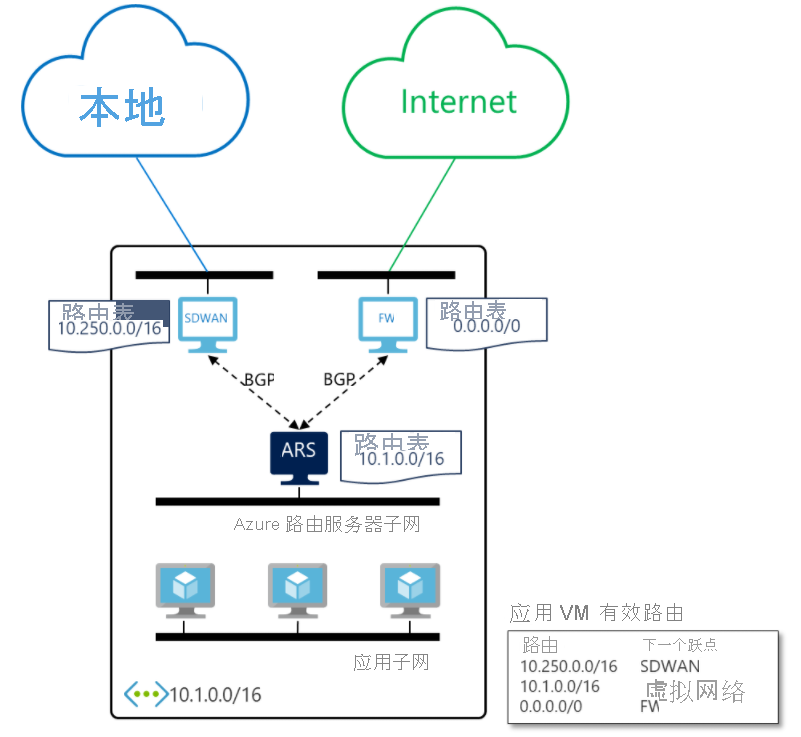

# 什么是 Azure 路由服务器？ 

Azure 路由服务器简化了网络虚拟设备 (NVA) 与虚拟网络之间的动态路由。 利用此功能，可以在 Azure 虚拟网络 (VNET) 中任何支持 BGP 路由协议的 NVA 与 Azure 软件定义的网络 (SDN) 之间，直接通过“边界网关协议 (BGP)”路由协议交换路由信息，而无需手动配置或维护路由表。 Azure 路由服务器是一项完全托管的服务，并且配置为具有高可用性。

> [!IMPORTANT]
> 如果在 9 月 1 日之前创建了 Azure 路由服务器，并且未关联公共 IP 地址，则需要重新创建路由服务器，以便它可以获取 IP 地址用于管理目的。

## 它是如何工作的？

下图说明了 Azure 路由服务器如何与虚拟网络中的 SDWAN NVA 和安全 NVA 配合使用。 在建立了 BGP 对等互连后，Azure 路由服务器将会从 SDWAN 设备接收本地路由 (10.250.0.0/16)，并从防火墙接收默认路由 (0.0.0.0/0)。 然后，在虚拟网络中的 VM 上将会自动配置这些路由。 因此，所有流向本地网络的流量都将会发送到 SDWAN 设备。 而所有 Internet 绑定流量都将会发送到防火墙。 在相反的方向上，Azure 路由服务器将会向两个 NVA 都发送虚拟网络地址 (10.1.0.0/16)。 SDWAN 设备可以进一步将该地址传播到本地网络。

## 主要优点 

Azure 路由服务器简化了虚拟网络中 NVA 的配置、管理和部署。  

* 每当虚拟网络地址更新时，你不再需要手动更新 NVA 上的路由表。 

* 每当 NVA 公布新路由或撤消旧路由时，你不再需要手动更新[用户定义的路由](../virtual-network/virtual-networks-udr-overview.md)。 

* 可以将 NVA 的多个实例与 Azure 路由服务器对等互连。 可以在 NVA 中配置 BGP 属性，并根据设计（例如通过主动-主动提高性能，或通过主动-被动实现弹性），让 Azure Route Server 知道哪个 NVA 实例是主动的，哪个是被动的。 

* NVA 与 Azure 路由服务器之间的接口基于通用标准协议。 只要 NVA 支持 BGP，你就可以将其与 Azure 路由服务器对等互连。 有关详细信息，请参阅[路由服务器支持的路由协议](route-server-faq.md#protocol)。

* 可以在任何新的或现有的虚拟网络中部署 Azure 路由服务器。 

## 常见问题解答

有关 Azure 路由服务器的常见问题，请参阅 [Azure 路由服务器常见问题解答](route-server-faq.md)。

## 后续步骤

- [了解如何配置 Azure 路由服务器](quickstart-configure-route-server-powershell.md)
- [了解 Azure 路由服务器如何与 Azure ExpressRoute 和 Azure VPN 配合使用](expressroute-vpn-support.md)
