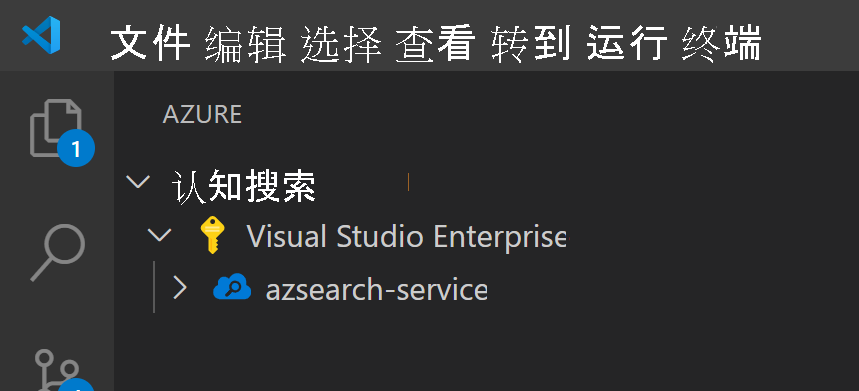
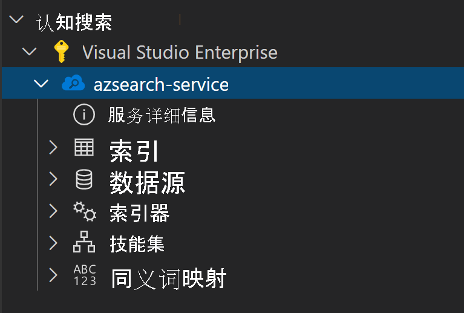
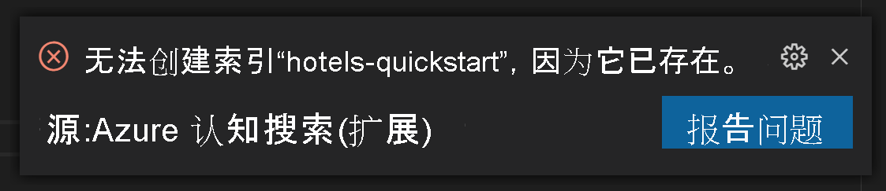
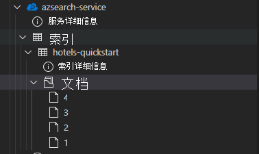
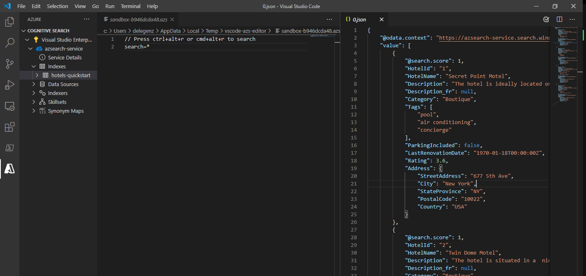
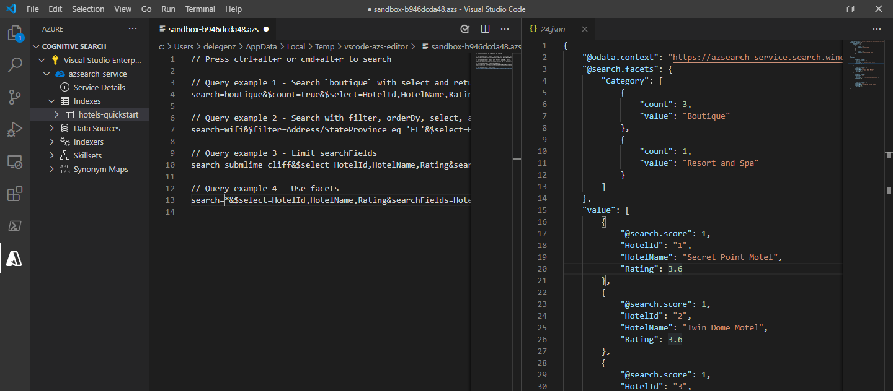

# <a name="get-started-with-azure-cognitive-search-using-visual-studio-code"></a>通过 Visual Studio Code 开始使用 Azure 认知搜索

本文介绍如何使用 [Azure 认知搜索 REST API](/rest/api/searchservice) 和 [Visual Studio Code](https://marketplace.visualstudio.com/items?itemName=ms-azuretools.vscode-azurecognitivesearch) 以交互方式构建 REST API 请求。 借助[适用于 Azure 认知搜索的 Visual Studio Code 扩展（预览版）](https://marketplace.visualstudio.com/items?itemName=ms-azuretools.vscode-azurecognitivesearch)和这些说明，你可以在编写任何代码之前发送请求和查看响应。

如果没有 Azure 订阅，请在开始之前创建一个[免费帐户](https://azure.microsoft.com/free/?WT.mc_id=A261C142F)。

> [!IMPORTANT] 
> 此技能根据[补充使用条款](https://azure.microsoft.com/support/legal/preview-supplemental-terms/)处于公开预览状态。 

## <a name="prerequisites"></a>先决条件

本快速入门需要以下服务和工具。 

+ [Visual Studio Code](https://code.visualstudio.com/download)

+ [适用于 Visual Studio Code（预览版）的 Azure 认知搜索](https://marketplace.visualstudio.com/items?itemName=ms-azuretools.vscode-azurecognitivesearch)

+ [创建 Azure 认知搜索服务](search-create-service-portal.md)或在当前订阅下[查找现有服务](https://ms.portal.azure.com/#blade/HubsExtension/BrowseResourceBlade/resourceType/Microsoft.Search%2FsearchServices)。 可以使用本快速入门的免费服务。 

## <a name="install-the-extension"></a>安装扩展

首先打开 [VS Code](https://code.visualstudio.com)。 选择活动栏上的“扩展”选项卡，然后搜索 Azure 认知搜索。 在搜索结果中找到扩展，然后选择“安装”。


或者，可以在 Web 浏览器中从 VS Code 市场安装 [Azure 认知搜索扩展](https://aka.ms/vscode-search)。

如果尚未安装，活动栏上应会显示新的 Azure 选项卡。


## <a name="connect-to-your-subscription"></a>连接到订阅

选择“登录到 Azure...”然后登录到 Azure 帐户。

应会显示你的订阅。 选择订阅以查看订阅中的搜索服务的列表。



若要限制显示的订阅，请打开命令面板（Ctrl+Shift+P 或 Cmd+Shift+P），搜索 Azure 或选择订阅 。 还有一些命令可用于登录和注销 Azure 帐户。

展开搜索服务时，你将看到每个认知搜索资源的树项：索引、数据源、索引器、技能集和同义词映射。



可以扩展这些树项以显示搜索服务中的资源

## <a name="1---create-an-index"></a>1 - 创建索引

若要开始使用 Azure 认知搜索，首先需要创建搜索索引。 这是使用[创建索引 REST API](/rest/api/searchservice/create-index) 来完成的。 

使用 VS Code 扩展时，只需要考虑请求的正文。 在本快速入门中，我们提供了一个示例索引定义和相应的文档。

### <a name="index-definition"></a>索引定义

以下索引定义是虚构酒店的示例架构。

`fields` 集合定义搜索索引中文档的结构。 每个字段都有一个数据类型和多个其他属性，这些属性决定了如何使用该字段。

```json
{
    "name": "hotels-quickstart",
    "fields": [
        {
            "name": "HotelId",
            "type": "Edm.String",
            "key": true,
            "filterable": true
        },
        {
            "name": "HotelName",
            "type": "Edm.String",
            "searchable": true,
            "filterable": false,
            "sortable": true,
            "facetable": false
        },
        {
            "name": "Description",
            "type": "Edm.String",
            "searchable": true,
            "filterable": false,
            "sortable": false,
            "facetable": false,
            "analyzer": "en.lucene"
        },
        {
            "name": "Description_fr",
            "type": "Edm.String",
            "searchable": true,
            "filterable": false,
            "sortable": false,
            "facetable": false,
            "analyzer": "fr.lucene"
        },
        {
            "name": "Category",
            "type": "Edm.String",
            "searchable": true,
            "filterable": true,
            "sortable": true,
            "facetable": true
        },
        {
            "name": "Tags",
            "type": "Collection(Edm.String)",
            "searchable": true,
            "filterable": true,
            "sortable": false,
            "facetable": true
        },
        {
            "name": "ParkingIncluded",
            "type": "Edm.Boolean",
            "filterable": true,
            "sortable": true,
            "facetable": true
        },
        {
            "name": "LastRenovationDate",
            "type": "Edm.DateTimeOffset",
            "filterable": true,
            "sortable": true,
            "facetable": true
        },
        {
            "name": "Rating",
            "type": "Edm.Double",
            "filterable": true,
            "sortable": true,
            "facetable": true
        },
        {
            "name": "Address",
            "type": "Edm.ComplexType",
            "fields": [
                {
                    "name": "StreetAddress",
                    "type": "Edm.String",
                    "filterable": false,
                    "sortable": false,
                    "facetable": false,
                    "searchable": true
                },
                {
                    "name": "City",
                    "type": "Edm.String",
                    "searchable": true,
                    "filterable": true,
                    "sortable": true,
                    "facetable": true
                },
                {
                    "name": "StateProvince",
                    "type": "Edm.String",
                    "searchable": true,
                    "filterable": true,
                    "sortable": true,
                    "facetable": true
                },
                {
                    "name": "PostalCode",
                    "type": "Edm.String",
                    "searchable": true,
                    "filterable": true,
                    "sortable": true,
                    "facetable": true
                },
                {
                    "name": "Country",
                    "type": "Edm.String",
                    "searchable": true,
                    "filterable": true,
                    "sortable": true,
                    "facetable": true
                }
            ]
        }
    ],
    "suggesters": [
        {
            "name": "sg",
            "searchMode": "analyzingInfixMatching",
            "sourceFields": [
                "HotelName"
            ]
        }
    ]
}
```

若要创建新索引，请右键单击“索引”然后选择“创建新索引” 。 将弹出一个名称类似于 `indexes-new-28c972f661.azsindex` 的编辑器。 

将上面的索引定义粘贴到窗口中。 如果想要更新索引，请保存文件并在出现提示时选择“上传”。 这将创建索引，并且该索引将在树状视图中可用。


如果索引定义有问题，会弹出错误消息，说明该错误。



如果发生这种情况，请修复问题并重新保存该文件。

## <a name="2---load-documents"></a>2 - 加载文档

创建索引和填充索引是分开的步骤。 在 Azure 认知搜索中，索引包含所有可搜索的数据。 在此场景中，数据以 JSON 文档的形式提供。 本任务将使用[添加、更新或删除文档 REST API](/rest/api/searchservice/addupdate-or-delete-documents)。 

若要在 VS Code 中添加新文档：

1. 展开创建的 `hotels-quickstart` 索引。 右键单击“文档”并选择“创建新文档” 。

    

2. 这会打开一个已推断出索引架构的 JSON 编辑器。

    

3. 粘贴下面的 JSON，并保存该文件。 将打开一个提示，要求确认更改。 选择“上传”以保存更改。

    ```json
    {
        "HotelId": "1",
        "HotelName": "Secret Point Motel",
        "Description": "The hotel is ideally located on the main commercial artery of the city in the heart of New York. A few minutes away is Time's Square and the historic centre of the city, as well as other places of interest that make New York one of America's most attractive and cosmopolitan cities.",
        "Category": "Boutique",
        "Tags": [ "pool", "air conditioning", "concierge" ],
        "ParkingIncluded": false,
        "LastRenovationDate": "1970-01-18T00:00:00Z",
        "Rating": 3.60,
        "Address": {
            "StreetAddress": "677 5th Ave",
            "City": "New York",
            "StateProvince": "NY",
            "PostalCode": "10022",
            "Country": "USA"
        } 
    }
    ```

4. 为其余三个文档重复此过程

    文档 2：
    ```json
    {
        "HotelId": "2",
        "HotelName": "Twin Dome Motel",
        "Description": "The hotel is situated in a  nineteenth century plaza, which has been expanded and renovated to the highest architectural standards to create a modern, functional and first-class hotel in which art and unique historical elements coexist with the most modern comforts.",
        "Category": "Boutique",
        "Tags": [ "pool", "free wifi", "concierge" ],
        "ParkingIncluded": false,
        "LastRenovationDate": "1979-02-18T00:00:00Z",
        "Rating": 3.60,
        "Address": {
            "StreetAddress": "140 University Town Center Dr",
            "City": "Sarasota",
            "StateProvince": "FL",
            "PostalCode": "34243",
            "Country": "USA"
        } 
    }
    ```

    文档 3：
    ```json
    {
        "HotelId": "3",
        "HotelName": "Triple Landscape Hotel",
        "Description": "The Hotel stands out for its gastronomic excellence under the management of William Dough, who advises on and oversees all of the Hotel’s restaurant services.",
        "Category": "Resort and Spa",
        "Tags": [ "air conditioning", "bar", "continental breakfast" ],
        "ParkingIncluded": true,
        "LastRenovationDate": "2015-09-20T00:00:00Z",
        "Rating": 4.80,
        "Address": {
            "StreetAddress": "3393 Peachtree Rd",
            "City": "Atlanta",
            "StateProvince": "GA",
            "PostalCode": "30326",
            "Country": "USA"
        } 
    }
    ```

    文档 4：
    ```json
    {
        "HotelId": "4",
        "HotelName": "Sublime Cliff Hotel",
        "Description": "Sublime Cliff Hotel is located in the heart of the historic center of Sublime in an extremely vibrant and lively area within short walking distance to the sites and landmarks of the city and is surrounded by the extraordinary beauty of churches, buildings, shops and monuments. Sublime Cliff is part of a lovingly restored 1800 palace.",
        "Category": "Boutique",
        "Tags": [ "concierge", "view", "24-hour front desk service" ],
        "ParkingIncluded": true,
        "LastRenovationDate": "1960-02-06T00:00:00Z",
        "Rating": 4.60,
        "Address": {
            "StreetAddress": "7400 San Pedro Ave",
            "City": "San Antonio",
            "StateProvince": "TX",
            "PostalCode": "78216",
            "Country": "USA"
        }
    }
    ```

此时，你应该在“文档”部分看到所有四个文档。



## <a name="3---search-an-index"></a>3 - 搜索索引

现在，索引和文档集已加载，可以使用[搜索文档 REST API](/rest/api/searchservice/search-documents) 针对它们发出查询了。

若要在 VS Code 执行此操作：

1. 右键单击要搜索的索引，然后选择“搜索索引”。 这会打开一个名称类似于 `sandbox-b946dcda48.azs` 的编辑器。

    

2. 会自动填充一个简单查询。 按“Ctrl+Alt+R”或“Cmd+Alt+R”以提交查询 。 你将在左侧的窗口中看到弹出的结果。

    


### <a name="example-queries"></a>查询示例

尝试其他查询示例来了解语法。 下面有另外四个可尝试的查询。 可以将多个查询添加到同一个编辑器。 按“Ctrl+Alt+R”或“Cmd+Alt+R”时，光标所在的行决定了要提交的查询 。



在第一个查询中，只搜索特定字段 `boutique` 和 `select`。 最佳做法是通过 `select` 仅选择你需要的字段，因为回发不必要的数据可能会增加查询的延迟时间。 该查询还将 `$count=true` 设置为搜索结果的返回总数。

```
// Query example 1 - Search `boutique` with select and return count
search=boutique&$count=true&$select=HotelId,HotelName,Rating,Category
```

在下一个查询中，我们指定搜索词 `wifi`，还包括一个筛选器，以仅返回状态等于 `'FL'` 的结果。 还会按酒店的 `Rating` 对结果进行排序。

```
// Query example 2 - Search with filter, orderBy, select, and count
search=wifi&$filter=Address/StateProvince eq 'FL'&$select=HotelId,HotelName,Rating&$orderby=Rating desc
```

接下来，使用 `searchFields` 参数将搜索限制为单个可搜索字段。 如果你知道自己只对某些字段中的匹配感兴趣，则很适合使用该选项来提高查询的效率。

```
// Query example 3 - Limit searchFields
search=submlime cliff&$select=HotelId,HotelName,Rating&searchFields=HotelName
```

查询中包含的另一个常见选项是 `facets`。 通过 facet，可在 UI 上构建筛选器，使用户能够轻松地了解可筛选出的值。

```
// Query example 4 - Take the top two results, and show only HotelName and Category in the results
search=*&$select=HotelId,HotelName,Rating&searchFields=HotelName&facet=Category
```

## <a name="open-index-in-the-portal"></a>在门户中打开索引

若要在门户中查看搜索服务，请右键单击搜索服务的名称，然后选择“在门户中打开”。 这会将你转到 Azure 门户中的搜索服务。

## <a name="clean-up-resources"></a>清理资源

在自己的订阅中操作时，最好在项目结束时确定是否仍需要已创建的资源。 持续运行资源可能会产生费用。 可以逐个删除资源，也可以删除资源组以删除整个资源集。

可以使用左侧导航窗格中的“所有资源”或“资源组”链接 ，在门户中查找和管理资源。

如果使用的是免费服务，请记住只能设置三个索引、索引器和数据源。 可以在门户中删除单个项目，以不超出此限制。 

## <a name="next-steps"></a>后续步骤

现在你已了解如何执行核心任务，你可以继续使用其他 REST API 调用来获取更高级的功能，例如索引器或[设置将内容转换添加到索引的扩充管道](cognitive-search-tutorial-blob.md)。 在下一步中，我们建议你访问以下链接：

> [!div class="nextstepaction"]
> [教程：使用 REST 和 AI 从 Azure Blob 生成可搜索的内容](cognitive-search-tutorial-blob.md)