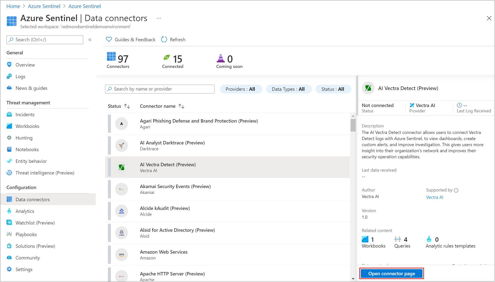

# Azure Sentinel 数据连接器

[!INCLUDE [reference-to-feature-availability](includes/reference-to-feature-availability.md)]

将 Azure Sentinel 载入工作区后，连接数据源以开始将数据引入 Azure Sentinel。 Azure Sentinel 附带许多适用于 Microsoft 产品的连接器，这些连接器立即可用并且可实现实时集成。 例如，服务到服务连接器包括 Microsoft 365 Defender 连接器和 Microsoft 365 源，例如 Office 365、Azure Active Directory (Azure AD)、Microsoft Defender for Identity 和 Microsoft Cloud App Security。

还可以启用内置的连接器，以拓宽非 Microsoft 产品的安全生态系统。 例如，可以使用 [Syslog](#syslog)、[通用事件格式 (CEF)](#common-event-format-cef) 或 [REST API](#rest-api-integration) 将数据源与 Azure Sentinel 连接。

“数据连接器”页面（可从 Azure Sentinel 导航菜单访问）显示 Azure Sentinel 提供的连接器的完整列表及其在工作区中的状态。 选择要连接的连接器，然后选择“打开连接器页”。

本文介绍支持的数据连接方法。 有关详细信息，请参阅 [Azure Sentinel 数据连接器参考](data-connectors-reference.md)和 [Azure Sentinel 解决方案目录](sentinel-solutions-catalog.md)。

## 启用数据连接器

“数据连接器”页面（可从 Azure Sentinel 导航菜单访问）显示 Azure Sentinel 提供的连接器的完整列表及其状态。 选择要连接的连接器，然后选择“打开连接器页”。

你需要满足所有先决条件，并且你将在连接器页面上看到有关将数据引入 Azure Sentinel 的完整说明。 数据可能需要一些时间来开始到达。 在连接后，可以在“收到的数据”图中查看数据摘要，以及数据类型的连接状态。

在“下一步”选项卡中，你将看到 Azure Sentinel 为特定数据类型（示例查询、可视化效果工作簿和分析规则模板）提供的可帮助检测和调查威胁的其他内容。

有关详细信息，请参阅[数据连接器参考](data-connectors-reference.md)中与数据连接器相关的部分。

## REST API 集成

许多安全技术提供了一组用于检索日志文件的 API，并且某些数据源可以使用这些 API 连接到 Azure Sentinel。

使用 API 的数据连接器或是从提供程序端集成，或是使用 Azure Functions 集成，具体如以下部分所述。

有关这些连接器的完整列表和信息，请参阅[数据连接器参考](data-connectors-reference.md)。

### 提供程序端的 REST API 集成

由提供程序构建的 API 集成将与提供程序数据源连接，并使用 [Azure Monitor 数据收集器 API](../azure-monitor/logs/data-collector-api.md) 将数据推送到 Azure Sentinel 自定义数据表。

有关详细信息，请参阅提供程序文档和[将数据源连接到 Azure Sentinel 的 REST-API 以引入数据](connect-rest-api-template.md)。

### 使用 Azure Functions 进行 REST API 集成

使用 [Azure Functions](../azure-functions/index.yml) 与提供程序 API 连接的集成首先会格式化数据，然后使用 [Azure Monitor 数据收集器 API](../azure-monitor/logs/data-collector-api.md) 将数据发送至 Azure Sentinel 自定义日志表。

若要配置这些数据连接器以与提供程序 API 连接并收集 Azure Sentinel 中的日志，请执行 Azure Sentinel 中针对每个数据连接器显示的步骤。

有关详细信息，请参阅[使用 Azure Functions 将数据源连接到Azure Sentinel](connect-azure-functions-template.md)。

> [!IMPORTANT]
> 使用 Azure Functions 的集成可能会产生额外的数据引入成本，这是因为你在 Azure 租户托管 Azure Functions。 有关详细信息，请参阅 [Azure Functions 定价页](https://azure.microsoft.com/pricing/details/functions/)。

## 基于代理的集成

Azure Sentinel 可以使用 Syslog 协议通过代理连接到任何执行实时日志流式处理的数据源。 例如，大多数本地数据源通过基于代理的集成进行连接。
以下部分介绍基于 Azure Sentinel 代理的数据连接器的不同类型。 按照每个 Azure Sentinel 数据连接器页中的步骤，使用基于代理的机制配置连接。

有关通过 CEF 或 Syslog 连接到 Azure Sentinel 的防火墙、代理和终结点的完整列表，请参阅[数据连接器参考](data-connectors-reference.md)。

### Syslog

可以使用适用于 Linux 的 Log Analytics 代理（以前称为 OMS 代理），将基于 Linux 的、支持 Syslog 的设备中的事件流式传输到 Azure Sentinel。 允许直接在设备上安装 Log Analytics 代理的任何设备均支持 Log Analytics 代理。

设备的内置 Syslog 守护程序会收集指定类型的本地事件，并在本地将其转发到代理，然后代理会将其流式传输到 Log Analytics 工作区。 成功配置后，数据将显示在 Log Analytics Syslog 表中。

根据设备类型，可以直接在设备上安装代理，或在专用的 Linux 日志转发器上安装代理。 Log Analytics 代理通过 UDP 从 Syslog 守护程序接收事件。 如果预期 Linux 计算机需要收集大量的 Syslog 事件，则会通过 TCP 将这些事件从 Syslog 守护程序发送到代理，然后从代理发送到 Log Analytics。

有关详细信息，请参阅[将基于 Syslog 的设备连接到 Azure Sentinel](connect-syslog.md)。 

### 通用事件格式 (CEF)

日志格式各不相同，但许多源支持基于 CEF 的格式设置。 Azure Sentinel 代理（实际上是 Log Analytics 代理）将 CEF 格式的日志转换为 Log Analytics 可以引入的格式。

对于在 CEF 中发出数据的数据源，请设置 Syslog 代理，然后配置 CEF 数据流。 成功配置后，数据将显示在 CommonSecurityLog 表中。

有关详细信息，请参阅[将基于 CEF 的设备连接到 Azure Sentinel](connect-common-event-format.md)。

### 自定义日志

某些数据源的日志可用于在 Windows 或 Linux 上作为文件收集。 可以使用 Log Analytics 自定义日志收集代理收集这些日志。

按照每个 Azure Sentinel 数据连接器页中的步骤，使用 Log Analytics 自定义日志收集代理进行连接。 成功配置后，数据将显示在自定义表中。

有关详细信息，请参阅[使用 Log Analytics 代理将数据以自定义日志格式收集到 Azure Sentinel](connect-custom-logs.md)。

## 服务到服务集成

Azure Sentinel 使用 Azure 基础为 Microsoft 服务和 Amazon Web Services 提供内置的服务到服务支持。

有关详细信息，请参阅[连接到 Azure、Windows、Microsoft 和 Amazon 服务](connect-azure-windows-microsoft-services.md)和[数据连接器参考](data-connectors-reference.md)。

## 在解决方案中部署

[Azure Sentinel 解决方案](sentinel-solutions.md)提供安全内容包，其中包括数据连接器、工作簿、分析规则、playbook 等。 部署使用数据连接器的解决方案时，你将获取数据连接器以及同一部署中的相关内容。 

有关详细信息，请参阅[发现和部署 Azure Sentinel 解决方案](sentinel-solutions-deploy.md)和 [Azure Sentinel 解决方案目录](sentinel-solutions-catalog.md)。
## 数据连接器支持

Microsoft 和其他组织都会开发 Azure Sentinel 连接器。 每个数据连接器都具有以下支持类型之一：

| 支持类型| 说明|
|-------------|------------|
|Microsoft 支持|适用于：<ul><li>数据源的数据连接器，其中 Microsoft 是数据提供程序和创建者。</li><li>适用于非 Microsoft 数据源的部分 Microsoft 开发的数据连接器。</li></ul>Microsoft 根据 [Microsoft Azure 支持计划](https://azure.microsoft.com/support/options/#overview)支持和维护此类别中的数据连接器。  合作伙伴或社区支持由除 Microsoft 以外的任何一方开发的数据连接器。|
|合作伙伴支持|适用于由 Microsoft 之外的各方开发的数据连接器。  合作伙伴公司可为这些数据连接器提供支持或维护。 合作伙伴公司可以是独立软件供应商、托管服务提供商 (MSP/MSSP)、系统集成商 (SI) 或在该数据连接器的 Azure Sentinel 页上提供其联系信息的任何组织。  对于有关合作伙伴支持的数据连接器的任何问题，请联系指定的数据连接器支持联系人。|
|社区支持|适用于由 Microsoft 或合作伙伴开发者开发、但未在 Azure Sentinel 中的指定数据连接器页列出数据连接器支持和维护联系人的数据连接器。  对于有关这些数据连接器的问题，可以在 [Azure Sentinel GitHub 社区](https://aka.ms/threathunters)[提出问题](https://github.com/Azure/Azure-Sentinel/issues/new/choose)。|

### 查找数据连接器的支持联系人

若要查找数据连接器的支持联系人信息：

1. 在 Azure Sentinel 左侧菜单中，选择“数据连接器”。

1. 选择要为其查找支持信息的连接器。

1. 查看数据连接器侧面板上的“支持者”字段。

   

   “支持者”字段提供了支持联系人的链接，你可以使用该链接来访问所选数据连接器的支持和维护信息。

## 后续步骤

- 若要开始使用 Azure Sentinel，需要订阅 Microsoft Azure。 如果没有订阅，可以注册[免费试用版](https://azure.microsoft.com/free/)。
- 了解如何[将数据载入到 Azure Sentinel](quickstart-onboard.md)，以及[获取数据和潜在威胁的见解](get-visibility.md)。
