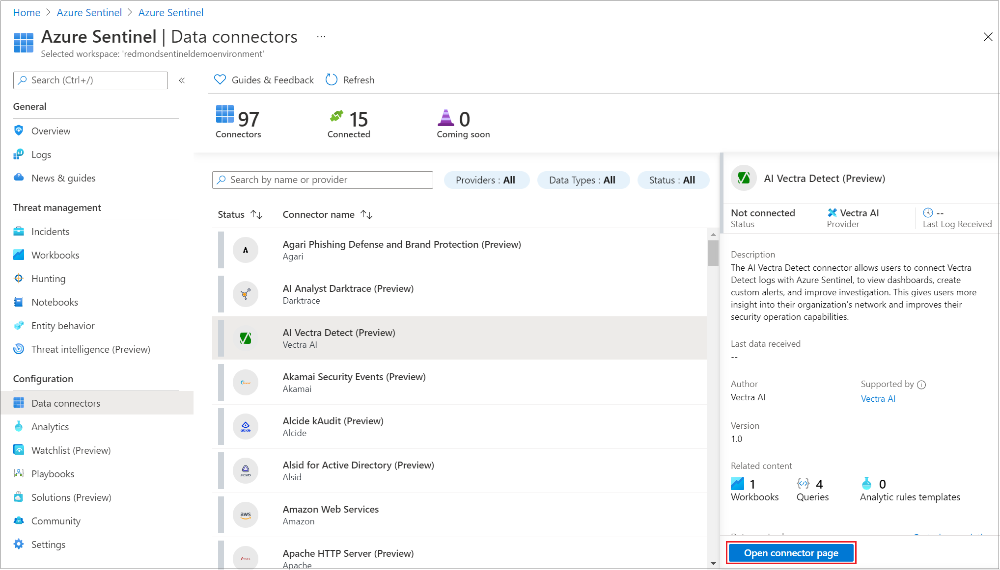

# 什么是 Azure Sentinel？

Microsoft Azure Sentinel 是可缩放的云原生 **安全信息事件管理 (SIEM)** 和 **安全业务流程自动响应 (SOAR)** 解决方案。 Azure Sentinel 在整个企业范围内提供智能安全分析和威胁智能，为警报检测、威胁可见性、主动搜寻和威胁响应提供单一解决方案。

Azure Sentinel 是整个企业的鸟瞰视图，可以缓解日益复杂的攻击、不断增加的警报数量以及长时间解决时间帧带来的压力。

- 跨所有用户、设备、应用程序和基础结构（包括本地和多个云）以 **云规模收集数据**。

- 使用 Microsoft 的分析和出色的威胁情报检测以前未检测到的威胁，并[最大限度地减少误报](false-positives.md)。

- **借助人工智能调查威胁**，结合 Microsoft 多年以来的网络安全工作经验大规模搜寻可疑活动。

- 通过内置的业务流程和常见任务自动化 **快速响应事件**。

Azure Sentinel 基于现有的各种 Azure 服务，原生集成了经过证实的基础服务，例如 Log Analytics 和逻辑应用。 Azure Sentinel 可以借助人工智能丰富调查和检测工作，并提供 Microsoft 的威胁智能流，使你能够运用自己的威胁智能。

## 连接到所有数据

若要载入 Azure Sentinel，首先需要[连接到安全源](connect-data-sources.md)。 

Azure Sentinel 随附许多适用于 Microsoft 解决方案的开箱即用的连接器，提供实时集成，包括 Microsoft 365 Defender（之前称为 Microsoft 威胁防护）解决方案、Microsoft 365 源（包括 Office 365）、Azure AD、Microsoft Defender for Identity（之前称为 Azure ATP）和 Microsoft Cloud App Security 等。 此外，内置的连接器可以拓宽非 Microsoft 解决方案的安全生态系统。 也可以使用常用事件格式 Syslog 或 REST-API 将数据源与 Azure Sentinel 相连接。 

有关详细信息，请参阅[查找数据连接器](data-connectors-reference.md)。

[!INCLUDE [azure-lighthouse-supported-service](../../includes/azure-lighthouse-supported-service.md)]

## 工作簿

[将数据源连接](quickstart-onboard.md)到 Azure Sentinel 后，可以使用 Azure Sentinel 与 Azure Monitor 工作簿的集成来监视数据，这在创建自定义工作簿方面提供了多样性。

虽然工作簿在 Azure Sentinel 中的显示方式有所不同，但可能有助于你了解如何[使用 Azure Monitor 工作簿创建交互式报表](../azure-monitor/visualize/workbooks-overview.md)。 Azure Sentinel 可让你跨数据创建自定义工作簿，并且还附带了内置的工作簿模板，使你可以在连接数据源后快速获得对数据的见解。

- 工作簿适用于所有层级的 SOC 工程师和分析师，可直观显示数据。

- 虽然工作簿最适用于 Azure Sentinel 数据的高级视图，并且不需要任何编码知识，但不能将工作簿与外部数据集成。

## Analytics

为了帮助降低干扰并尽量减少需要检查和调查的警报数目，Azure Sentinel [使用分析将警报关联到事件](detect-threats-built-in.md)。 **事件** 是相关警报的分组，它们共同创建了可以调查和解决的、可处理的可能威胁。 可以按原样使用内置的关联规则，也可以使用它们作为起点来生成自己的关联规则。 Azure Sentinel 还提供机器学习规则用于映射网络行为，然后查找不同资源中的异常。 这些分析通过将有关不同实体的低保真度警报合并成潜在的高保真度安全事件，来关联问题点。

## 安全自动化和业务流程

将常见任务自动化，并使用可与 Azure 服务和现有工具集成的 Playbook 来[简化安全业务流程](tutorial-respond-threats-playbook.md)。

Azure Sentinel 的自动化和业务流程解决方案构建在 Azure 逻辑应用的基础之上，提供高度可扩展的体系结构，当新的技术和威胁出现时，它可以实现可缩放的自动化。 若要使用 Azure 逻辑应用生成 Playbook，可以从不断扩充的内置 Playbook 库中进行选择。 这些 Playbook 包括适用于 Azure Functions 等服务的 [200 多个连接器](../connectors/apis-list.md)。 使用连接器可在代码、ServiceNow、Jira、Zendesk、HTTP 请求、Microsoft Teams、Slack、Windows Defender ATP 和 Cloud App Security 中应用任何自定义逻辑。

例如，如果使用 ServiceNow 票证系统，可以使用提供的工具通过 Azure 逻辑应用自动执行工作流，并在每次检测到特定的事件时在 ServiceNow 中开具票证。

- Playbook 适用于所有层级的 SOC 工程师和分析师，可自动化和简化任务，包括数据引入、扩充、调查和修正。

- Playbook 最适合单个、可重复的任务，无需任何编码知识。 Playbook 不适合临时或复杂的任务链，也不适合记录和共享证据。

## 调查

目前以预览版提供的 Azure Sentinel [深入调查](investigate-cases.md)工具可帮助你了解潜在安全威胁的范围并找到根本原因。 可在交互式图形中选择一个实体以提出有关特定实体的问题，然后向下钻取到该实体及其连接，以获取威胁的根本原因。 

## 搜寻

根据 MITRE 框架使用 Azure Sentinel 的[强大搜寻式搜索和查询工具](hunting.md)，可以在触发警报之前，主动搜寻组织的不同数据源中的安全威胁。 发现哪个搜寻式查询可以提供有关潜在攻击的宝贵见解后，还可以基于该查询创建自定义检测规则，并将这些见解作为警报传达给安全事件响应者。 搜寻时可为相关事件创建书签，以便将来可以再次找到这些事件、将其与他人共享，并将其与其他相关事件分组到一起，以创建令人关注的事件方便调查。

## 笔记本

Azure Sentinel 支持 Azure 机器学习工作区中的 Jupyter 笔记本，包括用于机器学习、可视化和数据分析的完整库。

[使用 Azure Sentinel 中的笔记本](notebooks.md)来扩展可对 Azure Sentinel 数据执行的操作的范围。 例如，执行 Azure Sentinel 中未内置的分析（例如某些 Python 机器学习功能）、创建 Azure Sentinel 中未内置的数据可视化（例如自定义时间线和流程树）或集成 Azure Sentinel 外部的数据源（例如本地数据集）。

:::image type="content" source="media/notebooks/sentinel-notebooks-on-machine-learning.png" alt-text="AML 工作区中 Sentinel 笔记本的屏幕截图。":::

- Azure Sentinel 笔记本适用于威胁猎手或 2-3 级分析师、事件调查员、数据科学家和安全研究人员。

- 笔记本提供对 Azure Sentinel 和外部数据的查询，以及用于数据扩充、调查、可视化、搜寻、机器学习和大数据分析的功能。

- 笔记本最适合较为复杂的可重复任务链、临时过程控制、机器学习和自定义分析，支持用于操作和可视化数据的丰富 Python 库，并且在记录和共享分析证据方面非常有用。

- 笔记本需要较高级的学习曲线和编码知识，对自动化的支持有限。

## 社区

Azure Sentinel 社区提供有关威胁检测和自动化的强有力资源。 Microsoft 安全分析师会不断创建和添加新的工作簿、Playbook、搜寻式查询及其他资源，并将其发布到社区，供你在环境中使用。 可以从个人社区 GitHub [存储库](https://aka.ms/asicommunity)下载示例内容，以创建适用于 Azure Sentinel 的自定义工作簿、搜寻式查询、Notebook 和 Playbook。

## 后续步骤

- 若要开始使用 Azure Sentinel，需要订阅 Microsoft Azure。 如果尚无订阅，可注册[免费试用版](https://azure.microsoft.com/free/)。
- 了解如何[将数据载入到 Azure Sentinel](quickstart-onboard.md)，以及[获取数据和潜在威胁的见解](get-visibility.md)。
