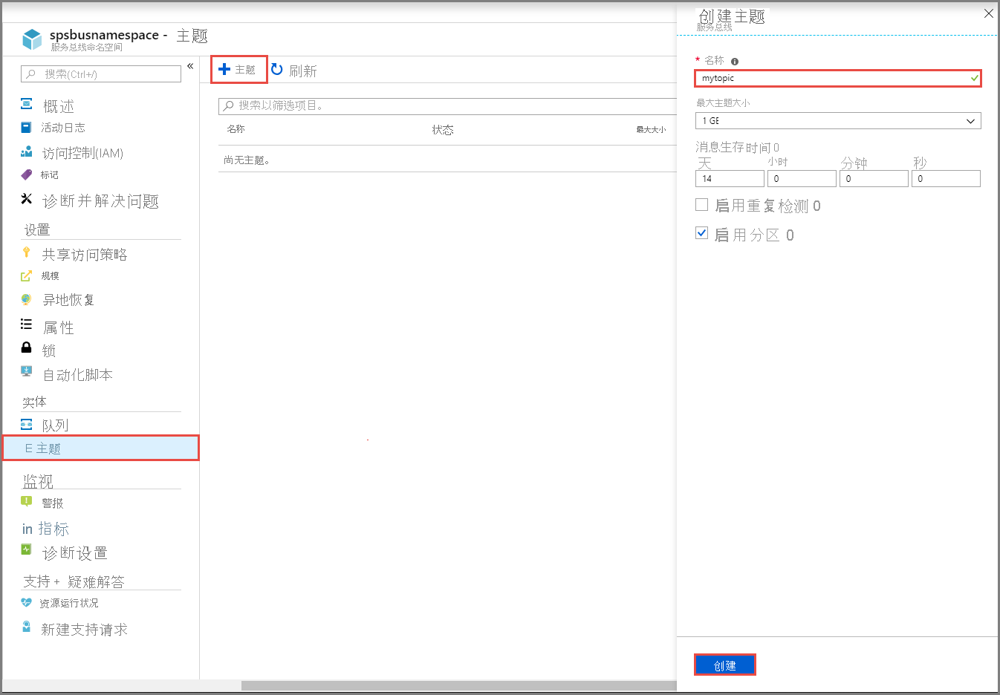
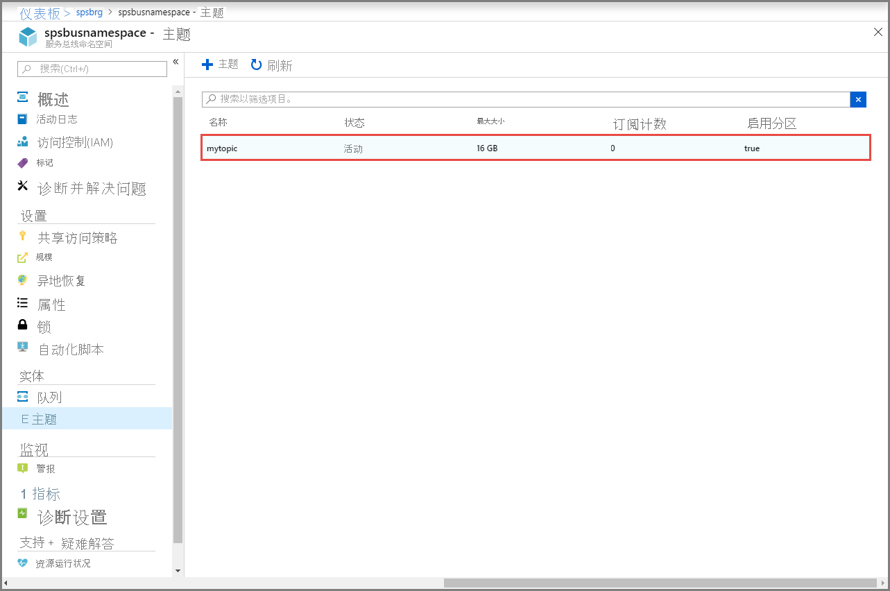
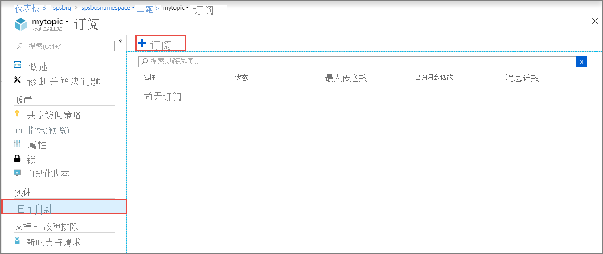
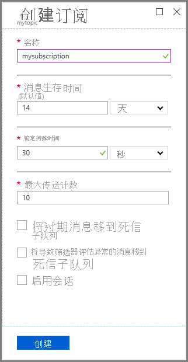

## 使用 Azure 门户创建主题
1. 在“服务总线命名空间”页面上，选择左侧菜单中的“主题”。
2. 在工具栏中选择“+ 主题”。 
4. 输入主题名称。 将其他选项保留默认值。
5. 选择“创建”。

    

## 创建对主题的订阅
1. 选择在上一部分创建的主题。 
    
    
2. 在“服务总线主题”页面上，从左侧菜单中选择“订阅”，然后工具栏上选择“+ 订阅”。 
    
    
3. 在“创建订阅”页上执行以下步骤：
    1. 对于订阅名称，输入“S1” 。
    1. 对于“最大交付数”，输入“3” 。
    1. 然后，选择“创建”以创建订阅。 

        
4. 重复上述步骤两次，创建名为 **S2** 和 **S3** 的订阅。