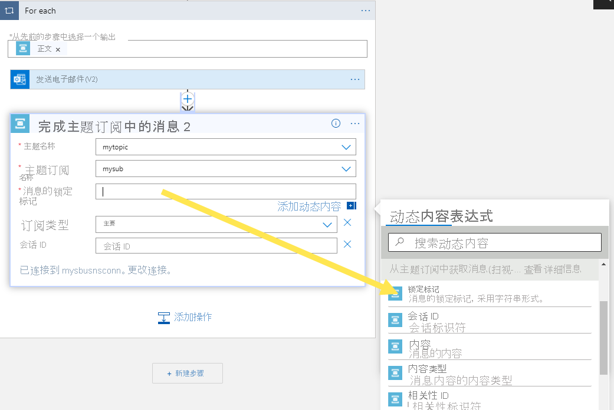

# <a name="tutorial-respond-to-azure-service-bus-events-received-via-azure-event-grid-by-using-azure-logic-apps"></a>教程：使用 Azure 逻辑应用响应通过 Azure 事件网格收到的 Azure 服务总线事件
本教程介绍如何使用 Azure 逻辑应用对通过 Azure 事件网格收到的 Azure 服务总线事件做出响应。 

[!INCLUDE [service-bus-event-grid-prerequisites](./includes/service-bus-event-grid-prerequisites.md)]

## <a name="receive-messages-by-using-logic-apps"></a>使用逻辑应用接收消息
在此步骤中，将创建一个通过 Azure 事件网格接收服务总线事件的 Azure 逻辑应用。 

1. 在 Azure 门户中创建逻辑应用。
    1. 依次选择“+ 创建资源”、“集成”、“逻辑应用”。 
    2. 选择 **Azure 订阅**。 
    3. 为“资源组”选择“使用现有项”，然后选择以前创建的、用于其他资源（例如 Azure 函数、服务总线命名空间）的资源组。 
    1. 对于“类型”，请选择“消耗” 。 
    1. 输入逻辑应用的“名称”。
    1. 为逻辑应用选择“区域”。 
    1. 选择“查看 + 创建”  。 
    1. 在“查看 + 创建”页面中，选择“创建”，以创建逻辑应用 。 
    1. 在“部署完成”页上，选择“转到资源” 。 
1. 在“逻辑应用设计器”页上，选择“模板”下的“空白逻辑应用”。 

### <a name="add-a-step-receive-messages-from-service-bus-via-event-grid"></a>添加步骤以通过事件网格从服务总线接收消息
1. 在设计器中执行以下步骤：
    1. 搜索“事件网格”。 
    2. 选择“发生资源事件时 - Azure 事件网格”。 

        
4. 选择“登录”，输入 Azure 凭据，然后选择“允许访问”。 
5. 在“当资源事件发生时”页上执行以下步骤：
    1. 选择 Azure 订阅。 
    2. 对于“资源类型”，请选择“Microsoft.ServiceBus.Namespaces”。 
    3. 对于“资源名称”，请选择你的服务总线命名空间。 
    4. 选择“添加新参数”，然后选择“后缀筛选器”，然后将焦点移到下拉列表之外 。
    
        :::image type="content" source="./media/service-bus-to-event-grid-integration-example/add-new-parameter-suffix-filter.png" alt-text="图像显示了添加后缀筛选器的情况。":::
    1. 对于“后缀筛选器”，请输入服务总线主题订阅的名称。 
        
1. 在设计器中选择“+ 新建步骤”，然后执行以下步骤：
    1. 搜索“服务总线”。
    2. 在列表中选择“服务总线”。 
    3. 在“操作”列表中选择“获取消息”。 
    4. 选择“从主题订阅中获取消息(扫视锁定)”。 

        
    5. 输入 **连接的名称**。 例如：**从主题订阅中获取消息**，并选择服务总线命名空间。 

         
    6. 选择“RootManageSharedAccessKey”，然后选择“创建” 。

         
    8. 选择你的主题和订阅 。 
    
        

### <a name="add-a-step-to-process-and-complete-received-messages"></a>添加步骤以处理和完成收到的消息
在此步骤中，你将添加所需的步骤以便在电子邮件中发送收到的消息，然后完成该消息。 在真实方案中，你会先在逻辑应用中处理消息，然后再完成该消息。

#### <a name="add-a-foreach-loop"></a>添加 For each 循环
1. 选择“+新建步骤”。
1. 搜索“控制”，然后将其选中。  

    :::image type="content" source="./media/service-bus-to-event-grid-integration-example/select-control.png" alt-text="该插图显示“控制”类别选项":::
1. 在“操作”列表中，选择“For each” 。

    :::image type="content" source="./media/service-bus-to-event-grid-integration-example/select-for-each.png" alt-text="该插图显示“For each”控制选项":::    
1. 对于“选择先前步骤的输出”（如果需要，请在文本框内部单击），请选择“从主题订阅中获取消息(扫视-锁定)”下的“正文”  。 

    :::image type="content" source="./media/service-bus-to-event-grid-integration-example/select-input-for-each.png" alt-text="该插图显示 For each 输入选项":::    

#### <a name="add-a-step-inside-the-foreach-loop-to-send-an-email-with-the-message-body"></a>在 For each 循环中添加一个步骤，以发送包含消息正文的电子邮件

1. 在“For Each”循环中，选择“添加操作” 。 

    :::image type="content" source="./media/service-bus-to-event-grid-integration-example/select-add-action.png" alt-text="该插图显示“For each”循环中的“添加操作”按钮":::        
1. 在“搜索连接器和操作”文本框中，输入“Office 365” 。 
1. 在搜索结果中选择“Office 365 Outlook”。 
1. 在操作列表中，选择“发送电子邮件(V2)”。 
1. 在“发送电子邮件(V2)”窗口中，执行以下步骤： 
1. 在“正文”文本框内部单击，然后执行以下步骤：
    1. 对于“收件人”，请输入电子邮件地址。 
    1. 对于“主题”，请输入“从服务总线主题的订阅收到的消息” 。  
    1. 切换到“表达式”。
    1. 输入以下表达式：
    
        ```
        base64ToString(items('For_each')?['ContentData'])
        ``` 
    1. 选择“确定”。 
    
        :::image type="content" source="./media/service-bus-to-event-grid-integration-example/specify-expression-email.png" alt-text="图像显示了“发送电子邮件”活动的“正文”的表达式。":::

#### <a name="add-another-action-in-the-foreach-loop-to-complete-the-message"></a>在 For each 循环中添加另一个操作以完成消息         
1. 在“For Each”循环中，选择“添加操作” 。 
    1. 在“最近”列表中选择“服务总线” 。
    2. 在操作列表中选择“完成主题订阅中的消息”。 
    3. 选择你的服务总线 **主题**。
    4. 选择主题的订阅。
    5. 对于“消息的锁定标记”，请从“动态内容”中选择“锁定标记”。 

        
8. 在逻辑应用设计器的工具栏上选择“保存”以保存逻辑应用。 

    :::image type="content" source="./media/service-bus-to-event-grid-integration-example/save-logic-app.png" alt-text="保存逻辑应用":::

## <a name="test-the-app"></a>测试应用
1. 如果尚未向主题发送测试消息，请按照[向服务总线主题发送消息](#send-messages-to-the-service-bus-topic)部分中的说明将消息发送到主题。 
1. 切换到逻辑应用的“概述”页，然后切换到底部窗格中的“运行历史记录”选项卡 。 你会看到逻辑应用运行发送到主题的消息。 可能需要几分钟时间，你才能看到逻辑应用运行。 选择工具栏上的“刷新”，以刷新页面。 

    
1. 选择一个逻辑应用运行，查看详细信息。 请注意，它在 for 循环中处理了 5 条消息。 
    
    :::image type="content" source="./media/service-bus-to-event-grid-integration-example/logic-app-run-details.png" alt-text="逻辑应用运行详细信息"::: 
2. 对于逻辑应用收到的每条消息，你应会收到一封电子邮件。    

## <a name="troubleshoot"></a>疑难解答
如果在等待和刷新一段时间后没有看到任何调用，请执行以下步骤： 

1. 确认消息已到达服务总线主题。 查看“服务总线主题”页面上的“传入消息”计数器 。 在本例中，我运行了两次 MessageSender 应用程序，因此我会看到 10 条消息（每次运行 5 条消息）。

    :::image type="content" source="./media/service-bus-to-event-grid-integration-example/topic-incoming-messages.png" alt-text="服务总线主题页面 - 传入消息":::    
1. 确认服务总线订阅中有“无活动消息”。 
    如果在此页面上未看到任何事件，请验证“服务总线订阅”页面没有显示任何“活动消息计数” 。 如果此计数器的数字大于零，则由于某些原因，订阅中的消息没有转发到处理程序函数（事件订阅处理程序）。 请验证是否已正确设置事件订阅。 

    :::image type="content" source="./media/service-bus-to-event-grid-integration-example/subscription-active-message-count.png" alt-text="服务总线订阅的活动消息计数":::    
1. 你还可在服务总线命名空间的“事件”页面上查看发送的事件数 。 

    :::image type="content" source="./media/service-bus-to-event-grid-integration-example/event-subscription-page.png" alt-text="事件页面 - 发送的事件数" lightbox="./media/service-bus-to-event-grid-integration-example/invocation-details.png":::
1. 还可在“事件订阅”页面上看到事件已发送。 可在“事件”页面上选择事件订阅来访问此页面。 
    
    :::image type="content" source="./media/service-bus-to-event-grid-integration-example/event-subscription-delivered-events.png" alt-text="事件订阅页面 - 发送的事件数":::
## <a name="next-steps"></a>后续步骤

* 详细了解 [Azure 事件网格](../event-grid/index.yml)。
* 详细了解 [Azure Functions](../azure-functions/index.yml)。
* 详细了解 [Azure 应用服务的逻辑应用功能](../logic-apps/index.yml)。
* 详细了解 [Azure 服务总线](/azure/service-bus/)。


[2]: ./media/service-bus-to-event-grid-integration-example/sbtoeventgrid2.png
[3]: ./media/service-bus-to-event-grid-integration-example/sbtoeventgrid3.png
[7]: ./media/service-bus-to-event-grid-integration-example/sbtoeventgrid7.png
[8]: ./media/service-bus-to-event-grid-integration-example/sbtoeventgrid8.png
[9]: ./media/service-bus-to-event-grid-integration-example/sbtoeventgrid9.png
[10]: ./media/service-bus-to-event-grid-integration-example/sbtoeventgrid10.png
[11]: ./media/service-bus-to-event-grid-integration-example/sbtoeventgrid11.png
[12]: ./media/service-bus-to-event-grid-integration-example/sbtoeventgrid12.png
[12-1]: ./media/service-bus-to-event-grid-integration-example/sbtoeventgrid12-1.png
[12-2]: ./media/service-bus-to-event-grid-integration-example/sbtoeventgrid12-2.png
[13]: ./media/service-bus-to-event-grid-integration-example/sbtoeventgrid13.png
[14]: ./media/service-bus-to-event-grid-integration-example/sbtoeventgrid14.png
[15]: ./media/service-bus-to-event-grid-integration-example/sbtoeventgrid15.png
[16]: ./media/service-bus-to-event-grid-integration-example/sbtoeventgrid16.png
[17]: ./media/service-bus-to-event-grid-integration-example/sbtoeventgrid17.png
[18]: ./media/service-bus-to-event-grid-integration-example/sbtoeventgrid18.png
[20]: ./media/service-bus-to-event-grid-integration-example/sbtoeventgridportal.png
[21]: ./media/service-bus-to-event-grid-integration-example/sbtoeventgridportal2.png