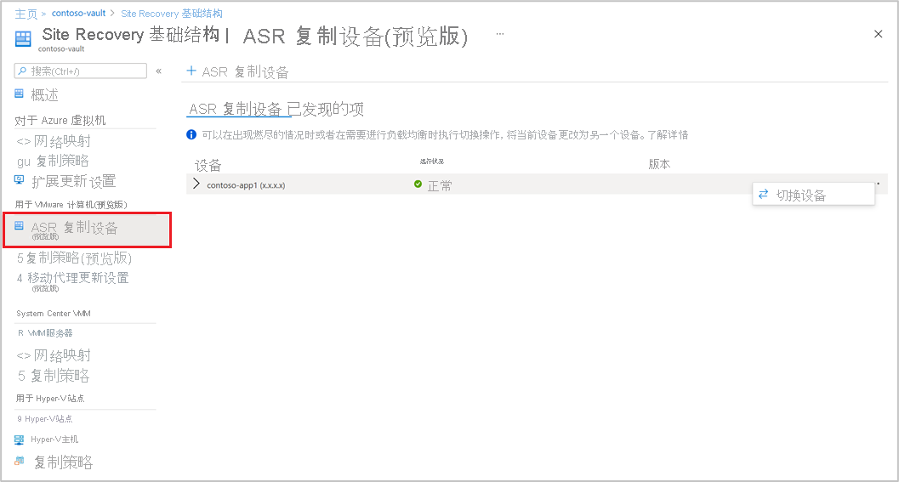

# 为本地 VMware VM 设置到 Azure 的灾难恢复 - 预览版

本文介绍如何使用 [Azure Site Recovery](site-recovery-overview.md) 服务的预览版启用本地 VMware VM 的复制，以便能够灾难恢复到 Azure。

有关如何在 Azure Site Recovery 经典版中设置灾难恢复的信息，请参阅[教程](vmware-azure-tutorial.md)。

本文是系列教程的第三篇文章，介绍如何为本地 VMware VM 设置到 Azure 的灾难恢复。 在上一篇教程中，我们已[准备本地 VMware 环境](vmware-azure-tutorial-prepare-on-premises.md)，以便能够灾难恢复到 Azure。

在本教程中，你将了解如何执行以下操作：

> [!div class="checklist"]
> * 设置源复制设置。
> * 设置复制目标。
> * 为 VMware VM 启用复制。

> [!NOTE]
> 教程介绍了某个方案的最简单部署路径。 它们尽可能使用默认选项，并且不显示所有可能的设置和路径。 有关详细说明，请查看 Site Recovery 目录的“操作指南”部分所列的文章。

## 入门

VMware 到 Azure 的复制包括以下过程：

- 登录到 [Azure 门户](https://portal.azure.com/)。
- 请首先导航到 [Azure 预览门户](https://aka.ms/rcmcanary)。 并执行以下部分详述的步骤。
- 准备 Azure 帐户
- 准备基础结构
- [创建恢复服务保管库](./quickstart-create-vault-template.md?tabs=CLI)
- [部署 Azure Site Recovery 复制设备](deploy-vmware-azure-replication-appliance-preview.md)
- 启用复制

## 准备 Azure 帐户

若要创建并注册 Azure Site Recovery 复制设备，需要具有以下权限的帐户：

- Azure 订阅的参与者或所有者权限。
- 用于注册 Azure Active Directory (AAD) 应用的权限。
- Azure 订阅上用于创建 Key Vault 的所有者或参与者以及用户访问管理员权限，在无代理 VMware 迁移期间使用。

如果你刚刚创建了免费的 Azure 帐户，那么你就是订阅的所有者。 如果你不是订阅所有者，请与所有者合作，获取所需权限。

使用以下步骤分配所需权限：

1. 在 Azure 门户中，搜索“订阅”，然后在“服务”下选择“订阅”搜索框，搜索所需的 Azure 订阅  。

2. 在“订阅页”上，选择已在其中创建恢复服务保管库的订阅。

3. 在“订阅”中，选择“访问控制”(IAM) >“检查访问权限” 。 在“检查访问权限”中，搜索相关的用户帐户。

4. 在“添加角色分配”中，选择“添加”，再选择参与者或所有者角色，然后选择帐户 。 然后选择“保存”。

5. 若要注册 Azure Site Recovery 复制设备，你的 Azure 帐户需要具有注册 AAD 应用的权限。

**按照以下步骤分配所需权限**：

1. 在 Azure 门户中，导航到“Azure Active Directory” > “用户” > “用户设置”  。 在“用户设置”中，验证 Azure AD 用户是否可以注册应用程序（默认情况下设置为“是”） 。

2. 如果“应用注册”设置为“否”，则须请求租户/全局管理员分配所需权限。 或者，租户/全局管理员可将“应用程序开发人员”角色分配给帐户，以允许注册 AAD 应用。

## 准备基础结构 - 设置 Azure Site Recovery 复制设备

你需要[在本地环境中设置 Azure Site Recovery 复制设备](deploy-vmware-azure-replication-appliance-preview.md)，用于传输移动代理通信。

## 启用 VMware VM 复制

将 Azure Site Recovery 复制设备添加到保管库后，便可开始保护计算机。

确保满足存储和网络的[先决条件](vmware-physical-azure-support-matrix.md)。

请按照下列步骤启用复制：

1. 在“入门”部分下，选择“Site Recovery” 。 在 VMware 部分下，单击“启用复制（预览版）”。

2. 选择要通过 Azure Site Recovery 保护的计算机类型。

   > [!NOTE]
   > 在预览版中，仅支持虚拟机。

   

3. 选择虚拟机后，选择已添加到 Azure Site Recovery 复制设备的 vCenter 服务器，该复制设备已在此保管库中注册。

4. 稍后，搜索源 VM 名称以保护你想保护的计算机。 若要查看所选的 VM，请选择“选定的资源”。

5. 选择 VM 列表后，选择“下一步”继续设置源。 此时选择复制设备和 VM 凭据。 在 VM 上，这些凭据会被配置服务器用于推送移动代理，以完成 Azure Site Recovery 的启用。 确保准确选择凭据。

   >[!NOTE]
   >对于 Linux OS，请确保提供根凭据。 对于 Windows OS，应添加具有管理员权限的用户帐户。 这些凭据将用于在启用复制操作期间将移动服务推送到源计算机上。

   

6. 选择“下一步”以提供目标区域属性。 默认选择保管库订阅和保管库资源组。 你可以选择想选的订阅和资源组。 将来执行故障转移时，源计算机会被部署到此订阅和资源组中。

   

7. 接下来，你可以选择一个现有的 Azure 网络或新建一个目标网络，以供在故障转移期间使用。 如果选择“新建”，系统会将你重定向到“创建虚拟网络上下文”边栏选项卡，并要求你提供地址空间和子网详细信息。 系统将在上一步所选的目标订阅和目标资源组中创建此网络。

8. 然后，请提供测试故障转移网络详细信息。

   > [!NOTE]
   > 请确保测试故障转移网络与故障转移网络有所不同。 这是为了确保在实际灾难发生时，可随时使用故障转移网络。

9. 选择存储。

    - 缓存存储帐户：现在，请选择缓存存储帐户，Azure Site Recovery 将该帐户用于暂存，也就是在将更改写入托管磁盘之前缓存和存储日志。

      默认情况下，Azure Site Recovery 将创建一个新的 LRS v1 类型的存储帐户，用于在保管库中首次启用复制操作。 对于后续操作，将重复使用相同的缓存存储帐户。
    -  托管磁盘

       默认情况下，在 Azure 中创建的是标准 HDD 托管磁盘。 你可以通过选择“自定义”来自定义托管磁盘的类型。 根据业务需求选择磁盘类型。 确保根据源计算机磁盘的 IOPS [选择适当的磁盘类型](../virtual-machines/disks-types.md#disk-comparison)。 有关定价信息，请参阅[此处](https://azure.microsoft.com/pricing/details/managed-disks/)的托管磁盘定价文档。

       >[!NOTE]
       > 如果在启用复制之前手动安装了移动服务，则可以在磁盘级别更改托管磁盘的类型。 另外，在计算机级别默认可选择一种托管磁盘类型

10. 根据需要创建新的复制策略。

     默认复制策略在保管库下创建，具有 72 小时的恢复点保留期和 4 小时的应用一致性频率。  你可以根据 RPO 要求，新建复制策略。

     - 选择“新建”。

     - 输入名称。

     - 输入恢复点保留期（小时）

     - 根据业务需求，选择应用一致性快照频率（小时）

     - 选择“确定”来保存策略。

     该策略会被创建，并可用于保护所选的源计算机。

11. 选择复制策略后，选择“下一步”。 查看源属性和目标属性。 选择“启用复制”以启动操作。

    

    创建了一个作业来启用所选计算机的复制。 若要跟踪进度，请导航到恢复服务保管库中的 Site Recovery 作业。

## 后续步骤
启用复制后，请运行演练以确保一切按预期进行。
> [!div class="nextstepaction"]
> [运行灾难恢复演练](site-recovery-test-failover-to-azure.md)