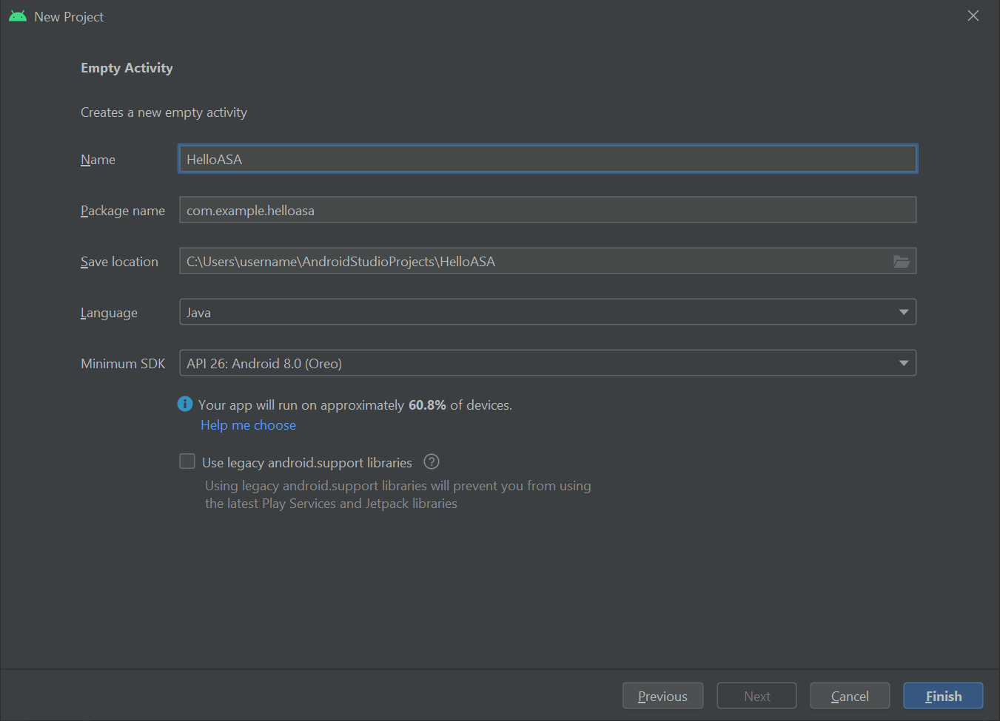
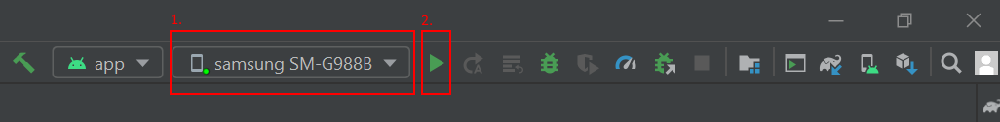

# <a name="tutorial-step-by-step-instructions-to-create-a-new-android-app-using-azure-spatial-anchors"></a>教程：有关使用 Azure 空间定位点创建新 Android 应用的分步说明

本教程介绍如何使用 Azure 空间定位点创建与 ARCore 功能集成的新 Android 应用。

## <a name="prerequisites"></a>先决条件

若要完成本教程，请确保做好以下准备：

- 具有 <a href="https://developer.android.com/studio/" target="_blank">Android Studio 3.4+</a> 的 Windows 或 macOS 计算机。
- <a href="https://developer.android.com/studio/debug/dev-options" target="_blank">支持开发人员</a>和 <a href="https://developers.google.com/ar/discover/supported-devices" target="_blank">ARCore 功能</a>的 Android 设备。

## <a name="getting-started"></a>入门

启动 Android Studio。 在“欢迎使用 Android Studio”窗口中，选择“启动新的 Android Studio 项目”。  
1. 选择“文件”->“新建项目” 。
1. 在“创建新项目”窗口中的“手机和平板电脑”部分下，选择“空活动”并单击“下一步”。   
1. 在“新建项目 - 空活动”窗口中，更改以下值：
   - 将“名称”、“包名称”和“保存位置”更改为所需值  
   - 将“语言”设置为 `Java`
   - 将“最小 API 级别”设置为 `API 26: Android 8.0 (Oreo)`
   - 将其他选项保持不变
   - 单击“完成”。 
1. “组件安装程序”随即运行。 经过某种处理后，Android Studio 将打开 IDE。



<!-- maybe snapshot here -->

## <a name="trying-it-out"></a>体验一下

若要测试新应用，请使用 USB 线缆将开发人员启用的设备连接到开发计算机。 在 Android Studio 右上方，选择已连接的设备，然后单击“运行应用”图标。 Android Studio 将在连接的设备上安装并启动该应用。 现在应会看到“Hello World!” 显示在设备上运行的应用中。 单击“运行”->“停止‘应用’”。 



## <a name="integrating-_arcore_"></a>集成 _ARCore_

<a href="https://developers.google.com/ar/discover/" target="_blank">_ARCore_</a> 是用于构建增强现实体验的 Google 平台，可让设备在移动时跟踪自身的位置，并建立自身对真实世界的理解。

修改 `app\manifests\AndroidManifest.xml`，以在根 `<manifest>` 节点中包含以下条目。 此代码片段的作用如下：

- 允许应用访问设备相机。
- 确保你的应用在 Google Play 商店中仅向支持 ARCore 的设备显示。
- 安装应用后，此代码片段会配置 Google Play 商店以下载并安装 ARCore（如果尚未安装）。

```xml
<manifest ...>

    <uses-permission android:name="android.permission.CAMERA" />
    <uses-feature android:name="android.hardware.camera.ar" />

    <application>
        ...
        <meta-data android:name="com.google.ar.core" android:value="required" />
        ...
    </application>

</manifest>
```

修改 `Gradle Scripts\build.gradle (Module: app)` 以包含以下条目。 此代码将确保应用面向 ARCore 版本 1.25。 完成此项更改后，Gradle 可能会发出一条通知，询问是否要同步：请单击“立即同步”。

```gradle
dependencies {
    ...
    implementation 'com.google.ar:core:1.25.0'
    ...
}
```

## <a name="integrating-_sceneform_"></a>集成 _Sceneform_

使用 [_Sceneform_](https://developers.google.com/sceneform/develop/) 能够轻松地在增强现实应用中渲染逼真的 3D 场景，且无需学习 OpenGL。

修改 `Gradle Scripts\build.gradle (Module: app)` 以包含以下条目。 此代码允许应用使用 Java 8 中的语言构造，而 `Sceneform` 要求使用此类构造。 它还将确保应用面向 `Sceneform` 版本 1.15。 完成此项更改后，Gradle 可能会发出一条通知，询问是否要同步：请单击“立即同步”。

```gradle
android {
    ...

    compileOptions {
        sourceCompatibility JavaVersion.VERSION_1_8
        targetCompatibility JavaVersion.VERSION_1_8
    }
}

dependencies {
    ...
    implementation 'com.google.ar.sceneform.ux:sceneform-ux:1.15.0'
    ...
}
```

打开 `app\res\layout\activity_main.xml`，将现有的 Hello Wolrd `<TextView ... />` 元素替换为以下 ArFragment。 此代码导致相机源显示在屏幕上，使 ARCore 能够跟踪设备在移动时所处的位置。


```xml
<fragment android:name="com.google.ar.sceneform.ux.ArFragment"
    android:id="@+id/ux_fragment"
    android:layout_width="match_parent"
    android:layout_height="match_parent" />
```

> [!NOTE]
> 若要查看主活动的原始 xml，请单击 Android Studio 右上方的“代码”或“拆分”按钮。

将应用[重新部署](#trying-it-out)到设备，以再次对其进行验证。 这一次，系统应会请求提供相机权限。 批准后，在屏幕上应会看到相机源渲染。

## <a name="place-an-object-in-the-real-world"></a>将对象放入真实世界

让我们使用该应用创建并放置一个对象。 首先，将以下 import 语句添加到 `app\java\<PackageName>\MainActivity`：

[!code-java[MainActivity](../../../includes/spatial-anchors-new-android-app-finished.md?range=21-23,27-33,17-18)]

然后，将以下成员变量添加到 `MainActivity` 类：

[!code-java[MainActivity](../../../includes/spatial-anchors-new-android-app-finished.md?range=47-52)]

接下来，将以下代码添加到 `app\java\<PackageName>\MainActivity` `onCreate()` 方法中。 此代码将挂接名为 `handleTap()` 的侦听器，当用户点击设备上的屏幕时，该侦听器可以检测到此动作。 如果恰好是在 ARCore 跟踪功能已识别到的表面上进行点击，则会运行该侦听器。

[!code-java[MainActivity](../../../includes/spatial-anchors-new-android-app-finished.md?range=63-69,80&highlight=6-7)]

最后，添加以下 `handleTap()` 方法，用于将所有元素关联到一起。 此方法将创建一个球体，并将其放在点击位置。 该球体最初为黑色，因为 `this.recommendedSessionProgress` 目前设置为零。 稍后将调整此值。

[!code-java[MainActivity](../../../includes/spatial-anchors-new-android-app-finished.md?range=159-167,179-180,183-192,209)]

将应用[重新部署](#trying-it-out)到设备，以再次对其进行验证。 此时，可以四处移动设备，让 ARCore 开始识别环境。 然后点击屏幕，以创建黑色球体并将其放在所选的表面上。

## <a name="attach-a-local-azure-spatial-anchor"></a>附加本地 Azure 空间定位点

修改 `Gradle Scripts\build.gradle (Module: app)` 以包含以下条目。 此示例代码片段面向 Azure 空间定位点 SDK 版本 2.10.2。 请注意，SDK 版本 2.7.0 是目前支持的最低版本，引用任何较新版本的 Azure 空间定位点也应能正常运行。 建议使用最新版本的 Azure 空间定位点 SDK。 你可在[此处](https://github.com/Azure/azure-spatial-anchors-samples/releases)找到 SDK 的版本说明。

```gradle
dependencies {
    ...
    implementation 'com.microsoft.azure.spatialanchors:spatialanchors_jni:[2.10.2]'
    implementation 'com.microsoft.azure.spatialanchors:spatialanchors_java:[2.10.2]'
    ...
}
```

如果面向 Azure 空间定位点 SDK 2.10.0 或更高版本，请在你项目的 `settings.gradle` 文件的 repositories 部分中包含以下条目。 这其中包括了 Maven 包源的 URL，该 URL 托管了适用于 SDK 2.10.0 或更高版本的 Azure 空间定位点 Android 包： 

```gradle
dependencyResolutionManagement {
    ...
    repositories {
        ...
        maven {
            url 'https://pkgs.dev.azure.com/aipmr/MixedReality-Unity-Packages/_packaging/Maven-packages/maven/v1'
        }
        ...
    }
}
```

右键单击 `app\java\<PackageName>`->“新建”->“Java 类”。  将“名称”设置为 MyFirstApp，并设置“类”。 将创建名为 `MyFirstApp.java` 的文件。 将以下 import 语句添加到该文件：

```java
import com.microsoft.CloudServices;
```

将 `android.app.Application` 定义为其超类。
```java
public class MyFirstApp extends android.app.Application {...
```

然后，在新的 `MyFirstApp` 类中添加以下代码，以确保使用应用程序的上下文初始化 Azure 空间定位点。

```java
    @Override
    public void onCreate() {
        super.onCreate();
        CloudServices.initialize(this);
    }
```

现在修改 `app\manifests\AndroidManifest.xml`，以在根 `<application>` 节点中包含以下条目。 此代码将创建的 Application 类挂接到应用中。

```xml
    <application
        android:name=".MyFirstApp"
        ...
    </application>
```

返回到 `app\java\<PackageName>\MainActivity`，在其中添加以下 import 语句：

[!code-java[MainActivity](../../../includes/spatial-anchors-new-android-app-finished.md?range=17,16,18,24,26,35,36,38&highlight=2-8)]

然后，将以下成员变量添加到 `MainActivity` 类：

[!code-java[MainActivity](../../../includes/spatial-anchors-new-android-app-finished.md?range=52-56&highlight=3-5)]

接下来，在 `mainActivity` 类中添加以下 `initializeSession()` 方法。 调用该方法后，它会确保在启动应用期间创建并正确初始化 Azure 空间定位点会话。 此代码通过提前返回来确保通过 `cloudSession.setSession` 调用传递到 ASA 会话的 sceneview 会话不为空。

[!code-java[MainActivity](../../../includes/spatial-anchors-new-android-app-finished.md?range=92-107,155)]

由于 `initializeSession()` 在 sceneView 会话尚未设置时（即，如果 `sceneView.getSession()` 为 null）可以进行提前返回，因此我们会添加 onUpdate 调用，以确保在创建 sceneView 会话后初始化 ASA 会话。
[!code-java[MainActivity](../../../includes/spatial-anchors-new-android-app-finished.md?name=scene_OnUpdate)]

现在，将 `initializeSession()` 和 `scene_OnUpdate(...)` 方法挂接到 `onCreate()` 方法。 另外，请确保将相机源中的帧发送到 Azure 空间定位点 SDK 进行处理。

[!code-java[MainActivity](../../../includes/spatial-anchors-new-android-app-finished.md?range=63-80&highlight=9-17)]

最后，将以下代码添加到 `handleTap()` 方法中。 此代码将本地 Azure 空间定位点附加到要放入真实世界的黑色球体。

[!code-java[MainActivity](../../../includes/spatial-anchors-new-android-app-finished.md?range=159-167,179-192,209&highlight=12-13)]

再次[重新部署](#trying-it-out)应用。 四处移动设备，点击屏幕，然后放置黑色球体。 不过，代码这一次会创建本地 Azure 空间定位点并将其附加到球体。

在继续进一步的操作之前，需要创建 Azure 空间定位点帐户以获取帐户标识符、密钥和域（如果尚未创建）。 遵循以下部分获取这些信息。

[!INCLUDE [Create Spatial Anchors resource](../../../includes/spatial-anchors-get-started-create-resource.md)]

## <a name="upload-your-local-anchor-into-the-cloud"></a>将本地定位点上传到云中

创建 Azure 空间定位点帐户标识符、密钥和域后，可以返回到 `app\java\<PackageName>\MainActivity` 并在其中添加以下 import 语句：

[!code-java[MainActivity](../../../includes/spatial-anchors-new-android-app-finished.md?range=38-43&highlight=3-6)]

然后，将以下成员变量添加到 `MainActivity` 类：

[!code-java[MainActivity](../../../includes/spatial-anchors-new-android-app-finished.md?range=56-61&highlight=3-6)]

现在，将以下代码添加到 `initializeSession()` 方法中。 首先，此代码允许应用监视 Azure 空间定位点 SDK 从相机源收集帧的进度。 在收集期间，球体颜色将从最初的黑色开始变为灰色。 收集到足够的帧，可将定位点提交到云中之后，球体将变为白色。 其次，此代码将提供所需的凭据来与云后端通信。 可在以下位置将应用配置为使用你的帐户标识符、密钥和域。 在[设置空间定位点资源](#create-a-spatial-anchors-resource)时，将它们复制到文本编辑器中。

[!code-java[MainActivity](../../../includes/spatial-anchors-new-android-app-finished.md?range=92-130,151-155&highlight=17-43)]

接下来，在 `mainActivity` 类中添加以下 `uploadCloudAnchorAsync()` 方法。 调用此方法后，它会以异步方式等到从设备中收集了足够的帧为止。 收集到足够的帧后，此方法会立即将球体颜色切换为黄色，然后开始将本地 Azure 空间定位点上传到云中。 上传完成后，该代码会返回定位标识符。

[!code-java[MainActivity](../../../includes/spatial-anchors-new-android-app-finished.md?name=uploadCloudAnchorAsync)]

最后，让我们将所有元素挂接到一起。 在 `handleTap()` 方法中添加以下代码。 创建球体后，此代码将立即调用 `uploadCloudAnchorAsync()` 方法。 该方法返回后，以下代码将对球体执行一次最终更新，将其颜色更改为蓝色。

[!code-java[MainActivity](../../../includes/spatial-anchors-new-android-app-finished.md?range=159-167,179-209&highlight=26-39)]

再次[重新部署](#trying-it-out)应用。 四处移动设备，点击屏幕，然后放置球体。 不过，这一次，在收集相机帧的过程中，球体颜色将从黑色更改为白色。 收集到足够的帧后，球体将变为黄色，并且云上传操作将会开始。 请确保你的手机已连接到 Internet。 上传完成后，球体将变为蓝色。 （可选）可以在 Android Studio 中监视 `Logcat` 窗口以查看应用发送的日志消息。 记录的消息示例包括帧捕获期间的会话进度，以及上传完成后由云返回的定位点标识符。

> [!NOTE]
> 如果未看到 `recommendedSessionProgress` 值（在调试日志中称为 `Session progress`），请确保在放置的球体周围移动和旋转手机。


## <a name="locate-your-cloud-spatial-anchor"></a>查找云空间定位点

将定位点上传到云后，可以再次尝试查找该定位点。 首先，将以下 import 语句添加到代码中。

[!code-java[MainActivity](../../../includes/spatial-anchors-new-android-app-finished.md?range=43,44,34,37&highlight=3-4)]

然后，将以下代码添加到 `handleTap()` 方法中。 此代码将会：

- 从屏幕中删除现有的蓝色球体。
- 再次初始化 Azure 空间定位点会话。 此操作确保要查找的定位点来自云，而不是创建的本地定位点。
- 针对上传到云的定位点发出查询。

[!code-java[MainActivity](../../../includes/spatial-anchors-new-android-app-finished.md?name=handleTap&highlight=10-19)]

现在，让我们挂接在找到要查询的定位点之后所要调用的代码。 在 `initializeSession()` 方法中添加以下代码。 找到云空间定位点后，此代码片段将创建并放置一个绿色球体。 它还支持再次点击屏幕，以便可以再次重复整个方案：创建另一个本地定位点，将其上传，然后再次找到它。

[!code-java[MainActivity](../../../includes/spatial-anchors-new-android-app-finished.md?name=initializeSession&highlight=40-59)]

就这么简单！ 最后一次[重新部署](#trying-it-out)应用，以从头到尾体验整个方案。 四处移动设备，并放置黑色球体。 然后，不断移动设备以捕获相机帧，直到球体变为黄色。 本地定位点将会上传，球体将变为蓝色。 最后，再次点击屏幕以删除本地定位点，然后查询该定位点在云中的对应定位点。 继续移动设备，直到找到云空间定位点。 绿色球体应会显示在正确的位置；可以再次清除并重复整个方案。

## <a name="putting-everything-together"></a>将所有内容放在一起

下面是将所有不同的元素放在一起后，完整的 `MainActivity` 类文件看起来的样子。 可以将它用做参考与自己的文件进行比较，看是否有任何差异。

[!INCLUDE [Share Anchors Sample Prerequisites](../../../includes/spatial-anchors-new-android-app-finished.md)]

## <a name="next-steps"></a>后续步骤

本教程介绍了如何使用 Azure 空间定位点创建与 ARCore 功能集成的新 Android 应用。 若要了解有关 Azure 空间定位点库的详细信息，请继续阅读我们有关如何创建并找到定位点的教程。

> [!div class="nextstepaction"]
> [使用 Azure 空间定位点创建并找到定位点](../../../articles/spatial-anchors/create-locate-anchors-overview.md)