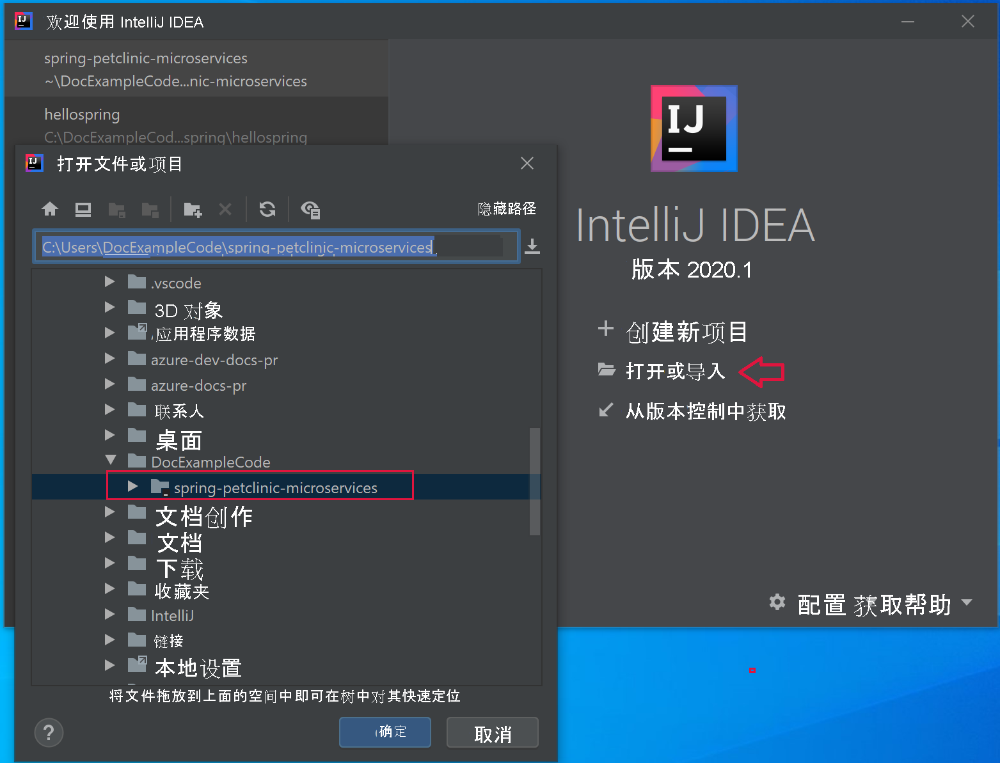
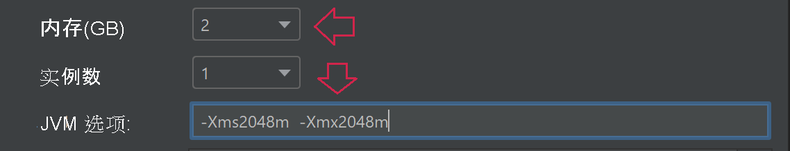
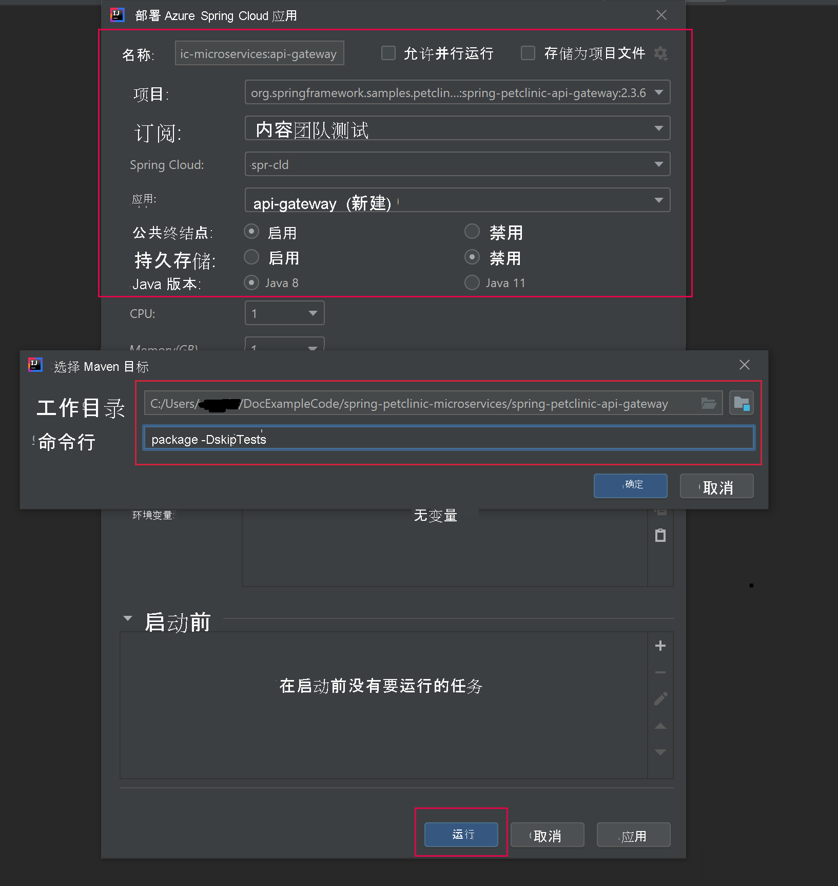

# <a name="quickstart-build-and-deploy-apps-to-azure-spring-cloud"></a>快速入门：生成应用并将其部署到 Azure Spring Cloud

::: zone pivot="programming-language-csharp"
在本快速入门中，你会使用 Azure CLI 生成微服务应用程序并将其部署到 Azure Spring Cloud。

## <a name="prerequisites"></a>必备知识

* 完成此系列中前面的快速入门：

  * [预配 Azure Spring Cloud 服务](./quickstart-provision-service-instance.md)。
  * [设置 Azure Spring Cloud 配置服务器](./quickstart-setup-config-server.md)。

## <a name="download-the-sample-app"></a>下载示例应用

如果你到目前为止一直在使用 Azure Cloud Shell，请切换到本地命令提示符以执行以下步骤。

1. 创建一个新文件夹，并克隆示例应用存储库。

   ```console
   mkdir source-code
   ```

   ```console
   cd source-code
   ```

   ```console
   git clone https://github.com/Azure-Samples/Azure-Spring-Cloud-Samples
   ```

1. 导航到存储库目录中。

   ```console
   cd Azure-Spring-Cloud-Samples
   ```

## <a name="deploy-planetweatherprovider"></a>部署 PlanetWeatherProvider

1. 在 Azure Spring Cloud 实例中为 PlanetWeatherProvider 项目创建应用。

   ```azurecli
   az spring-cloud app create --name planet-weather-provider --runtime-version NetCore_31
   ```

   为了启用自动服务注册，为应用提供了与项目 appsettings.json 文件中的 `spring.application.name` 值相同的名称：

   ```json
   "spring": {
     "application": {
       "name": "planet-weather-provider"
     }
   }
   ```

   此命令可能需要几分钟才能运行。

1. 将目录切换到 `PlanetWeatherProvider` 项目文件夹。

   ```console
   cd steeltoe-sample/src/planet-weather-provider
   ```

1. 创建要部署的二进制文件和 .zip 文件。

   ```console
   dotnet publish -c release -o ./publish
   ```

   > [!TIP]
   > 项目文件包含以下 XML，以便在将二进制文件写入 ./publish 文件夹之后，将它们打包为 .zip 文件 ：
   >
   > ```xml
   > <Target Name="Publish-Zip" AfterTargets="Publish">
   >   <ZipDirectory SourceDirectory="$(PublishDir)" DestinationFile="$(MSBuildProjectDirectory)/publish-deploy-planet.zip" Overwrite="true" />
   > </Target>
   > ```

1. 部署到 Azure。

   运行以下命令之前，请确保命令提示符处于项目文件夹中。

   ```console
   az spring-cloud app deploy -n planet-weather-provider --runtime-version NetCore_31 --main-entry Microsoft.Azure.SpringCloud.Sample.PlanetWeatherProvider.dll --artifact-path ./publish-deploy-planet.zip
   ```

   `--main-entry` 选项指定从 .zip 文件的根文件夹到包含应用程序入口点的 .dll 文件的相对路径。 服务上传 .zip 文件之后，它会提取所有文件和文件夹，并尝试执行指定 .dll 文件中的入口点。

   此命令可能需要几分钟才能运行。

## <a name="deploy-solarsystemweather"></a>部署 SolarSystemWeather

1. 这次在 Azure Spring Cloud 实例中为 SolarSystemWeather 项目创建另一个应用：

   ```azurecli
   az spring-cloud app create --name solar-system-weather --runtime-version NetCore_31
   ```

   `solar-system-weather` 是在 `SolarSystemWeather` 项目的 appsettings.json 文件中指定的名称。

   此命令可能需要几分钟才能运行。

1. 将目录切换到 `SolarSystemWeather` 项目。

   ```console
   cd ../solar-system-weather
   ```

1. 创建要部署的二进制文件和 .zip 文件。

   ```console
   dotnet publish -c release -o ./publish
   ```

1. 部署到 Azure。

   ```console
   az spring-cloud app deploy -n solar-system-weather --runtime-version NetCore_31 --main-entry Microsoft.Azure.SpringCloud.Sample.SolarSystemWeather.dll --artifact-path ./publish-deploy-solar.zip
   ```

   此命令可能需要几分钟才能运行。

## <a name="assign-public-endpoint"></a>分配公共终结点

若要测试应用程序，请通过浏览器将 HTTP GET 请求发送到 `solar-system-weather` 应用程序。  为此，需要一个公共终结点以用于请求。

1. 若要分配终结点，请运行以下命令。

   ```azurecli
   az spring-cloud app update -n solar-system-weather --assign-endpoint true
   ```

1. 若要获取终结点的 URL，请运行以下命令。

   Windows:

   ```azurecli
   az spring-cloud app show -n solar-system-weather -o table
   ```

   Linux：

   ```azurecli
   az spring-cloud app show --name solar-system-weather | grep url
   ```

## <a name="test-the-application"></a>测试应用程序

将 GET 请求发送到 `solar-system-weather` 应用。 在浏览器中，导航到末尾追加了 `/weatherforecast` 的公共 URL。 例如： `https://servicename-solar-system-weather.azuremicroservices.io/weatherforecast`

输出为 JSON：

```json
[{"Key":"Mercury","Value":"very warm"},{"Key":"Venus","Value":"quite unpleasant"},{"Key":"Mars","Value":"very cool"},{"Key":"Saturn","Value":"a little bit sandy"}]
```

此响应显示两个微服务应用程序都在运行。 `SolarSystemWeather` 应用返回从 `PlanetWeatherProvider` 应用检索的数据。
::: zone-end
---
::: zone pivot="programming-language-java"
本文档说明如何使用以下内容生成微服务应用程序并将其部署到 Azure Spring Cloud：
* Azure CLI
* Maven 插件
* Intellij

在使用 Azure CLI 或 Maven 进行部署之前，请完成[预配 Azure Spring Cloud 实例](./quickstart-provision-service-instance.md)和[设置配置服务器](./quickstart-setup-config-server.md)的示例。

## <a name="prerequisites"></a>先决条件

* [安装 JDK 8](/java/azure/jdk/)
* [注册 Azure 订阅](https://azure.microsoft.com/free/)
* （可选）[安装 Azure CLI 版本 2.0.67 或更高版本](/cli/azure/install-azure-cli)，并使用以下命令安装 Azure Spring Cloud 扩展：`az extension add --name spring-cloud`
* （可选）[安装 Azure Toolkit for IntelliJ](https://plugins.jetbrains.com/plugin/8053-azure-toolkit-for-intellij/) 并[登录](/azure/developer/java/toolkit-for-intellij/create-hello-world-web-app#installation-and-sign-in)

## <a name="deployment-procedures"></a>部署过程

#### <a name="cli"></a>[CLI](#tab/Azure-CLI)

## <a name="build-the-microservices-applications-locally"></a>在本地构建微服务应用程序

1. 将示例应用存储库克隆到你的 Azure 云帐户。  更改目录并生成项目。

    ```azurecli
    git clone https://github.com/azure-samples/spring-petclinic-microservices
    cd spring-petclinic-microservices
    mvn clean package -DskipTests -Denv=cloud
    ```

编译项目需要 5 至 10 分钟时间。 完成后，相应的文件夹中应会包含每个服务的各个 JAR 文件。

## <a name="create-and-deploy-apps-on-azure-spring-cloud"></a>生成应用并将其部署到 Azure Spring Cloud

1. 如果在前面的快速入门中没有运行以下命令，请设置 CLI 默认值。

    ```azurecli
    az configure --defaults group=<resource group name> spring-cloud=<service name>
    ```

1. 创建 PetClinic 的 2 核微服务：API 网关和客户服务。

    ```azurecli
    az spring-cloud app create --name api-gateway --instance-count 1 --memory 2 --assign-endpoint
    az spring-cloud app create --name customers-service --instance-count 1 --memory 2
    ```

1. 部署上一步骤中生成的 JAR 文件。

    ```azurecli
    az spring-cloud app deploy --name api-gateway --jar-path spring-petclinic-api-gateway/target/spring-petclinic-api-gateway-2.3.6.jar --jvm-options="-Xms2048m -Xmx2048m"
    az spring-cloud app deploy --name customers-service --jar-path spring-petclinic-customers-service/target/spring-petclinic-customers-service-2.3.6.jar --jvm-options="-Xms2048m -Xmx2048m"
    ```

1. 在部署后通过以下命令查询应用状态。

    ```azurecli
    az spring-cloud app list -o table
    ```

    ```azurecli
        Name               Location    ResourceGroup    Production Deployment    Public Url                                           Provisioning Status    CPU    Memory    Running Instance    Registered Instance    Persistent Storage
    -----------------  ----------  ---------------  -----------------------  ---------------------------------------------------  ---------------------  -----  --------  ------------------  ---------------------  --------------------
    api-gateway        eastus      xxxxxx-sp         default                  https://<service name>-api-gateway.azuremicroservices.io   Succeeded              1      2         1/1                 1/1                    -
    customers-service  eastus      <service name>         default                                                                       Succeeded              1      2         1/1                 1/1                    -
    ```

## <a name="verify-the-services"></a>验证服务

使用如上所示的公共 URL（格式为 `https://<service name>-api-gateway.azuremicroservices.io`）从浏览器访问应用网关和客户服务。


> [!TIP]
> 若要对部署进行故障排除，可以使用以下命令在每次应用运行 `az spring-cloud app logs --name <app name> -f` 时实时获取日志流式处理。

## <a name="deploy-extra-apps"></a>部署额外的应用

若要让 PetClinic 应用正常运行所有功能（如“管理服务器”、“访问”和“兽医”功能），可以通过以下命令部署其他应用：

```azurecli
az spring-cloud app create --name admin-server --instance-count 1 --memory 2 --assign-endpoint
az spring-cloud app create --name vets-service --instance-count 1 --memory 2
az spring-cloud app create --name visits-service --instance-count 1 --memory 2
az spring-cloud app deploy --name admin-server --jar-path spring-petclinic-admin-server/target/spring-petclinic-admin-server-2.3.6.jar --jvm-options="-Xms2048m -Xmx2048m"
az spring-cloud app deploy --name vets-service --jar-path spring-petclinic-vets-service/target/spring-petclinic-vets-service-2.3.6.jar --jvm-options="-Xms2048m -Xmx2048m"
az spring-cloud app deploy --name visits-service --jar-path spring-petclinic-visits-service/target/spring-petclinic-visits-service-2.3.6.jar --jvm-options="-Xms2048m -Xmx2048m"
```

#### <a name="maven"></a>[Maven](#tab/Maven)

## <a name="build-the-microservices-applications-locally"></a>在本地构建微服务应用程序

1. 将示例应用存储库克隆到你的 Azure 云帐户。  更改目录并生成项目。

    ```azurecli
    git clone https://github.com/azure-samples/spring-petclinic-microservices
    cd spring-petclinic-microservices
    mvn clean package -DskipTests -Denv=cloud
    ```

编译项目需要 5 至 10 分钟时间。 完成后，相应的文件夹中应会包含每个服务的各个 JAR 文件。

## <a name="generate-configurations-and-deploy-to-the-azure-spring-cloud"></a>生成配置并将其部署到 Azure Spring Cloud

1. 通过在包含父 POM 的 PetClinic 的根文件夹中运行以下命令来生成配置。 如果已使用 Azure CLI 登录，则该命令将自动提取凭据。 否则，它将提示你登录。 有关详细信息，请参阅我们的 [wiki 页面](https://github.com/microsoft/azure-maven-plugins/wiki/Authentication)。

    ```azurecli
    mvn com.microsoft.azure:azure-spring-cloud-maven-plugin:1.6.0:config
    ```

    系统会提示你选择：

    * **模块：** 选择 `api-gateway` 和 `customers-service`。
    * **订阅：** 这是用于创建 Azure Spring Cloud 实例的订阅。
    * **服务实例：** 这是 Azure Spring Cloud 实例的名称。
    * **公共终结点：** 在提供的项目列表中，输入与 `api-gateway` 对应的数字。  这使其具有公共访问权限。

1. 验证 POM 文件中的 `appName` 元素是否正确：

    ```xml
    <build>
        <plugins>
            <plugin>
                <groupId>com.microsoft.azure</groupId>
                <artifactId>azure-spring-cloud-maven-plugin</artifactId>
                <version>1.6.0</version>
                <configuration>
                    <subscriptionId>xxxxxxxxx-xxxx-xxxx-xxxxxxxxxxxx</subscriptionId>
                    <clusterName>v-spr-cld</clusterName>
                    <appName>customers-service</appName>

    ```

    请确保 `appName` 文本与以下内容匹配，根据需要删除任何前缀并保存文件：
    * api-gateway
    * customers-service

1. POM 现包含插件依赖项和配置。 使用以下命令部署应用。

    ```azurecli
    mvn azure-spring-cloud:deploy
    ```

## <a name="verify-the-services"></a>验证服务

成功的部署命令将返回以下格式的 URL：`https://<service name>-spring-petclinic-api-gateway.azuremicroservices.io`。 使用该 URL 导航到正在运行的服务。


还可以导航 Azure 门户以查找 URL。

1. 导航到服务。
2. 选择“应用”  。
3. 选择 api-gateway。
4. 在“api-gateway | 概述”页面上查找 URL。

## <a name="deploy-extra-apps"></a>部署额外的应用

若要让 PetClinic 应用正常运行所有功能（如“管理服务器”、“访问”和“兽医”功能），可以部署其他微服务。 重新运行配置命令并选择以下微服务。

* admin-server
* vets-service
* visits-service

为上述模块更正每个 `pom.xml` 中的应用名称，然后再次运行 `deploy` 命令。

#### <a name="intellij"></a>[IntelliJ](#tab/IntelliJ)

## <a name="import-sample-project-in-intellij"></a>导入 IntelliJ 中的示例项目

1. 下载本教程的源存储库并将其解压缩，或使用 Git: `git clone https://github.com/azure-samples/spring-petclinic-microservices` 克隆它

1. 打开 IntelliJ 的“欢迎”对话框，选择“导入项目”以打开导入向导 。

1. 选择 `spring-petclinic-microservices` 文件夹。

    

### <a name="deploy-api-gateway-app-to-azure-spring-cloud"></a>将 api-gateway 应用部署到 Azure Spring Cloud

若要部署到 Azure，必须通过 Azure Toolkit for IntelliJ 使用 Azure 帐户登录，然后选择你的订阅。 有关登录的详细信息，请参阅[安装和登录](/azure/developer/java/toolkit-for-intellij/create-hello-world-web-app#installation-and-sign-in)。

1. 在 IntelliJ 项目资源管理器中右键单击你的项目，选择“Azure” -> “部署到 Azure Spring Cloud”。 

    

1. 在“名称”字段中，将“:api-gateway”追加到现有“名称”。
1. 在“项目”文本框中，选择“spring-petclinic-api-gateway-2.3.6”。
1. 在“订阅”文本框中，验证订阅。
1. 在“Spring Cloud”文本框中，选择你在[预配 Azure Spring Cloud 实例](./quickstart-provision-service-instance.md)中创建的 Azure Spring Cloud 实例。
1. 将“公共终结点”设置为“启用”。
1. 在“应用:”文本框中，选择“创建应用…” 。
1. 输入 api-gateway，然后选择“确定”。
1. 将内存指定为 2 GB 并指定 JVM 选项：`-Xms2048m -Xmx2048m`。

    

1. 在对话框的“启动之前”部分中，双击“运行 Maven 目标”。
1. 在“工作目录”文本框中，导航到“spring-petclinic-microservices/gateway”文件夹。
1. 在“命令行”文本框中，输入“package -DskipTests”。 选择“确定”。

    

1. 选择“部署 Azure Spring Cloud 应用”对话框底部的“运行”按钮，开始部署 。 此插件会对 `api-gateway` 应用运行命令 `mvn package`，然后部署由 `package` 命令生成的 jar。

### <a name="deploy-customers-service-and-other-apps-to-azure-spring-cloud"></a>将 customers-service 和其他应用部署到 Azure Spring Cloud

可以重复上述步骤，将 `customers-service` 和其他 PetClinic 应用部署到 Azure Spring Cloud：

1. 修改“名称”和“项目”以标识 `customers-service` 应用 。
1. 在“应用:”文本框中，选择“创建应用…”以创建 `customers-service` 应用 。
1. 验证“公用终结点”选项是否设置为“禁用”。
1. 在对话框的“启动之前”部分中，将“工作目录”切换到“petclinic/customers-service”文件夹 。
1. 选择“部署 Azure Spring Cloud 应用”对话框底部的“运行”按钮，开始部署 。

## <a name="verify-the-services"></a>验证服务

导航到以下格式的 URL：`https://<service name>-spring-petclinic-api-gateway.azuremicroservices.io`


还可以导航 Azure 门户以查找 URL。

1. 导航到服务
2. 选择“应用”
3. 选择“api-gateway”
4. 在“api-gateway | 概述”页上查找 URL

## <a name="deploy-extra-apps"></a>部署额外的应用

在此示例中包含的其他微服务可以按同样的方式进行部署。

* admin-server
* vets-service
* visits-service

::: zone-end

## <a name="next-steps"></a>后续步骤

在此快速入门中，你创建了 Azure 资源，如果这些资源保留在订阅中，将继续产生费用。 如果不打算继续学习下一个快速入门，请参阅[清理资源](./quickstart-logs-metrics-tracing.md#clean-up-resources)。 否则，请继续学习下一个快速入门：

> [!div class="nextstepaction"]
> [日志、指标和跟踪](./quickstart-logs-metrics-tracing.md)
