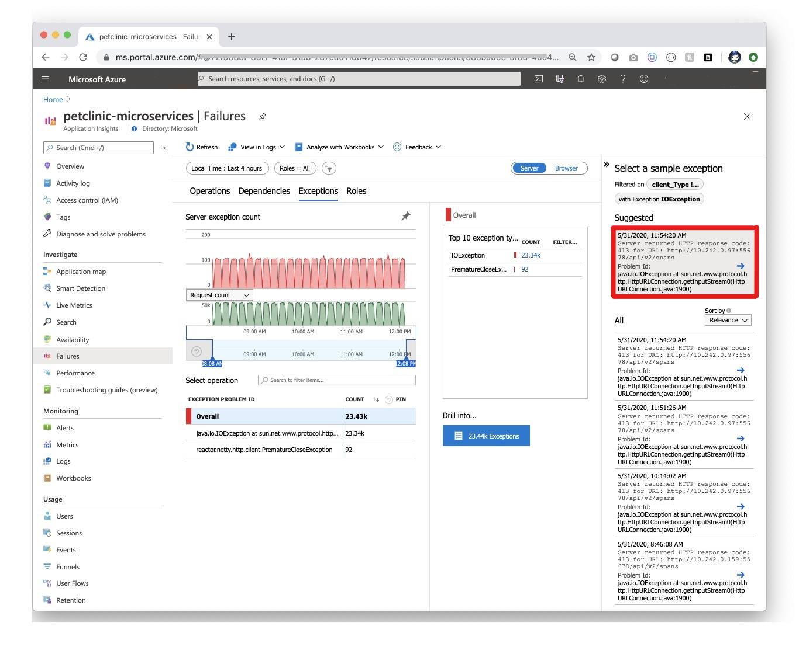

# <a name="quickstart-monitoring-azure-spring-cloud-apps-with-logs-metrics-and-tracing"></a>快速入门：通过日志、指标和跟踪来监视 Azure Spring Cloud 应用

::: zone pivot="programming-language-csharp"
使用 Azure Spring Cloud 中的内置监视功能，可以调试和监视复杂问题。 Azure Spring Cloud 将 Steeltoe [分布式跟踪](https://docs.steeltoe.io/api/v3/tracing/) 与 Azure 的 [Application Insights](../azure-monitor/app/app-insights-overview.md) 集成。 这种集成可以通过 Azure 门户提供强大的日志、指标和分布式跟踪功能。

以下过程说明如何通过你在前面快速入门中部署的示例应用使用日志流式处理、Log Analytics、指标和分布式跟踪。

## <a name="prerequisites"></a>先决条件

* 完成此系列中前面的快速入门：

  * [预配 Azure Spring Cloud 服务](./quickstart-provision-service-instance.md)。
  * [设置 Azure Spring Cloud 配置服务器](./quickstart-setup-config-server.md)。
  * [构建和部署应用](./quickstart-deploy-apps.md)。

## <a name="logs"></a>日志

可以通过两种方式在 Azure Spring Cloud 上查看日志：每个应用实例的实时日志的日志流式处理或具有高级查询功能的聚合日志的 Log Analytics 。

### <a name="log-streaming"></a>日志流式处理

可以通过以下命令在 Azure CLI 中使用日志流式处理。

```azurecli
az spring-cloud app logs -n solar-system-weather -f
```

将会看到类似于以下示例的输出：

```output
=> ConnectionId:0HM2HOMHT82UK => RequestPath:/weatherforecast RequestId:0HM2HOMHT82UK:00000003, SpanId:|e8c1682e-46518cc0202c5fd9., TraceId:e8c1682e-46518cc0202c5fd9, ParentId: => Microsoft.Azure.SpringCloud.Sample.SolarSystemWeather.Controllers.WeatherForecastController.Get (Microsoft.Azure.SpringCloud.Sample.SolarSystemWeather)
Executing action method Microsoft.Azure.SpringCloud.Sample.SolarSystemWeather.Controllers.WeatherForecastController.Get (Microsoft.Azure.SpringCloud.Sample.SolarSystemWeather) - Validation state: Valid
←[40m←[32minfo←[39m←[22m←[49m: Microsoft.Azure.SpringCloud.Sample.SolarSystemWeather.Controllers.WeatherForecastController[0]

=> ConnectionId:0HM2HOMHT82UK => RequestPath:/weatherforecast RequestId:0HM2HOMHT82UK:00000003, SpanId:|e8c1682e-46518cc0202c5fd9., TraceId:e8c1682e-46518cc0202c5fd9, ParentId: => Microsoft.Azure.SpringCloud.Sample.SolarSystemWeather.Controllers.WeatherForecastController.Get (Microsoft.Azure.SpringCloud.Sample.SolarSystemWeather)
Retrieved weather data from 4 planets
←[40m←[32minfo←[39m←[22m←[49m: Microsoft.AspNetCore.Mvc.Infrastructure.ControllerActionInvoker[2]

=> ConnectionId:0HM2HOMHT82UK => RequestPath:/weatherforecast RequestId:0HM2HOMHT82UK:00000003, SpanId:|e8c1682e-46518cc0202c5fd9., TraceId:e8c1682e-46518cc0202c5fd9, ParentId: => Microsoft.Azure.SpringCloud.Sample.SolarSystemWeather.Controllers.WeatherForecastController.Get (Microsoft.Azure.SpringCloud.Sample.SolarSystemWeather)
Executing ObjectResult, writing value of type 'System.Collections.Generic.KeyValuePair`2[[System.String, System.Private.CoreLib, Version=4.0.0.0, Culture=neutral, PublicKeyToken=7cec85d7bea7798e],[System.String, System.Private.CoreLib, Version=4.0.0.0, Culture=neutral, PublicKeyToken=7cec85d7bea7798e]][]'.
←[40m←[32minfo←[39m←[22m←[49m: Microsoft.AspNetCore.Mvc.Infrastructure.ControllerActionInvoker[2]
```

> [!TIP]
> 使用 `az spring-cloud app logs -h` 浏览更多参数和日志流功能。

### <a name="log-analytics"></a>Log Analytics

1. 在 Azure 门户中转到“服务 | 概览”页，然后在“监视”部分选择“日志”  。 选择 Azure Spring Cloud 的一个示例查询上的“运行”。

   [  ](media/spring-cloud-quickstart-logs-metrics-tracing/logs-entry.png#lightbox)

1. 编辑查询以删除将显示限制为警告和错误日志的 Where 子句。

1. 然后选择 `Run`，随即会显示日志。 有关编写查询的更多指导，请参阅 [Azure Logs Analytics 文档](../azure-monitor/logs/get-started-queries.md)。

   [  ](media/spring-cloud-quickstart-logs-metrics-tracing/logs-query-steeltoe.png#lightbox)

1. 若要详细了解 Log Analytics 中使用的查询语言，请参阅 [Azure Monitor 日志查询](/azure/data-explorer/kusto/query/)。 要从一个集中的客户端查询所有 Log Analytics 日志，请查看 [Azure 数据资源管理器](/azure/data-explorer/query-monitor-data)。

## <a name="metrics"></a>指标

1. 在 Azure 门户中转到“服务 | 概述”页，然后在“监视”部分中选择“指标”  。 添加第一个指标（方法是：在“性能(.NET)”或“请求(.NET)”下的“指标”下拉框中选择 .NET 指标之一，并在“聚合”中选择 `Avg`）以查看该指标的时间线。

   [  ](media/spring-cloud-quickstart-logs-metrics-tracing/metrics-basic-cpu-steeltoe.png#lightbox)

1. 选择工具栏中的“添加筛选器”，选择 `App=solar-system-weather`，以仅查看“solar-system-weather”应用的 CPU 使用情况 。

   [  ](media/spring-cloud-quickstart-logs-metrics-tracing/metrics-filter-steeltoe.png#lightbox)

1. 关闭在前一步中创建的筛选器，选择“应用拆分”，然后为“值”选择 `App` 以查看不同应用的 CPU 使用情况 。

   [  ](media/spring-cloud-quickstart-logs-metrics-tracing/metrics-split-steeltoe.png#lightbox)

## <a name="distributed-tracing"></a>分布式跟踪

1. 在Azure 门户中转到“服务 | 概述”页，然后在“监视”部分中选择“分布式跟踪”  。 然后选择右侧的“查看应用程序映射”选项卡。

   [  ](media/spring-cloud-quickstart-logs-metrics-tracing/tracing-entry.png#lightbox)

1. 现在可以查看应用间的调用状态。

   [  ](media/spring-cloud-quickstart-logs-metrics-tracing/tracing-overview-steeltoe.png#lightbox)

1. 选择“solar-system-weather”和“planet-weather-provider”之间的链接，查看更多详细信息，如最慢的 HTTP 方法调用 。

   [  ](media/spring-cloud-quickstart-logs-metrics-tracing/tracing-call-steeltoe.png#lightbox)

1. 最后，选择“调查性能”以探索更强大的内置性能分析。

   [  ](media/spring-cloud-quickstart-logs-metrics-tracing/tracing-performance-steeltoe.png#lightbox)
::: zone-end

::: zone pivot="programming-language-java"
使用 Azure Spring Cloud 中的内置监视功能，可以调试和监视复杂问题。 Azure Spring Cloud 将 [Spring Cloud Sleuth](https://spring.io/projects/spring-cloud-sleuth) 与 Azure 的 [Application Insights](../azure-monitor/app/app-insights-overview.md) 集成。 这种集成可以通过 Azure 门户提供强大的日志、指标和分布式跟踪功能。 以下过程说明如何通过已部署的 PetClinic 应用使用日志流式处理、Log Analytics、指标和分布式跟踪。

## <a name="prerequisites"></a>先决条件

完成前面的步骤：

* [预配 Azure Spring Cloud 的实例](./quickstart-provision-service-instance.md)
* [设置 Config Server](./quickstart-setup-config-server.md)
* [构建和部署应用](./quickstart-deploy-apps.md)。

## <a name="logs"></a>日志

可以通过两种方式在 Azure Spring Cloud 上查看日志：每个应用实例的实时日志的日志流式处理或具有高级查询功能的聚合日志的 Log Analytics 。

### <a name="log-streaming"></a>日志流式处理

#### <a name="cli"></a>[CLI](#tab/Azure-CLI)

可以通过以下命令在 Azure CLI 中使用日志流式处理。

```azurecli
az spring-cloud app logs -s <service instance name> -g <resource group name> -n gateway -f
```

将显示如下所示的日志：

[  ](media/spring-cloud-quickstart-logs-metrics-tracing/logs-streaming-cli.png#lightbox)

> [!TIP]
> 使用 `az spring-cloud app logs -h` 浏览更多参数和日志流功能。

若要详细了解 Log Analytics 中使用的查询语言，请参阅 [Azure Monitor 日志查询](/azure/data-explorer/kusto/query/)。 要从一个集中的客户端查询所有 Log Analytics 日志，请查看 [Azure 数据资源管理器](/azure/data-explorer/query-monitor-data)。

#### <a name="intellij"></a>[IntelliJ](#tab/IntelliJ)

使用 Azure Toolkit for IntelliJ 获取日志：

1. 选择“Azure 资源管理器”，然后选择“Spring Cloud”。

1. 右键单击正在运行的应用。

1. 从下拉列表中选择“流式处理日志”。

   

1. 选择“实例”。

   

1. 流式处理日志将显示在输出窗口中。

   

 若要详细了解 Log Analytics 中使用的查询语言，请参阅 [Azure Monitor 日志查询](/azure/data-explorer/kusto/query/)。 要从一个集中的客户端查询所有 Log Analytics 日志，请查看 [Azure 数据资源管理器](/azure/data-explorer/query-monitor-data)。

---

### <a name="log-analytics"></a>Log Analytics

1. 转到“服务 | 概述”页，然后在“监视”部分中选择“日志”  。 选择 Azure Spring Cloud 的一个示例查询上的“运行”。

   [  ](media/spring-cloud-quickstart-logs-metrics-tracing/update-logs-metrics-tracing/logs-entry.png#lightbox)

1. 然后，将显示已筛选的日志。 有关编写查询的更多指导，请参阅 [Azure Logs Analytics 文档](../azure-monitor/logs/get-started-queries.md)。

   [  ](media/spring-cloud-quickstart-logs-metrics-tracing/update-logs-metrics-tracing/logs-query.png#lightbox)

## <a name="metrics"></a>指标

导航到“`Application insights`边栏选项卡。 然后导航到“`Metrics`”边栏选项卡，可以看到由 Spring Boot 应用、Spring Cloud 模块和依赖项提供的指标。 

下图显示 `gateway-requests`（Spring Cloud 网关）、`hikaricp_connections`（JDBC 连接）和 `http_client_requests`。

[  ](media/spring-cloud-quickstart-logs-metrics-tracing/update-logs-metrics-tracing/petclinic-microservices-metrics.jpg#lightbox)

Spring Boot 注册了大量核心指标：JVM、CPU、Tomcat、Logback 等。Spring Boot 自动配置可用于检测由 Spring MVC 处理的请求。
所有这三个 REST 控制器（`OwnerResource`、`PetResource` 和 `VisitResource`）已由类级别的 `@Timed` Micrometer 注释检测。

* `customers-service` 应用程序启用了下列自定义指标：
  * @Timed: `petclinic.owner`
  * @Timed: `petclinic.pet`
* `visits-service` 应用程序启用了下列自定义指标：
  * @Timed: `petclinic.visit`

可以在“`Metrics`”边栏选项卡中查看这些自定义指标：[  ](media/spring-cloud-quickstart-logs-metrics-tracing/update-logs-metrics-tracing/petclinic-microservices-custom-metrics.jpg#lightbox)

可以使用 Application Insights 中的可用性测试功能并监视应用程序的可用性：

[  ](media/spring-cloud-quickstart-logs-metrics-tracing/update-logs-metrics-tracing/petclinic-microservices-availability.jpg#lightbox)

导航到“`Live Metrics`”边栏选项卡 - 可以在屏幕上看到低延迟小于 1 秒的实时指标：[  ](media/spring-cloud-quickstart-logs-metrics-tracing/update-logs-metrics-tracing/petclinic-microservices-live-metrics.jpg#lightbox)

## <a name="tracing"></a>跟踪

打开 Azure Spring Cloud 创建的 Application Insights，并开始监视微服务应用程序。

导航到“`Application Map`”边栏选项卡：[  ](media/spring-cloud-quickstart-logs-metrics-tracing/update-logs-metrics-tracing/distributed-tracking-new-ai-agent.jpg#lightbox)

导航到“`Performance`”边栏选项卡：[  ](media/spring-cloud-quickstart-logs-metrics-tracing/update-logs-metrics-tracing/petclinic-microservices-performance.jpg#lightbox)

导航到“`Performance/Dependenices`”边栏选项卡 - 可以查看依赖项的性能数，尤其是 SQL 调用：[  ](media/spring-cloud-quickstart-logs-metrics-tracing/update-logs-metrics-tracing/petclinic-microservices-insights-on-dependencies.jpg#lightbox)

选择 SQL 调用，查看上下文中的端到端事务：[  ](media/spring-cloud-quickstart-logs-metrics-tracing/update-logs-metrics-tracing/petclinic-microservices-end-to-end-transaction-details.jpg#lightbox)

导航到“`Failures/Exceptions`”边栏选项卡，可以看到异常的集合：[  ](media/spring-cloud-quickstart-logs-metrics-tracing/update-logs-metrics-tracing/petclinic-microservices-failures-exceptions.png#lightbox)

选择一个异常以查看上下文中的端到端事务和堆栈跟踪：[  ](media/spring-cloud-quickstart-logs-metrics-tracing/update-logs-metrics-tracing/end-to-end-transaction-details.jpg#lightbox)

::: zone-end

## <a name="clean-up-resources"></a>清理资源

在这些快速入门中，你创建了 Azure 资源，如果这些资源保留在订阅中，将继续产生费用。 如果你认为将来不需要这些资源，请使用门户或通过在 Cloud Shell 中运行以下命令删除资源组：

```azurecli
az group delete --name <your resource group name; for example: helloworld-1558400876966-rg> --yes
```

在前面的快速入门中，你还设置了默认资源组名称。 如果不打算继续学习下一个快速入门，请通过运行以下 CLI 命令清除该默认名称：

```azurecli
az config set defaults.group=
```

## <a name="next-steps"></a>后续步骤

若要了解 Azure Spring Cloud 的更多监视功能，请参阅：

> [!div class="nextstepaction"]
> [诊断服务](diagnostic-services.md)
>
> [分布式跟踪](./how-to-distributed-tracing.md)
>
> [实时流式传输日志](./how-to-log-streaming.md)
