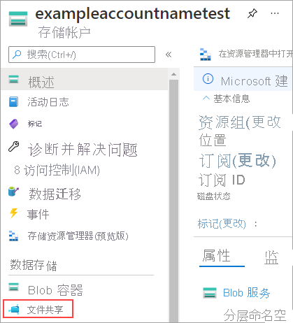

# <a name="quickstart-create-and-manage-azure-file-shares"></a>快速入门：创建和管理 Azure 文件共享
[Azure 文件](storage-files-introduction.md)是 Microsoft 推出的易用云文件系统。 可以在 Windows、Linux 和 macOS 中装载 Azure 文件共享。 本指南介绍通过 Azure 门户、Azure CLI 或 Azure PowerShell 模块来使用 Azure 文件共享的基础知识。

## <a name="applies-to"></a>适用于
| 文件共享类型 | SMB | NFS |
|-|:-:|:-:|
| 标准文件共享 (GPv2)、LRS/ZRS |  |  |
| 标准文件共享 (GPv2)、GRS/GZRS |  |  |
| 高级文件共享 (FileStorage)、LRS/ZRS |  |  |

## <a name="pre-requisites"></a>先决条件

# <a name="portal"></a>[门户](#tab/azure-portal)

如果没有 Azure 订阅，请在开始之前创建一个[免费帐户](https://azure.microsoft.com/free/?WT.mc_id=A261C142F)。

# <a name="powershell"></a>[PowerShell](#tab/azure-powershell)

如果没有 Azure 订阅，请在开始之前创建一个[免费帐户](https://azure.microsoft.com/free/?WT.mc_id=A261C142F)。

[!INCLUDE [cloud-shell-try-it.md](../../../includes/cloud-shell-try-it.md)]

若要在本地安装并使用 PowerShell，则本指南需要 Azure PowerShell 模块 Az 0.7 或更高版本。 若要找出正在运行的 Azure PowerShell 模块的版本，请执行 `Get-Module -ListAvailable Az`。 如果需要进行升级，请参阅 [Install Azure PowerShell module](/powershell/azure/install-Az-ps)（安装 Azure PowerShell 模块）。 如果在本地运行 PowerShell，则还需运行 `Login-AzAccount` 以登录到 Azure 帐户。

# <a name="azure-cli"></a>[Azure CLI](#tab/azure-cli)

[!INCLUDE [azure-cli-prepare-your-environment.md](../../../includes/azure-cli-prepare-your-environment.md)]

- 本文需要 Azure CLI 版本 2.0.4 或更高版本。 如果使用 Azure Cloud Shell，则最新版本已安装。

- 默认情况下，Azure CLI 命令返回 JavaScript 对象表示法 (JSON)。 JSON 是通过 REST API 发送和接收消息的标准方式。 为了便于处理 JSON 响应，本文中的某些示例使用基于 Azure CLI 命令的 *query* 参数。 该参数使用 [JMESPath 查询语言](http://jmespath.org/)来分析 JSON。 若要详细了解如何按照 JMESPath 查询语言的规范来使用 Azure CLI 命令的结果，请参阅 [JMESPath tutorial](http://jmespath.org/tutorial.html)（JMESPath 教程）。

---

## <a name="create-a-storage-account"></a>创建存储帐户

# <a name="portal"></a>[Portal](#tab/azure-portal)
[!INCLUDE [storage-files-create-storage-account-portal](../../../includes/storage-files-create-storage-account-portal.md)]


# <a name="powershell"></a>[PowerShell](#tab/azure-powershell)


### <a name="powershell---create-a-resource-group"></a>PowerShell - 创建资源组
资源组是在其中部署和管理 Azure 资源的逻辑容器。 如果没有 Azure 资源组，可以使用 [New-AzResourceGroup](/powershell/module/az.resources/new-azresourcegroup) cmdlet 新建一个。 你需要使用资源组来创建存储帐户。

以下示例在“美国西部 2”区域创建名为“myResourceGroup”的资源组：

```azurepowershell-interactive
$resourceGroupName = "myResourceGroup"
$region = "westus2"

New-AzResourceGroup `
    -Name $resourceGroupName `
    -Location $region | Out-Null
```

### <a name="powershell---create-a-storage-account"></a>PowerShell - 创建存储帐户

存储帐户是一个存储共享池，可以用来部署 Azure 文件共享。

此示例使用 [New-AzStorageAccount](/powershell/module/az.storage/new-azstorageaccount) cmdlet 创建存储帐户。 存储帐户名为 *mystorageaccount\<random number>*，对该存储帐户的引用存储在变量 **$storageAcct** 中。 存储帐户名称必须唯一，因此请使用 `Get-Random` 将一个数字追加到名称末尾，使之变得唯一。 

```azurepowershell-interactive 
$storageAccountName = "mystorageacct$(Get-Random)"

$storageAcct = New-AzStorageAccount `
    -ResourceGroupName $resourceGroupName `
    -Name $storageAccountName `
    -Location $region `
    -Kind StorageV2 `
    -SkuName Standard_LRS `
    -EnableLargeFileShare
```

# <a name="azure-cli"></a>[Azure CLI](#tab/azure-cli)

### <a name="cli---create-a-resource-group"></a>CLI - 创建资源组
资源组是在其中部署和管理 Azure 资源的逻辑容器。 如果还没有 Azure 资源组，可以使用 [az group create](/cli/azure/group) 命令创建一个。 你需要使用资源组来创建存储帐户。

以下示例在“美国西部 2”位置创建名为“myResourceGroup”的资源组：

```azurecli-interactive 
export resourceGroupName="myResourceGroup"
region="westus2"

az group create \
    --name $resourceGroupName \
    --location $region \
    --output none
```

### <a name="cli---create-a-storage-account"></a>CLI - 创建存储帐户
存储帐户是一个存储共享池，可以在其中部署 Azure 文件共享。

以下示例使用 [az storage account create](/cli/azure/storage/account) 命令创建一个存储帐户。 存储帐户名称必须唯一，因此请使用 `$RANDOM` 将一个数字追加到名称末尾，使之变得唯一。

```azurecli-interactive 
export storageAccountName="mystorageacct$RANDOM"

az storage account create \
    --resource-group $resourceGroupName \
    --name $storageAccountName \
    --location $region \
    --kind StorageV2 \
    --sku Standard_LRS \
    --enable-large-file-share \
    --output none
```


---


## <a name="create-an-azure-file-share"></a>创建 Azure 文件共享


# <a name="portal"></a>[门户](#tab/azure-portal)

若要创建 Azure 文件共享，请执行以下操作：

1. 从仪表板中选择存储帐户。
1. 在存储帐户页的“服务”部分，选择“文件”。
    
    

1. 在“文件服务”页顶部的菜单中，单击“文件共享”。 “新建文件共享”页此时会向下拉开。
1. 在“名称”中键入 myshare，输入配额；对于“层级”，使“事务优化”保持选中状态 。
1. 选择“创建”以创建 Azure 文件共享。

共享名必须全部采用小写字母、数字和单个连字符，但不能以连字符开头。 有关命名文件共享和文件的完整详细信息，请参阅 [命名和引用共享、目录、文件和元数据](/rest/api/storageservices/Naming-and-Referencing-Shares--Directories--Files--and-Metadata)。

# <a name="powershell"></a>[PowerShell](#tab/azure-powershell)

你已经创建了存储帐户，现在可以创建第一个 Azure 文件共享。 使用 [New-AzRmStorageShare](/powershell/module/az.storage/New-AzRmStorageShare) cmdlet 创建文件共享。 此示例将创建名为 myshare 的共享。

```azurepowershell-interactive
$shareName = "myshare"

New-AzRmStorageShare `
    -StorageAccount $storageAcct `
    -Name $shareName `
    -EnabledProtocol SMB `
    -QuotaGiB 1024 | Out-Null
```

# <a name="azure-cli"></a>[Azure CLI](#tab/azure-cli)

你已经创建了存储帐户，现在可以创建第一个 Azure 文件共享。 请使用 [az storage share-rm create](/cli/azure/storage/share-rm?view=azure-cli-latest&preserve-view=false#az_storage_share_rm_create) 命令创建文件共享。 以下示例创建名为 **myshare** 的 Azure 文件共享： 

```azurecli-interactive
shareName="myshare"

az storage share-rm create \
    --resource-group $resourceGroupName \
    --storage-account $storageAccountName \
    --name $shareName \
    --quota 1024 \
    --enabled-protocols SMB \
    --output none
```

---

#### <a name="create-a-directory"></a>创建目录

# <a name="portal"></a>[Portal](#tab/azure-portal)

若要在 Azure 文件共享的根目录中创建名为 *myDirectory* 的新目录，请执行以下操作：

1. 在“文件服务”页面中，选择“myshare”文件共享。 文件共享的页面此时会打开。
1. 在页面顶部的菜单中选择“+ 添加目录”。 “新建目录”页此时会向下拉开。
1. 键入 *myDirectory*，然后单击“确定”。

# <a name="powershell"></a>[PowerShell](#tab/azure-powershell)

若要在 Azure 文件共享的根目录中创建名为 **myDirectory** 的新目录，请使用 [New-AzStorageDirectory](/powershell/module/az.storage/New-AzStorageDirectory) cmdlet。

```azurepowershell-interactive
New-AzStorageDirectory `
   -Context $storageAcct.Context `
   -ShareName $shareName `
   -Path "myDirectory"
```

# <a name="azure-cli"></a>[Azure CLI](#tab/azure-cli)

若要在 Azure 文件共享的根目录中创建名为 **myDirectory** 的新目录，请使用 [`az storage directory create`](/cli/azure/storage/directory) 命令：

```azurecli-interactive
az storage directory create \
   --account-name $storageAccountName \
   --account-key $storageAccountKey \
   --share-name $shareName \
   --name "myDirectory" \
   --output none
```

---


#### <a name="upload-a-file"></a>上传文件 
# <a name="portal"></a>[门户](#tab/azure-portal)


若要演示如何上传文件，首先需创建或选择一个需要上传的文件。 可以根据需要采用任何方式来这样做。 选定要上传的文件以后，请执行以下操作：

1. 选择“myDirectory”目录。 此时会打开 **myDirectory** 面板。
1. 在顶部菜单中，选择“上传”。 “上传文件”面板此时会打开。  
    
    

1. 选择文件夹图标，打开一个用来浏览本地文件的窗口。 
1. 选择文件，然后选择“打开”。 
1. 在“上传文件”页中验证文件名，然后选择“上传” 。
1. 完成后，文件会显示在 **myDirectory** 页的列表中。

# <a name="powershell"></a>[PowerShell](#tab/azure-powershell)

若要演示如何使用 [Set-AzStorageFileContent](/powershell/module/az.storage/Set-AzStorageFileContent) cmdlet 来上传文件，首先需要在 PowerShell Cloud Shell 的暂存驱动器中创建要上传的文件。 

此示例将当前的日期和时间置于暂存驱动器的新文件中，然后将文件上传到文件共享。

```azurepowershell-interactive
# this expression will put the current date and time into a new file on your scratch drive
cd "~/CloudDrive/"
Get-Date | Out-File -FilePath "SampleUpload.txt" -Force

# this expression will upload that newly created file to your Azure file share
Set-AzStorageFileContent `
   -Context $storageAcct.Context `
   -ShareName $shareName `
   -Source "SampleUpload.txt" `
   -Path "myDirectory\SampleUpload.txt"
```   

如果在本地运行 PowerShell，请将 `~/CloudDrive/` 替换为计算机上的现有路径。

上传文件后，可以使用 [Get-AzStorageFile](/powershell/module/Az.Storage/Get-AzStorageFile) cmdlet 进行检查，确保文件已上传到 Azure 文件共享。 

```azurepowershell-interactive
Get-AzStorageFile `
    -Context $storageAcct.Context `
    -ShareName $shareName `
    -Path "myDirectory\" 
```


# <a name="azure-cli"></a>[Azure CLI](#tab/azure-cli)

若要演示如何使用 [`az storage file upload`](/cli/azure/storage/file) 命令来上传文件，请首先在 Cloud Shell 暂存驱动器上创建要上传的文件。 以下示例创建并上传该文件：

```azurecli-interactive
cd ~/clouddrive/
date > SampleUpload.txt

az storage file upload \
    --account-name $storageAccountName \
    --account-key $storageAccountKey \
    --share-name $shareName \
    --source "SampleUpload.txt" \
    --path "myDirectory/SampleUpload.txt"
```

如果在本地运行 Azure CLI，请将 `~/clouddrive` 替换为计算机上的现有路径。

上传文件以后，即可使用 [`az storage file list`](/cli/azure/storage/file) 命令，确保文件已上传到 Azure 文件共享：

```azurecli-interactive
az storage file list \
    --account-name $storageAccountName \
    --account-key $storageAccountKey \
    --share-name $shareName \
    --path "myDirectory" \
    --output table
```


---

#### <a name="download-a-file"></a>下载文件
# <a name="portal"></a>[门户](#tab/azure-portal)

若要下载已上传文件的副本，可以右键单击该文件。 选择下载按钮后的具体体验取决于所使用的操作系统和浏览器。


# <a name="powershell"></a>[PowerShell](#tab/azure-powershell)

可以使用 [Get-AzStorageFileContent](/powershell/module/az.storage/Get-AzStorageFilecontent) cmdlet 下载已上传到 Cloud Shell 暂存驱动器的文件的副本。

```azurepowershell-interactive
# Delete an existing file by the same name as SampleDownload.txt, if it exists because you've run this example before.
Remove-Item `
    -Path "SampleDownload.txt" `
    -Force `
    -ErrorAction SilentlyContinue

Get-AzStorageFileContent `
    -Context $storageAcct.Context `
    -ShareName $shareName `
    -Path "myDirectory\SampleUpload.txt" `
    -Destination "SampleDownload.txt"
```

下载文件以后，可以使用 `Get-ChildItem` 来查看该文件是否已下载到 PowerShell Cloud Shell 的暂存驱动器。

```azurepowershell-interactive
Get-ChildItem | Where-Object { $_.Name -eq "SampleDownload.txt" }
``` 

# <a name="azure-cli"></a>[Azure CLI](#tab/azure-cli)

可以使用 [`az storage file download`](/cli/azure/storage/file) 命令下载已上传到 Cloud Shell 暂存驱动器的文件的副本：

```azurecli-interactive
# Delete an existing file by the same name as SampleDownload.txt, if it exists, because you've run this example before
rm -f SampleDownload.txt

az storage file download \
    --account-name $storageAccountName \
    --account-key $storageAccountKey \
    --share-name $shareName \
    --path "myDirectory/SampleUpload.txt" \
    --dest "SampleDownload.txt" \
    --output none
```

---

## <a name="clean-up-resources"></a>清理资源
# <a name="portal"></a>[门户](#tab/azure-portal)

[!INCLUDE [storage-files-clean-up-portal](../../../includes/storage-files-clean-up-portal.md)]

# <a name="powershell"></a>[PowerShell](#tab/azure-powershell)

完成后，可以使用 [Remove-AzResourceGroup](/powershell/module/az.resources/remove-azresourcegroup) cmdlet 删除资源组以及资源组中包含的所有资源。 

```azurepowershell-interactive
Remove-AzResourceGroup -Name myResourceGroup
```

# <a name="azure-cli"></a>[Azure CLI](#tab/azure-cli)

完成后，可以使用 [`az group delete`](/cli/azure/group) 命令删除资源组以及资源组中包含的所有资源： 

```azurecli-interactive 
az group delete --name $resourceGroupName
```


---

## <a name="next-steps"></a>后续步骤

> [!div class="nextstepaction"]
> [什么是 Azure 文件？](storage-files-introduction.md)