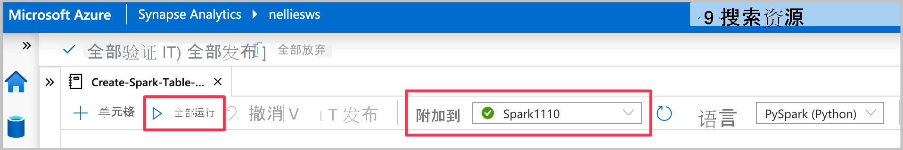
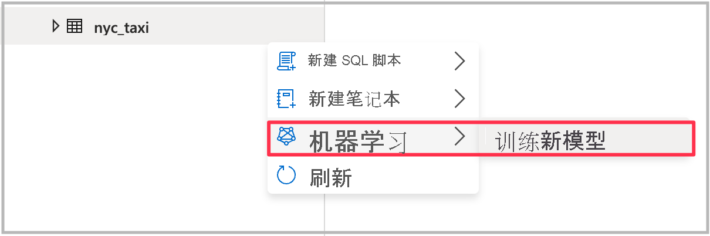
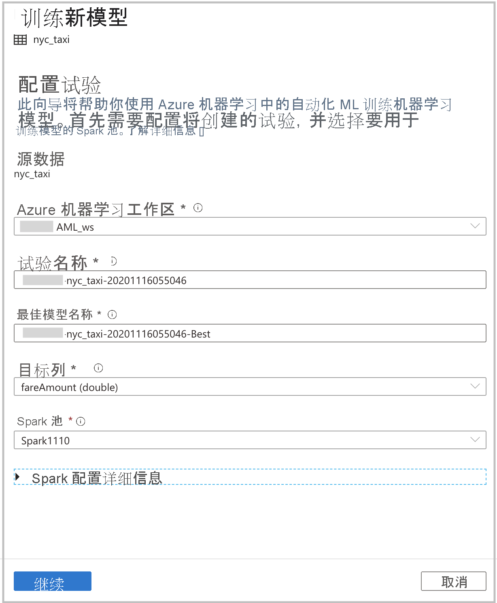
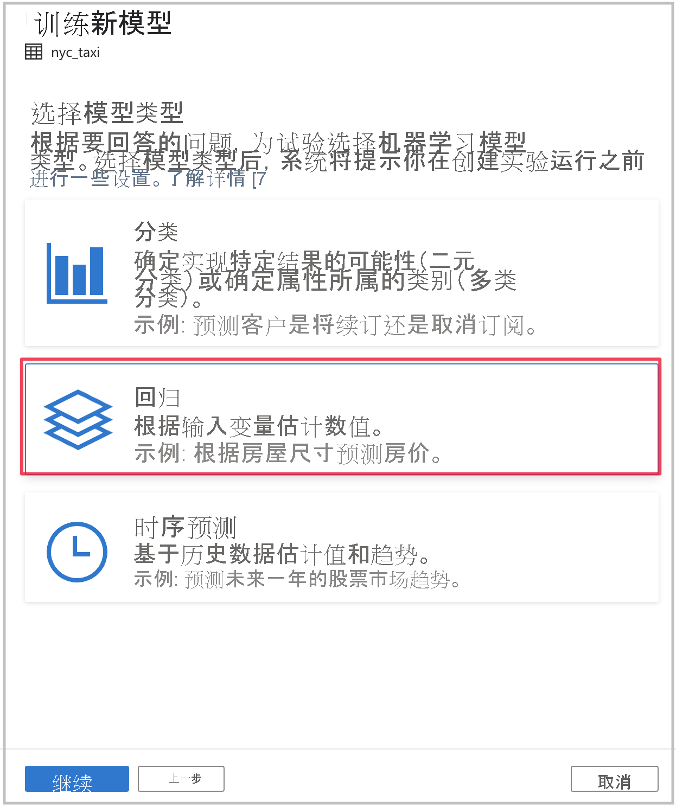
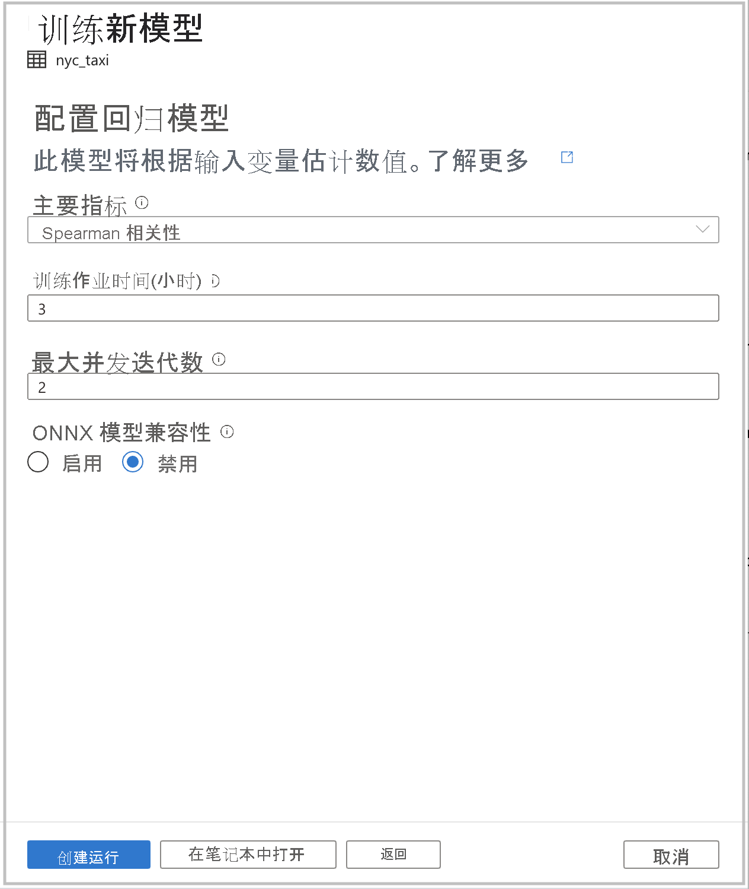
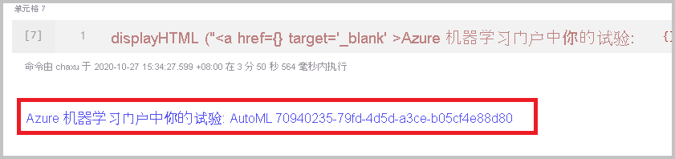

# 教程：无代码训练机器学习模型

可使用[自动化机器学习](https://docs.microsoft.com/azure/machine-learning/concept-automated-ml)训练的新的机器学习模型轻松扩充 Spark 表中的数据。 在 Azure Synapse Analytics 中，可在工作区中选择 Spark 表作为训练数据集，用于在无代码体验中构建机器学习模型。

本教程介绍如何使用 Azure Synapse Analytics 工作室中的无代码体验来训练机器学习模型。 在 Azure 机器学习中使用自动化机器学习，而不是手动对体验进行编码。 你训练的模型类型取决于你要解决的问题。

如果没有 Azure 订阅，请[在开始之前创建一个免费帐户](https://azure.microsoft.com/free/)。

## 先决条件

- 一个 [Azure Synapse Analytics 工作区](../get-started-create-workspace.md)。 确保它具有以下存储帐户（该帐户被配置为默认存储）：Azure Data Lake Storage Gen2。 对于使用的 Data Lake Storage Gen2 文件系统，请确保你是存储 Blob 数据参与者。
- Azure Synapse Analytics 工作区中的 Apache Spark 池。 有关详细信息，请参阅[快速入门：使用 Azure Synapse Analytics 工作室创建专用 SQL 池](../quickstart-create-sql-pool-studio.md)。
- Azure Synapse Analytics 工作区中的 Azure 机器学习链接服务。 有关详细信息，请参阅[快速入门：在 Azure Synapse Analytics 中创建新的 Azure 机器学习链接服务](quickstart-integrate-azure-machine-learning.md)。

## 登录到 Azure 门户

登录 [Azure 门户](https://portal.azure.com/)。

## 创建用于训练数据集的 Spark 表

在本教程中，需要一个 Spark 表。 以下笔记本会创建一个。

1. 下载笔记本 [Create-Spark-Table-NYCTaxi- Data.ipynb](https://go.microsoft.com/fwlink/?linkid=2149229)。

1. 将笔记本导入 Azure Synapse Analytics 工作室。

1. 选择要使用的 Spark 池，然后选择“全部运行”。 这将从打开的数据集获取纽约出租车数据，并保存到默认的 Spark 数据库中。

1. 笔记本运行完成后，你将在默认的 Spark 数据库下看到一个新的 Spark 表。 从“数据”中找到名为 nyc_taxi 的表 。

## 启动自动化机器学习向导

下面介绍如何操作：

1. 右键单击在上一步中创建的 Spark 表。 若要打开向导，请选择“机器学习” > “使用新模型进行扩充” 。

1. 然后，可提供配置详细信息用于创建在 Azure 机器学习中运行的自动化机器学习实验。 此运行会训练多个模型，其中成功运行的最佳模型在 Azure 机器学习模型注册表中注册。

   

    - **Azure 机器学习工作区**：需要 Azure 机器学习工作区才能创建自动化机器学习试验运行。 你还需要使用[链接服务](quickstart-integrate-azure-machine-learning.md)将 Azure Synapse Analytics 工作区与 Azure 机器学习工作区相关联。 满足所有先决条件后，就可指定要用于此自动化运行的 Azure 机器学习工作区。

    - **试验名称**：指定试验名称。 提交自动化机器学习运行时，需提供试验名称。 运行的信息存储在 Azure 机器学习工作区中的试验下。 默认情况下，这种体验将创建一个新试验并生成建议的名称，但你也可提供现有试验的名称。

    - **最佳模型**：指定自动化运行中最佳模型的名称。 将此名称赋予最佳模型，并在该运行后自动保存在 Azure 机器学习模型注册表中。 自动化机器学习运行会创建许多机器学习模型。 根据将在后面步骤中选择的主要指标，可比较这些模型并选择最佳模型。

    - **目标列**：这就是被训练来预测的模型。 选择要预测的列。 （在本教程中，我们选择数值列 `fareAmount` 作为目标列。）

    - **Spark 池**：要用于自动化试验运行的 Spark 池。 计算在指定的池上运行。

    - **Spark 配置详细信息**：除 Spark 池外，还可以选择提供会话配置详细信息。

1. 选择“继续”。 

## 选择任务类型

根据要回答的问题选择用于试验的机器学习模型类型。 `fareAmount` 是目标列而且是数值，因此请在此处选择“回归”。 然后选择“继续”。 

## 其他配置

如果在上一部分中选择“回归”或“分类”作为模型类型，可使用以下配置 ：

- **主要指标**：用于衡量模型运行情况的指标。 该指标用于比较在自动化运行中创建的不同模型，并确定哪个模型效果最佳。

- 训练作业时间(小时)：运行和训练模型的试验所需的最长时间（以小时为单位）。 请注意，还可提供小于 1 的值（例如 `0.5`）。

- 最大并发迭代数：表示并行运行的最大迭代数。

- **ONNX 模型兼容性**：如果启用此选项，则由自动化机器学习训练的模型将转换为 ONNX 格式。 如果想要使用模型在 Azure Synapse Analytics SQL 池中进行评分，这一点尤其重要。

所有这些设置都具有可自定义的默认值。

完成所有必需配置后，可启动自动化运行。 可选择“创建运行”，这无需代码就会直接启动运行。 如果你更想要使用代码，可选择“在笔记本中打开”。 通过此选项，可查看用于创建运行和运行笔记本的代码。

>[!NOTE]
>如果在上一部分中选择“时序预测”作为模型类型，则必须进行其他配置。 预测也不支持 ONNX 模型兼容性。

### 直接创建运行

若要直接启动自动化机器学习运行，请选择“开始运行”。 你会看到一个通知，它指示运行正在启动。 然后，你会看到另一个通知指示成功。 你还可选择通知中的链接来查看 Azure 机器学习中的状态。

### 使用笔记本创建运行

若要生成笔记本，请选择“在笔记本中打开”。 然后，选择“全部运行”。 这样，你还有机会向自动化机器学习运行添加其他设置。

成功提交运行后，你将在笔记本输出中看到一个链接，它指向 Azure 机器学习工作区中的试验运行。 选择该链接可监视 Azure 机器学习中的自动化运行。
）

## 后续步骤

- [教程：用于专用 SQL 池的机器学习模型评分向导（预览版）](tutorial-sql-pool-model-scoring-wizard.md)
- [快速入门：在 Azure Synapse Analytics 中创建新的 Azure 机器学习链接服务](quickstart-integrate-azure-machine-learning.md)
- [Azure Synapse Analytics 中的机器学习功能](what-is-machine-learning.md)
