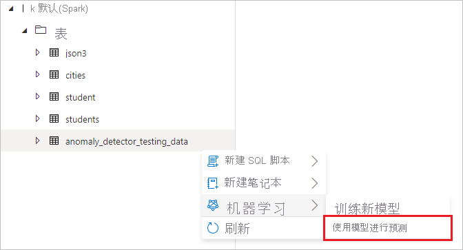
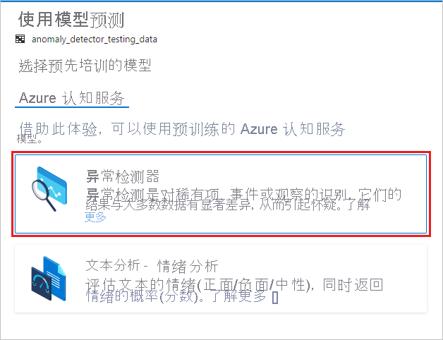
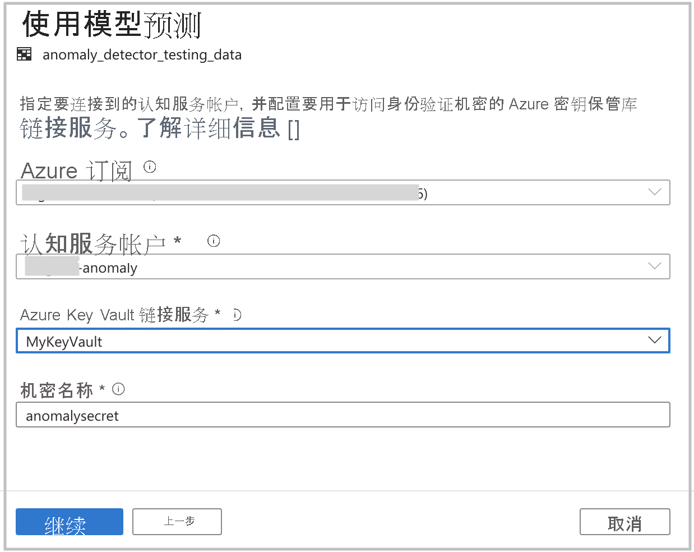
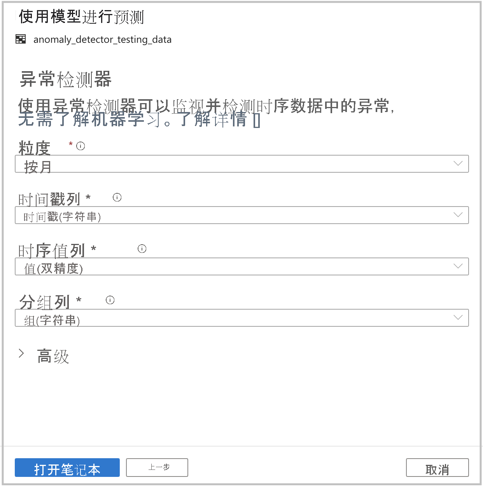

# Tutorial:使用认知服务进行异常情况检测（预览版）

本教程介绍如何使用 [Azure 认知服务](../../cognitive-services/index.yml)在 Azure Synapse Analytics 中轻松扩充数据。 你将使用[异常检测器](../../cognitive-services/anomaly-detector/index.yml)查找异常。 Azure Synapse 中的用户可以直接选择某一个表进行扩充，以检测异常。

本教程涉及：

> [!div class="checklist"]
> - 获取包含时序数据的 Spark 表数据集的步骤。
> - 在 Azure Synapse 中使用向导体验，通过在认知服务中使用异常检测器来扩充数据。

如果没有 Azure 订阅，请[在开始之前创建一个免费帐户](https://azure.microsoft.com/free/)。

## 先决条件

- [Azure Synapse Analytics 工作区](../get-started-create-workspace.md)，其中 Azure Data Lake Storage Gen2 存储帐户配置为默认存储。 你需要成为所使用的 Data Lake Storage Gen2 文件系统的存储 Blob 数据参与者。
- Azure Synapse Analytics 工作区中的 Spark 池。 有关详细信息，请参阅[在 Azure Synapse 中创建 Spark 池](../quickstart-create-sql-pool-studio.md)。
- 完成[在 Azure Synapse 中配置认知服务](tutorial-configure-cognitive-services-synapse.md)教程中的预配置步骤。

## 登录到 Azure 门户

登录到 [Azure 门户](https://portal.azure.com/)。

## 创建 Spark 表

本教程需要一个 Spark 表。

1. 下载以下笔记本文件，其中包含用于生成 Spark 表的代码：[prepare_anomaly_detector_data.ipynb](https://go.microsoft.com/fwlink/?linkid=2149577)。

1. 将文件上传到 Azure Synapse 工作区。

   

1. 打开笔记本文件，然后选择“全部运行”以运行所有单元格。

   

1. 现在，默认的 Spark 数据库中应显示名为 anomaly_detector_testing_data 的 Spark 表。

## 打开认知服务向导

1. 右键单击在上一步中创建的 Spark 表。 选择“机器学习” > “使用新模型进行预测”打开向导。

   

2. 此时会显示配置面板，你需要选择认知服务模型。 选择“异常检测器”。

   

## 提供身份验证详细信息

若要对认知服务进行身份验证，需要引用密钥保管库中的机密。 以下输入取决于应在此之前完成的[必备步骤](tutorial-configure-cognitive-services-synapse.md)。

- **Azure 订阅**：选择你的密钥保管库所属的 Azure 订阅。
- **认知服务帐户**：输入要连接到的文本分析资源。
- **Azure Key Vault 链接服务**：在必备步骤中，你创建了一个与文本分析资源链接的服务。 请在这里选择该服务。
- **机密名称**：输入密钥保管库中的机密的名称，该密钥保管库包含用于向认知服务资源进行身份验证的密钥。

## 配置异常检测器

提供以下详细信息以配置异常检测器：

- **粒度**：采样数据的速率。 选择“每月一次”。 

- **时间戳列**：表示时序的列。 选择“时间戳(字符串)”。

- **时序值列**：表示“时间戳”列所指定时间所对应序列值的列。 选择“值(double)”。

- **分组列**：对系列进行分组的列。 也就是说，在此列中具有相同值的所有行应形成一个时序。 选择“组(字符串)”。

完成后，选择“打开笔记本”。 这将生成包含 PySpark 代码的笔记本，该笔记本使用 Azure 认知服务检测异常。

## 运行笔记本

你刚才打开的笔记本使用 [mmlspark 库](https://github.com/Azure/mmlspark)连接到认知服务。 你提供的 Azure Key Vault 详细信息可让你在不泄露它们的情况下安全地引用此体验中的机密。

现在，可以运行所有单元格以执行异常情况检测。 选择“全部运行”。 [详细了解认知服务中的异常探测器](../../cognitive-services/anomaly-detector/index.yml)。

## 后续步骤

- [教程：使用 Azure 认知服务进行情绪分析](tutorial-cognitive-services-sentiment.md)
- [教程：Azure Synapse 专用 SQL 池中的机器学习模型评分](tutorial-sql-pool-model-scoring-wizard.md)
- [Azure Synapse Analytics 中的机器学习功能](what-is-machine-learning.md)
