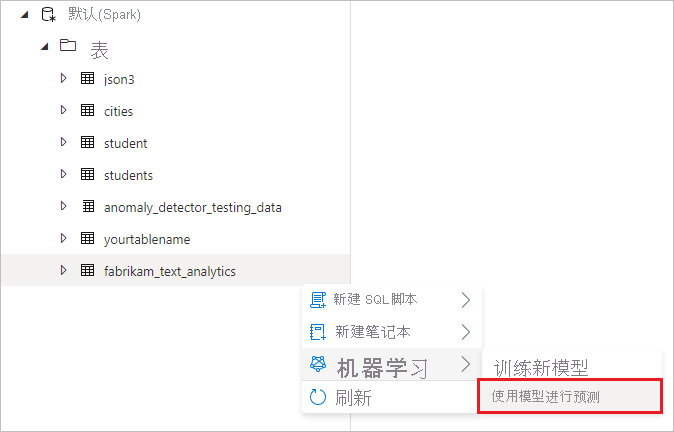
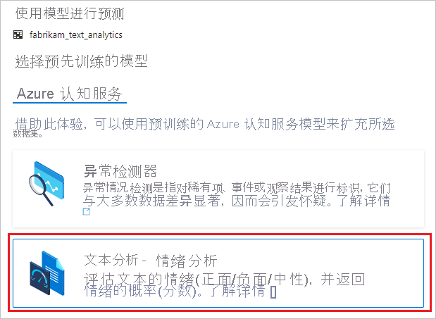
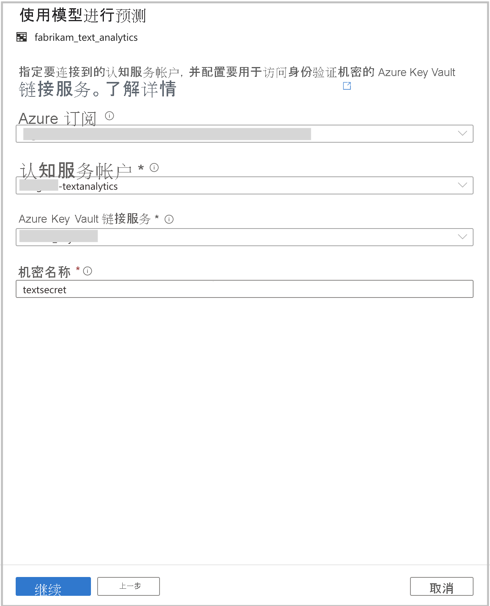
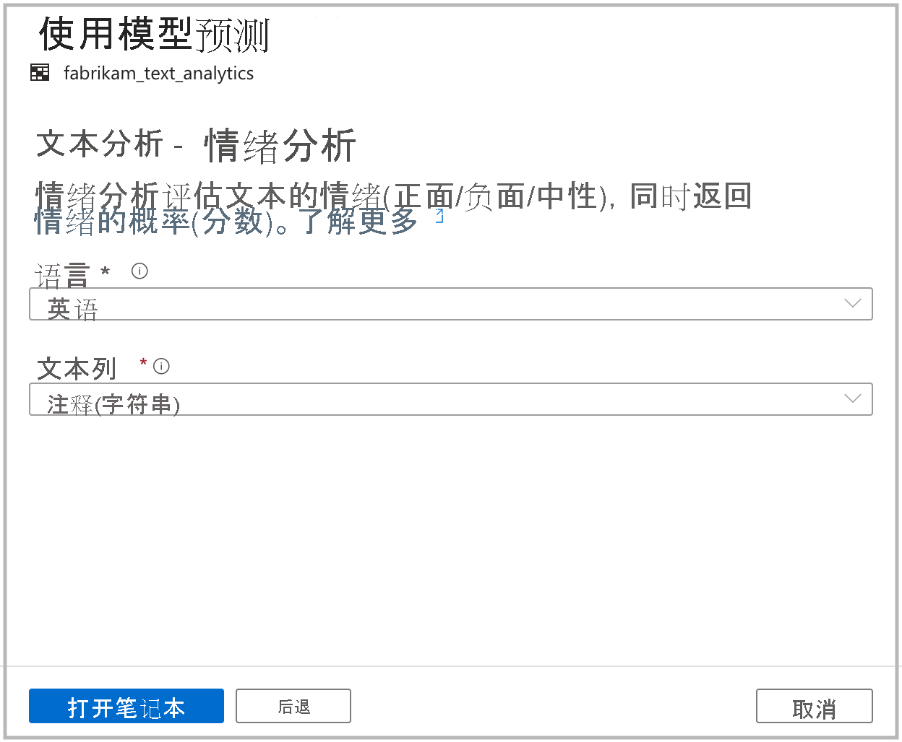

# <a name="tutorial-sentiment-analysis-with-cognitive-services-preview"></a>Tutorial:使用认知服务进行情绪分析（预览版）

本教程介绍如何使用 [Azure 认知服务](../../cognitive-services/index.yml)在 Azure Synapse Analytics 中轻松扩充数据。 你将使用[文本分析](../../cognitive-services/text-analytics/index.yml)功能来进行情绪分析。 

Azure Synapse 中的用户可以直接选择包含文本列的表，以扩充情绪。 这些情绪可以是积极、消极、混杂或中立的。 系统还将返回概率。

本教程涉及：

> [!div class="checklist"]
> - 获取 Spark 表数据集的步骤，该数据集中包含用于进行情感分析的文本列。
> - 通过 Azure Synapse 中的向导体验，使用认知服务中的文本分析来扩充数据。

如果没有 Azure 订阅，请[在开始之前创建一个免费帐户](https://azure.microsoft.com/free/)。

## <a name="prerequisites"></a>先决条件

- [Azure Synapse Analytics 工作区](../get-started-create-workspace.md)，其中 Azure Data Lake Storage Gen2 存储帐户配置为默认存储。 你需要成为所使用的 Data Lake Storage Gen2 文件系统的存储 Blob 数据参与者。
- Azure Synapse Analytics 工作区中的 Spark 池。 有关详细信息，请参阅[在 Azure Synapse 中创建 Spark 池](../quickstart-create-sql-pool-studio.md)。
- [在 Azure Synapse 中配置认知服务](tutorial-configure-cognitive-services-synapse.md)教程中所述的预配置步骤。

## <a name="sign-in-to-the-azure-portal"></a>登录到 Azure 门户

登录到 [Azure 门户](https://portal.azure.com/)。

## <a name="create-a-spark-table"></a>创建 Spark 表

本教程需要一个 Spark 表。

1. 下载 [FabrikamComments.csv](https://github.com/Kaiqb/KaiqbRepo0731190208/blob/master/CognitiveServices/TextAnalytics/FabrikamComments.csv) 文件，其中包含用于文本分析的数据集。 

1. 将文件上传到 Data Lake Storage Gen2 中的 Azure Synapse 存储帐户。
  
   

1. 通过右键单击文件并选择“新建笔记本” > “创建 Spark 表”，从 .csv 文件创建 Spark 表 。

   

1. 在代码单元格中命名表，然后在 Spark 池上运行笔记本。 请记得设置 `header=True`。

   

   ```python
   %%pyspark
   df = spark.read.load('abfss://default@azuresynapsesa.dfs.core.windows.net/data/FabrikamComments.csv', format='csv'
   ## If a header exists, uncomment the line below
   , header=True
   )
   df.write.mode("overwrite").saveAsTable("default.YourTableName")
   ```

## <a name="open-the-cognitive-services-wizard"></a>打开认知服务向导

1. 右键单击在上一步中创建的 Spark 表。 选择“机器学习” > “使用新模型进行预测”打开向导。

   

2. 此时会显示配置面板，你需要选择认知服务模型。 选择“文本分析 - 情绪分析”。

   

## <a name="provide-authentication-details"></a>提供身份验证详细信息

若要对认知服务进行身份验证，需要引用密钥保管库的机密。 以下输入取决于应在此之前完成的[必备步骤](tutorial-configure-cognitive-services-synapse.md)。

- **Azure 订阅**：选择你的密钥保管库所属的 Azure 订阅。
- **认知服务帐户**：输入要连接到的文本分析资源。
- **Azure Key Vault 链接服务**：在必备步骤中，你创建了一个与文本分析资源链接的服务。 请在这里选择该服务。
- **机密名称**：输入密钥保管库中的机密的名称，该密钥保管库包含用于向认知服务资源进行身份验证的密钥。



## <a name="configure-sentiment-analysis"></a>配置情绪分析

接下来，配置情绪分析。 请选择以下详细信息：
- **语言**：选择“英语”作为要对其进行情绪分析的文本的语言。
- **文本列**：选择“注释(字符串)”作为数据集中你要对其进行分析以确定情绪的文本列。

完成后，选择“打开笔记本”。 随即将生成使用 PySpark 代码的笔记本来通过 Azure 认知服务执行情绪分析。



## <a name="run-the-notebook"></a>运行笔记本

你刚才打开的笔记本使用 [mmlspark 库](https://github.com/Azure/mmlspark)连接到认知服务。 你提供的 Azure Key Vault 详细信息可让你在不泄露它们的情况下安全地引用此体验中的机密。

现在，可以运行所有单元，以使用情绪扩充数据。 选择“全部运行”。 

情绪返回结果为“积极”、“消极”、“中立”或“混杂”   。 你还将获得每种情绪的概率。 [详细了解认知服务中的情绪分析](../../cognitive-services/text-analytics/how-tos/text-analytics-how-to-sentiment-analysis.md)。


## <a name="next-steps"></a>后续步骤
- [教程：使用 Azure 认知服务进行异常情况检测](tutorial-cognitive-services-anomaly.md)
- [教程：Azure Synapse 专用 SQL 池中的机器学习模型评分](tutorial-sql-pool-model-scoring-wizard.md)
- [Azure Synapse Analytics 中的机器学习功能](what-is-machine-learning.md)
