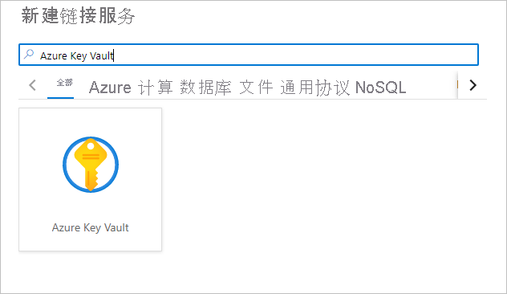
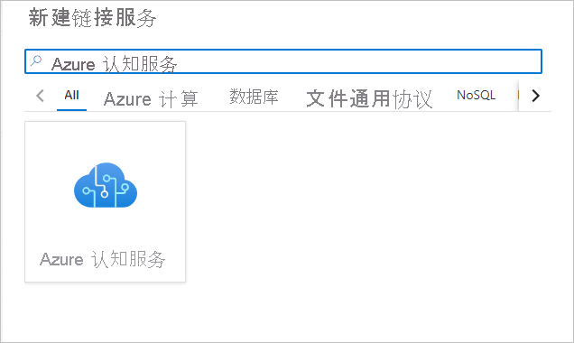

# 快速入门：配置在 Azure Synapse Analytics 中使用认知服务的先决条件

本快速入门介绍如何设置在 Azure Synapse Analytics 中安全使用 Azure 认知服务的先决条件。 通过链接这些 Azure 认知服务，可以利用来自 Synapse 中各种体验的 Azure 认知服务。

本快速入门涵盖：
> [!div class="checklist"]
> - 创建文本分析或异常检测器等认知服务资源。
> - 将认知服务资源的身份验证密钥存储为 Azure Key Vault 中的机密，并配置 Azure Synapse Analytics 工作区的访问权限。
> - 在 Azure Synapse Analytics 工作区中创建 Azure Key Vault 链接服务。
> - 在 Azure Synapse Analytics 工作区中创建 Azure 认知服务链接服务。

如果没有 Azure 订阅，请[在开始之前创建一个免费帐户](https://azure.microsoft.com/free/)。

## 先决条件

- [Azure Synapse Analytics 工作区](../get-started-create-workspace.md)，其中 Azure Data Lake Storage Gen2 存储帐户配置为默认存储。 你需要成为所使用的 Azure Data Lake Storage Gen2 文件系统的存储 Blob 数据参与者。

## 登录到 Azure 门户

登录到 [Azure 门户](https://portal.azure.com/)。

## 创建认知服务资源

[Azure 认知服务](../../cognitive-services/index.yml)包括多种类型的服务。 Azure Synapse 教程中的文本分析和异常检测器就是两个例子。

你可以在 Azure 门户中创建[文本分析](https://ms.portal.azure.com/#create/Microsoft.CognitiveServicesTextAnalytics)资源：

你可以在 Azure 门户中创建[异常检测器](https://ms.portal.azure.com/#create/Microsoft.CognitiveServicesTextAnalytics)资源：

## 创建密钥保管库并配置机密和访问权限

1. 在 Azure 门户中创建[密钥保管库](https://ms.portal.azure.com/#create/Microsoft.KeyVault)。
2. 转到“Key Vault” > “访问策略”，并向 [Azure Synapse 工作区 MSI](../security/synapse-workspace-managed-identity.md) 授予从 Azure Key Vault 读取机密的权限 。

   > [!NOTE]
   > 请确保已保存策略更改。 此步骤很容易被忽略。

   

3. 转到认知服务资源。 例如，转到“异常检测器” > “密钥和终结点” 。 然后将两个密钥中的任意一个复制到剪贴板。

4. 转到“Key Vault” > “机密”创建新机密 。 指定机密的名称，然后将上一步的密钥粘贴到“值”字段中。 最后，选择“创建”。

   

   > [!IMPORTANT]
   > 请确保记住或记下此密钥名称。 稍后在创建 Azure 认知服务链接服务时将用到它。

## 在 Azure Synapse 中创建 Azure Key Vault 链接服务

1. 在 Synapse Studio 中打开工作区。 
2. 转到“管理” > “链接服务” 。 创建指向刚刚创建的密钥保管库的“Azure Key Vault”链接服务。 
3. 选择“测试连接”按钮，对连接进行验证。 如果连接为绿色，请选择“创建”，然后选择“全部发布”，以保存所做的更改 。

## 在 Azure Synapse 中创建 Azure 认知服务链接服务

1. 在 Synapse Studio 中打开工作区。
2. 转到“管理” > “链接服务” 。 通过指向刚刚创建的认知服务来创建 Azure 认知服务链接服务。 
3. 选择“测试连接”按钮，对连接进行验证。 如果连接为绿色，请选择“创建”，然后选择“全部发布”，以保存所做的更改 。

现在，可以继续学习关于在 Synapse Studio 中使用 Azure 认知服务体验的教程之一。

## 后续步骤

- [教程：使用 Azure 认知服务进行情绪分析](tutorial-cognitive-services-sentiment.md)
- [教程：使用 Azure 认知服务进行异常情况检测](tutorial-cognitive-services-sentiment.md)
- [教程：Azure Synapse 专用 SQL 池中的机器学习模型评分](tutorial-sql-pool-model-scoring-wizard.md)。
- [Azure Synapse Analytics 中的机器学习功能](what-is-machine-learning.md)
