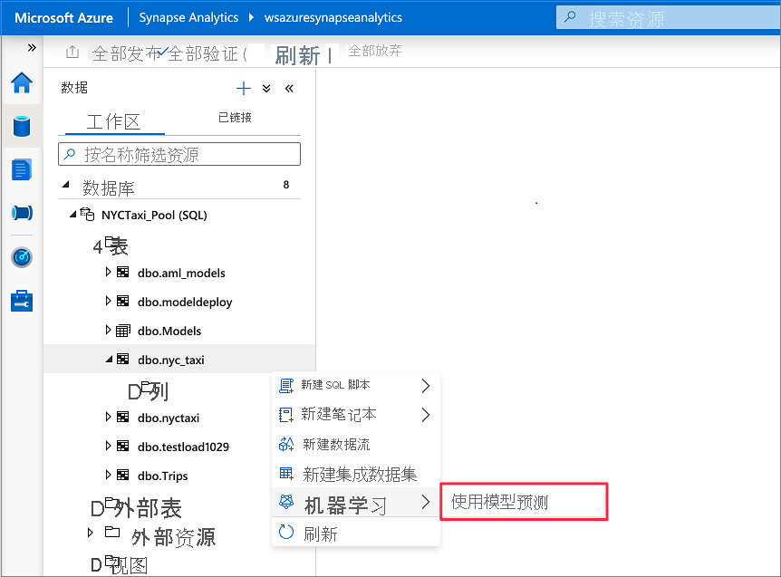
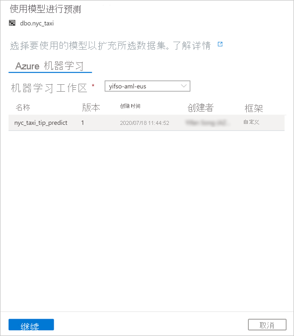
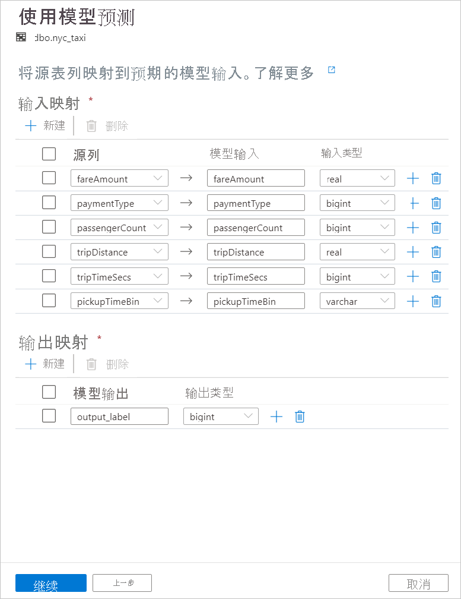
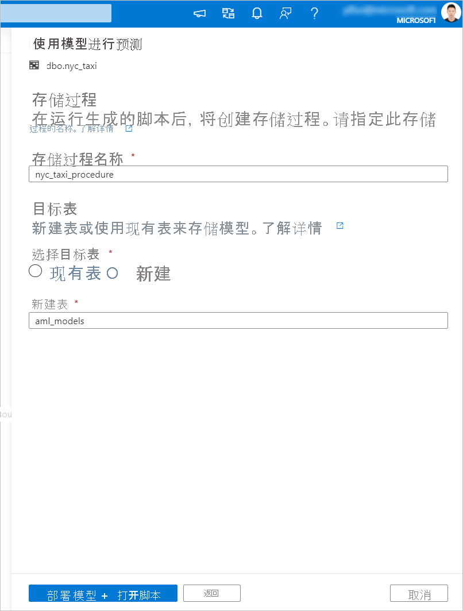

# <a name="tutorial-machine-learning-model-scoring-wizard-preview-for-dedicated-sql-pools"></a>教程：用于专用 SQL 池的机器学习模型评分向导（预览版）

了解如何借助预测性机器学习模型轻松扩充专用 SQL 池中的数据。 数据专业人员现在可以轻松使用数据科学家创建的模型进行预测分析。 Azure Synapse Analytics 中的数据专业人员可以直接从 Azure 机器学习模型注册表中选择一个模型，以便在 Azure Synapse SQL 池中进行部署，并启动预测来扩充数据。

在本教程中，你将了解：

> [!div class="checklist"]
> - 训练一个预测性机器学习模型并在 Azure 机器学习模型注册表中注册该模型。
> - 使用 SQL 评分向导在专用 SQL 池中启动预测。

如果没有 Azure 订阅，请[在开始之前创建一个免费帐户](https://azure.microsoft.com/free/)。

## <a name="prerequisites"></a>先决条件

- [Azure Synapse Analytics 工作区](../get-started-create-workspace.md)，其中 Azure Data Lake Storage Gen2 存储帐户配置为默认存储。 你需要成为所使用的 Data Lake Storage Gen2 文件系统的存储 Blob 数据参与者。
- Azure Synapse Analytics 工作区中的专用 SQL 池。 有关详细信息，请参阅[创建专用 SQL 池](../quickstart-create-sql-pool-studio.md)。
- Azure Synapse Analytics 工作区中的 Azure 机器学习链接服务。 有关详细信息，请参阅[在 Azure Synapse 中创建 Azure 机器学习链接服务](quickstart-integrate-azure-machine-learning.md)。

## <a name="sign-in-to-the-azure-portal"></a>登录到 Azure 门户

登录到 [Azure 门户](https://portal.azure.com/)。

## <a name="train-a-model-in-azure-machine-learning"></a>在 Azure 机器学习中训练模型

在开始之前，请验证你的 sklearn 版本是否为 0.20.3。

运行笔记本中的所有单元之前，请检查计算实例是否正在运行。


1. 转到你的 Azure 机器学习工作区。

1. 下载 [Predict NYC Taxi Tips.ipynb](https://go.microsoft.com/fwlink/?linkid=2144301)。

1. 在 [Azure 机器学习工作室](https://ml.azure.com)中打开 Azure 机器学习工作区。

1. 转到“笔记本” > “上传文件” 。 然后选择并上传已下载的“Predict NYC Taxi Tips.ipynb”文件。
   

1. 在笔记本上传并打开后，选择“运行所有单元格”。

   其中一个单元格可能会失败并要求你向 Azure 进行身份验证。 请在单元格输出中注意此信息，在浏览器中使用以下链接并输入代码进行身份验证。 然后，再次运行笔记本。

1. 该笔记本会训练 ONNX 模型并将其注册到 MLflow。 转到“模型”来检查新模型是否已正确注册。
   

1. 运行笔记本还会将测试数据导出到 CSV 文件中。 将 CSV 文件下载到本地系统。 稍后，将 CSV 文件导入到专用 SQL 池中并使用该数据来测试模型。

   CSV 文件是在笔记本文件所在的文件夹中创建的。 如果没有立刻看到该文件，请在文件资源管理器中选择“刷新”。

   

## <a name="launch-predictions-with-the-sql-scoring-wizard"></a>使用 SQL 评分向导启动预测

1. 使用 Synapse Studio 打开 Azure Synapse 工作区。

1. 转到“数据” > “链接” > “存储帐户”  。 将 `test_data.csv` 上传到默认存储帐户。

   

1. 转到“开发” > “SQL 脚本”。 创建新的 SQL 脚本，将 `test_data.csv` 加载到专用 SQL 池。

   > [!NOTE]
   > 在运行此脚本之前，请更新其中的文件 URL。

   ```SQL
   IF NOT EXISTS (SELECT * FROM sys.objects WHERE NAME = 'nyc_taxi' AND TYPE = 'U')
   CREATE TABLE dbo.nyc_taxi
   (
       tipped int,
       fareAmount float,
       paymentType int,
       passengerCount int,
       tripDistance float,
       tripTimeSecs bigint,
       pickupTimeBin nvarchar(30)
   )
   WITH
   (
       DISTRIBUTION = ROUND_ROBIN,
       CLUSTERED COLUMNSTORE INDEX
   )
   GO
   
   COPY INTO dbo.nyc_taxi
   (tipped 1, fareAmount 2, paymentType 3, passengerCount 4, tripDistance 5, tripTimeSecs 6, pickupTimeBin 7)
   FROM '<URL to linked storage account>/test_data.csv'
   WITH
   (
       FILE_TYPE = 'CSV',
       ROWTERMINATOR='0x0A',
       FIELDQUOTE = '"',
       FIELDTERMINATOR = ',',
       FIRSTROW = 2
   )
   GO
   
   SELECT TOP 100 * FROM nyc_taxi
   GO
   ```

   

1. 转到“数据” > “工作区”。 通过右键单击专用 SQL 池表打开 SQL 评分向导。 选择“机器学习” > “使用模型进行预测”。

   > [!NOTE]
   > 除非为 Azure 机器学习创建了链接服务，否则不会出现机器学习选项。 （请参阅本教程开头部分的[先决条件](#prerequisites)。）

   

1. 在下拉框中，选择一个链接的 Azure 机器学习工作区。 该步骤会从所选 Azure 机器学习工作区的模型注册表中加载机器学习模型的列表。 当前仅支持 ONNX 模型，因此该步骤只会显示 ONNX 模型。

1. 选择刚训练的模型，然后选择“继续”。

   

1. 将表列映射到模型输入并指定模型输出。 如果模型是以 MLflow 格式保存的并且模型签名已进行填充，则系统会使用基于名称相似性的逻辑为你自动执行映射。 此界面还支持手动映射。

   选择“继续”。 

   

1. 生成的 T-SQL 代码包装在存储过程中。 这就是需要为存储过程提供名称的原因。 包含元数据（版本、说明和其他信息）的模型二进制文件会以物理方式从 Azure 机器学习复制到专用 SQL 池表。 因此，你需要指定要在其中保存模型的表。 

   你可以选择“现有表”或“新建” 。 完成后，选择“部署模型 + 打开脚本”以部署模型并生成 T-SQL 预测脚本。

   

1. 生成脚本后，选择“运行”以执行评分操作并获取预测。

   

## <a name="next-steps"></a>后续步骤

- [快速入门：在 Azure Synapse 中创建新的 Azure 机器学习链接服务](quickstart-integrate-azure-machine-learning.md)
- [Azure Synapse Analytics 中的机器学习功能](what-is-machine-learning.md)
