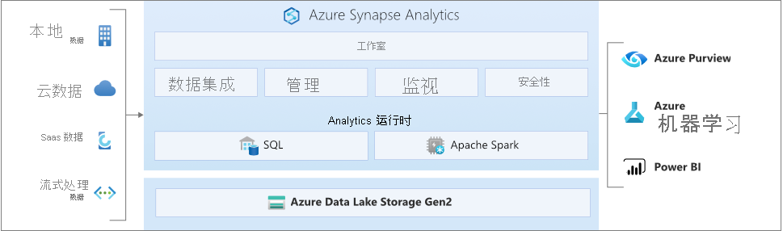

# 什么是 Azure Synapse Analytics？

Azure Synapse 是一项企业分析服务，可以缩短在数据仓库和大数据系统中进行见解提取所需的时间。 Azure Synapse 汇集了企业数据仓库中所用 SQL 技术的精华、用于大数据的 Spark 技术、用于数据集成和 ETL/ELT 的 Pipelines，以及与其他 Azure 服务（Power BI、CosmosDB 和 AzureML）的深度集成。     。

## 行业领先的 SQL

Synapse SQL 是 T-SQL 的分布式查询系统，它实现了数据仓库和数据虚拟化方案，还扩展了 T-SQL 来应对流式处理和计算机学习方案。

* Synapse SQL 同时提供了“无服务器”和“专用”资源模型。  若要使性能和成本可预测，可以创建专用 SQL 池，以保留对 SQL 表中存储的数据进行处理的能力。 对于计划外或突发性的工作负荷，请使用始终可用的无服务器 SQL 终结点。
* 使用内置的流式处理功能可将数据从云数据源载入到 SQL 表中。
* 将数据加载到托管表以获取最佳查询性能，或直接在 [Azure Data Lake Storage](sql/query-data-storage.md) 或 [Azure Cosmos DB](sql/query-cosmos-db-analytical-store.md) 中查询数据，而无需执行定期导入任务并等待完成。
* 通过使用机器学习模型并使用 [T-SQL PREDICT 函数](/sql/t-sql/queries/predict-transact-sql?view=azure-sqldw-latest&preserve-view=true)对数据进行评分，将 AI 与 SQL 集成。

## 行业标准 Apache Spark

Apache Spark for Azure Synapse 深入无缝地集成了 Apache Spark - 用于数据准备、数据工程、ETL 和机器学习的最流行的开源大数据引擎。

* Apache Spark 2.4 的集成了 SparkML 算法和 AzureML 的 ML 模型原生支持 Linux Foundation Delta Lake。
* 简化的资源模型使你无需担心群集的管理。
* Spark 可以快速启动并主动自动缩放。
* 原生支持 .NET for Spark，使你能够在 Spark 应用程序中重复利用自己的 C# 专业知识和现有的 .Net 代码。

## 使用数据湖

Azure Synapse 消除了结合使用 SQL 和 Spark 时存在的传统技术阻碍。 你可以根据需求和专业知识无缝混搭使用这两种技术。

* Spark 或 Hive 可以无缝使用基于数据湖中文件定义的各种表。
* SQL 和 Spark 可以直接浏览和分析 Data Lake 中存储的 Parquet、CSV、TSV、Delta Lake 和 JSON 文件。
* 在 SQL 与 Spark 数据库之间以可缩放的方式快速加载的数据

## 内置数据集成

Azure Synapse 包含了与 Azure 数据工厂相同的数据集成引擎和体验，使你可以创建丰富的大规模 ETL 管道，而无需离开 Azure Synapse Analytics。

* 从 90 多个数据源引入数据
* 使用数据流活动的无代码 ETL
* 协调笔记本、Spark 作业、存储过程、SQL 脚本等

## 统一体验 

Synapse Studio 为企业提供了一种单一方法来生成解决方案、维护和保护单一用户体验中的所有内容

* 执行关键任务：引入、浏览、准备、编排、可视化
* 监视 SQL 与 Spark 中的资源、使用情况和用户
* 使用基于角色的访问控制来简化对分析资源的访问
* 编写 SQL 或 Spark 代码，并与企业 CI/CD 过程集成

## 与 Synapse 社区互动

- [Microsoft Q&A](/answers/topics/azure-synapse-analytics.html)：询问技术问题。
- [Stack Overflow](https://stackoverflow.com/questions/tagged/azure-synapse)：询问开发问题。

## 后续步骤

* [Azure Synapse Analytics 入门](get-started.md)
* [创建工作区](quickstart-create-workspace.md)
* [使用无服务器 SQL 池](quickstart-sql-on-demand.md)
