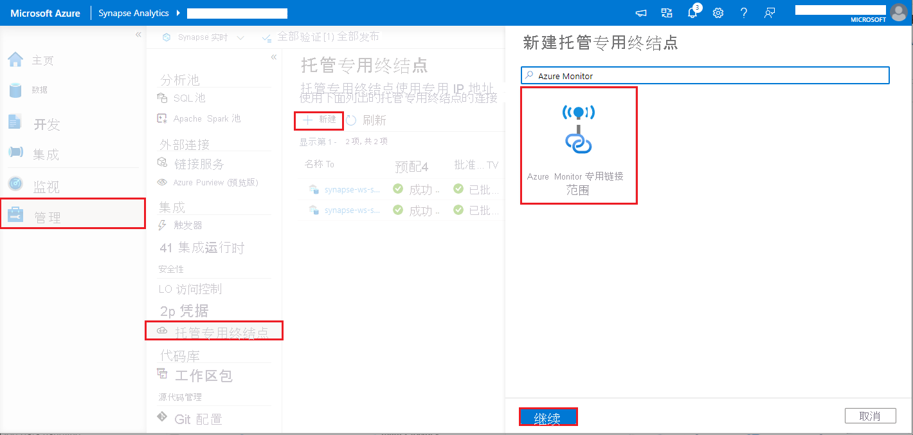
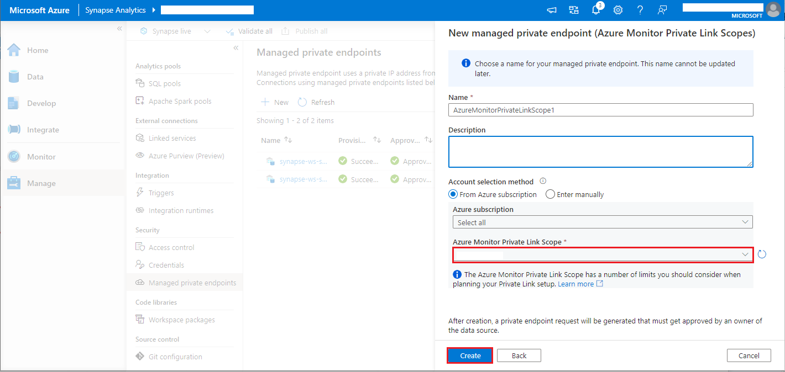

# <a name="monitor-apache-spark-applications-with-azure-log-analytics-preview"></a>通过 Azure Log Analytics 监视 Apache Spark 应用程序（预览）

在本教程中，你先学习如何启用内置于 Log Analytics 中的 Synapse Studio 连接器。 然后，你可以收集 Apache Spark 应用程序指标和日志并将其发送到 [Log Analytics 工作区](../../azure-monitor/logs/quick-create-workspace.md)。 最后，可使用 Azure Monitor 工作簿将指标和日志可视化。

## <a name="configure-workspace-information"></a>配置工作区信息

按照以下步骤配置 Synapse Studio 中的必要信息。

### <a name="step-1-create-a-log-analytics-workspace"></a>步骤 1：创建 Log Analytics 工作区

参考以下任一资源，创建此工作区：
- [在 Azure 门户中创建工作区](../../azure-monitor/logs/quick-create-workspace.md)
- [使用 Azure CLI 创建工作区](../../azure-monitor/logs/resource-manager-workspace.md)
- [使用 PowerShell 在 Azure Monitor 中创建和配置工作区](../../azure-monitor/logs/powershell-workspace-configuration.md)

### <a name="step-2-prepare-a-apache-spark-configuration-file"></a>步骤 2：准备 Apache Spark 配置文件

使用下面的任何一个选项来准备此文件。

#### <a name="option-1-configure-with-log-analytics-workspace-id-and-key"></a>选项 1：配置 Log Analytics 工作区 ID 和密钥 

复制以下 Apache Spark 配置，将其保存为“spark_loganalytics_conf.txt”，并填入以下参数：

   - `<LOG_ANALYTICS_WORKSPACE_ID>`：Log Analytics 工作区 ID。
   - `<LOG_ANALYTICS_WORKSPACE_KEY>`：Log Analytics 密钥。 若要查找此项，请在 Azure 门户中转到“Azure Log Analytics 工作区” > “代理管理” > “主密钥”  。

```properties
spark.synapse.logAnalytics.enabled true
spark.synapse.logAnalytics.workspaceId <LOG_ANALYTICS_WORKSPACE_ID>
spark.synapse.logAnalytics.secret <LOG_ANALYTICS_WORKSPACE_KEY>
```

#### <a name="option-2-configure-with-azure-key-vault"></a>选项 2：配置 Azure 密钥保管库

> [!NOTE]
> 对于将提交 Apache Spark 应用程序的用户，需要向其授予读取机密权限。 有关详细信息，请参阅[使用 Azure 基于角色的访问控制提供对密钥保管库密钥、证书和机密的访问权限](../../key-vault/general/rbac-guide.md)。

若要配置 Azure 密钥保管库以存储工作区密钥，请执行以下步骤：

1. 在 Azure 门户中，创建并转到密钥保管库。
2. 在密钥保管库的“设置”页上，选择“机密”。
3. 选择“生成/导入”。
4. 在“创建机密”屏幕上，选择以下值：
   - **名称**：输入机密的名称。 对于默认设置，请输入 `SparkLogAnalyticsSecret`。
   - **值**：输入机密的 `<LOG_ANALYTICS_WORKSPACE_KEY>`。
   - 让其他值保留默认设置。 然后选择“创建”。
5. 复制以下 Apache Spark 配置，将其保存为“spark_loganalytics_conf.txt”，并填入以下参数：

   - `<LOG_ANALYTICS_WORKSPACE_ID>`：Log Analytics 工作区 ID。
   - `<AZURE_KEY_VAULT_NAME>`：配置的密钥保管库名称。
   - `<AZURE_KEY_VAULT_SECRET_KEY_NAME>`（可选）：工作区密钥的密钥保管库中的机密名称。 默认为 `SparkLogAnalyticsSecret`。

```properties
spark.synapse.logAnalytics.enabled true
spark.synapse.logAnalytics.workspaceId <LOG_ANALYTICS_WORKSPACE_ID>
spark.synapse.logAnalytics.keyVault.name <AZURE_KEY_VAULT_NAME>
spark.synapse.logAnalytics.keyVault.key.secret <AZURE_KEY_VAULT_SECRET_KEY_NAME>
```

> [!NOTE]
> 你还可以将工作区 ID 存储到密钥保管库中。 请参考前述步骤，存储包含机密名称 `SparkLogAnalyticsWorkspaceId` 的工作区 ID。 或者，可以使用配置 `spark.synapse.logAnalytics.keyVault.key.workspaceId` 在密钥保管库中指定工作区 ID 机密名称。

#### <a name="option-3-configure-with-a-linked-service"></a>选项 3. 配置链接服务

> [!NOTE]
> 对于将提交 Apache Spark 应用程序的用户，需要向其授予读取机密权限。 有关详细信息，请参阅[使用 Azure 基于角色的访问控制提供对密钥保管库密钥、证书和机密的访问权限](../../key-vault/general/rbac-guide.md)。

若要在 Synapse Studio 中配置密钥保管库链接服务以存储工作区密钥，请执行以下步骤：

1. 执行上一个部分（选项 2）中的所有步骤。
2. 在 Synapse Studio 中创建密钥保管库链接服务：

    a. 转到“Synapse Studio” > “管理” > “链接服务”，然后选择“新建”   。

    b. 在搜索框中，搜索“Azure 密钥保管库”。

    c. 输入链接服务名称。

    d. 选择密钥保管库，并选择“创建”。

3. 将 `spark.synapse.logAnalytics.keyVault.linkedServiceName` 项添加到 Apache Spark 配置。

```properties
spark.synapse.logAnalytics.enabled true
spark.synapse.logAnalytics.workspaceId <LOG_ANALYTICS_WORKSPACE_ID>
spark.synapse.logAnalytics.keyVault.name <AZURE_KEY_VAULT_NAME>
spark.synapse.logAnalytics.keyVault.key.secret <AZURE_KEY_VAULT_SECRET_KEY_NAME>
spark.synapse.logAnalytics.keyVault.linkedServiceName <LINKED_SERVICE_NAME>
```

#### <a name="available-apache-spark-configuration"></a>可用的 Apache Spark 配置

| 配置名称 | 默认值 | 说明 |
| ------------------ | ------------- | ----------- |
| spark.synapse.logAnalytics.enabled | false | 若要为 Spark 应用程序启用 Log Analytics 接收器，为 true。 否则为 false。 |
| spark.synapse.logAnalytics.workspaceId | - | 目标 Log Analytics 工作区 ID。 |
| spark.synapse.logAnalytics.secret | - | 目标 Log Analytics 工作区机密。 |
| spark.synapse.logAnalytics.keyVault.linkedServiceName   | - | Log Analytics 工作区 ID 和密钥的密钥保管库链接服务名称。 |
| spark.synapse.logAnalytics.keyVault.name | - | Log Analytics ID 和密钥的密钥保管库名称。 |
| spark.synapse.logAnalytics.keyVault.key.workspaceId | SparkLogAnalyticsWorkspaceId | Log Analytics 工作区 ID 的密钥保管库机密名称。 |
| spark.synapse.logAnalytics.keyVault.key.secret | SparkLogAnalyticsSecret | Log Analytics 工作区的 Key Vault 机密名称 |
| spark.synapse.logAnalytics.uriSuffix | ods.opinsights.azure.com | 目标 Log Analytics 工作区的 [URI 后缀][uri_suffix]。 如果工作区不在 Azure 全球中，则需要根据相应的云更新 URI 后缀。 |
| spark.synapse.logAnalytics.filter.eventName.match | - | 可选。 以逗号分隔的 Spark 事件名称，你可指定要收集的事件。 例如：`SparkListenerJobStart,SparkListenerJobEnd` |
| spark.synapse.logAnalytics.filter.loggerName.match | - | 可选。 以逗号分隔的 log4j 记录器名称，你可指定要收集的日志。 例如：`org.apache.spark.SparkContext,org.example.Logger` |
| spark.synapse.logAnalytics.filter.metricName.match | - | 可选。 以逗号分隔的 Spark 指标名称后缀，你可指定要收集的指标。 例如：`jvm.heap.used`|

> [!NOTE]  
> - 对于 Azure 中国，`spark.synapse.logAnalytics.uriSuffix` 参数应为 `ods.opinsights.azure.cn`。 
> - 对于 Azure 政府，`spark.synapse.logAnalytics.uriSuffix` 参数应为 `ods.opinsights.azure.us`。 

[uri_suffix]: ../../azure-monitor/logs/data-collector-api.md#request-uri


### <a name="step-3-upload-your-apache-spark-configuration-to-a-apache-spark-pool"></a>步骤 3：将 Apache Spark 配置上传到 Apache Spark 池
你可以将配置文件上传到 Azure Synapse Analytics 中的 Apache Spark 池。 在 Synapse Studio 中：

   1. 选择“管理” > “Apache Spark 池” 。
   2. 选择 Apache Spark 池旁边的“...”按钮。
   3. 选择“Apache Spark 配置”。 
   4. 选择“上传”，然后选择“spark_loganalytics_conf.txt”文件。
   5. 选择“上传”，然后选择“应用” 。

      > [!div class="mx-imgBorder"]
      > 

> [!NOTE] 
>
> 提交到 Apache Spark 池的所有 Apache Spark 应用程序都会使用该配置设置将 Apache Spark 应用程序指标和日志推送到指定工作区。

## <a name="submit-a-apache-spark-application-and-view-the-logs-and-metrics&quot;></a>提交 Apache Spark 应用程序并查看日志和指标

下面介绍如何操作：

1. 将 Apache Spark 应用程序提交到上一步中配置的 Apache Spark 池。 可以使用以下任何一个方法来实现此操作：
    - 在 Synapse Studio 中运行笔记本。 
    - 在 Synapse Studio 中，通过 Apache Spark 作业定义提交一个 Apache Spark 批处理作业。
    - 运行包含 Apache Spark 活动的管道。

1. 转到指定的 Log Analytics 工作区，然后在 Apache Spark 应用程序开始运行时查看应用程序指标和日志。

## <a name=&quot;write-custom-application-logs&quot;></a>编写自定义应用程序日志

可以使用 Apache Log4j 库编写自定义日志。

Scala 的示例：

```scala
%%spark
val logger = org.apache.log4j.LogManager.getLogger(&quot;com.contoso.LoggerExample")
logger.info("info message")
logger.warn("warn message")
logger.error("error message")
```

PySpark 的示例：

```python
%%pyspark
logger = sc._jvm.org.apache.log4j.LogManager.getLogger("com.contoso.PythonLoggerExample")
logger.info("info message")
logger.warn("warn message")
logger.error("error message")
```

## <a name="use-the-sample-workbook-to-visualize-the-metrics-and-logs"></a>使用示例工作簿可视化指标和日志

1. [下载工作簿](https://aka.ms/SynapseSparkLogAnalyticsWorkbook)。
2. 打开并复制工作簿文件内容。
3. 在 [Azure 门户](https://portal.azure.com/)中，选择“Log Analytics 工作区” > “工作簿” 。 
4. 打开空白工作簿。 通过选择 </> 图标来使用“高级编辑器”模式 。
5. 粘贴任何存在的 JSON 代码。
6. 选择“应用”，然后选择“完成编辑” 。

    > [!div class="mx-imgBorder"]
    > 

    > [!div class="mx-imgBorder"]
    > 

然后，将 Apache Spark 应用程序提交到配置的 Apache Spark 池。 在应用程序进入正在运行状态后，在工作簿下拉列表中选择正在运行的应用程序。

> [!div class="mx-imgBorder"]
> 

你可以自定义工作簿。 例如，可以使用 Kusto 查询并配置警报。

> [!div class="mx-imgBorder"]
> 

## <a name="query-data-with-kusto"></a>使用 Kusto 查询数据

下面是查询 Apache Spark 事件的示例：

```kusto
SparkListenerEvent_CL
| where workspaceName_s == "{SynapseWorkspace}" and clusterName_s == "{SparkPool}" and livyId_s == "{LivyId}"
| order by TimeGenerated desc
| limit 100 
```

下面是查询 Apache Spark 应用程序驱动程序和执行程序日志的示例：

```kusto
SparkLoggingEvent_CL
| where workspaceName_s == "{SynapseWorkspace}" and clusterName_s == "{SparkPool}" and livyId_s == "{LivyId}"
| order by TimeGenerated desc
| limit 100
```

下面是查询 Apache Spark 指标的示例：

```kusto
SparkMetrics_CL
| where workspaceName_s == "{SynapseWorkspace}" and clusterName_s == "{SparkPool}" and livyId_s == "{LivyId}"
| where name_s endswith "jvm.total.used"
| summarize max(value_d) by bin(TimeGenerated, 30s), executorId_s
| order by TimeGenerated asc
```


## <a name="create-and-manage-alerts"></a>创建和管理警报

用户可以进行查询，以按设置的频率评估指标和日志，并根据结果触发警报。 有关详细信息，请参阅[使用 Azure Monitor 创建、查看和管理日志警报](../../azure-monitor/alerts/alerts-log.md)。

## <a name="synapse-workspace-with-data-exfiltration-protection-enabled"></a>启用了数据外泄防护功能的 Synapse 工作区

在启用[数据外泄防护](../security/workspace-data-exfiltration-protection.md)的情况下创建 Synapse 工作区之后。

若要启用此功能，需要在工作区已批准的 Azure AD 租户中创建对 [Azure Monitor 专用链接范围 (AMPLS)](../../azure-monitor/logs/private-link-security.md) 的托管专用终结点连接请求。

可以按照以下步骤创建到 Azure Monitor 专用链接范围 (AMPLS) 的托管专用终结点连接：

1. 如果没有现有的 AMPLS，请按照 [Azure Monitor 专用链接连接设置](../../azure-monitor/logs/private-link-security.md)创建一个。
2. 在 Azure 门户中导航到 AMPLS，在“Azure Monitor 资源”页面上，单击“添加”以添加到 Azure Log Analytics 工作区的连接 。
3. 导航到“Synapse Studio”>“管理”>“托管专用终结点”，单击“新建”按钮，选择“Azure Monitor 专用链接范围”，然后选择“继续”   。
   > [!div class="mx-imgBorder"]
   > 
4. 选择刚刚创建的 Azure Monitor 专用链接范围，然后单击“创建”按钮。
   > [!div class="mx-imgBorder"]
   > 
5. 预配专用终结点期间请耐心等待。
6. 在 Azure 门户中再次导航到 AMPLS，在“专用终结点连接”页面上，选择刚刚预配的连接，然后单击“批准” 。

> [!NOTE] 
>  - 在规划专用链接设置时，应考虑到 AMPLS 对象的许多限制。 若要深入了解这些限制，请参阅 [AMPLS 限制](../../azure-monitor/logs/private-link-security.md)。 
>  - 检查是否具有创建托管专用终结点的[正确权限](../security/synapse-workspace-access-control-overview.md)。

## <a name="next-steps"></a>后续步骤

 - [在 Synapse Studio 中使用无服务器 Apache Spark 池](../quickstart-create-apache-spark-pool-studio.md)。
 - [在笔记本中运行 Spark 应用程序](./apache-spark-development-using-notebooks.md)。
 - [在 Azure Studio 中创建 Apache Spark 作业定义](./apache-spark-job-definitions.md)。
 - [使用 Azure 存储帐户收集 Apache Spark 应用程序日志和指标](./azure-synapse-diagnostic-emitters-azure-storage.md)。
 - [使用 Azure 事件中心收集 Apache Spark 应用程序日志和指标](./azure-synapse-diagnostic-emitters-azure-eventhub.md)。