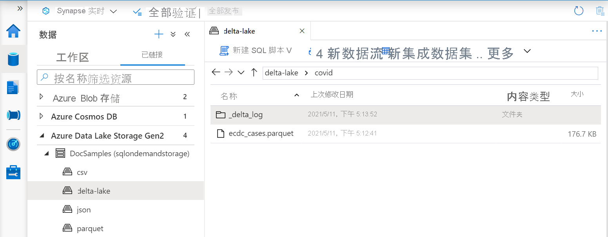
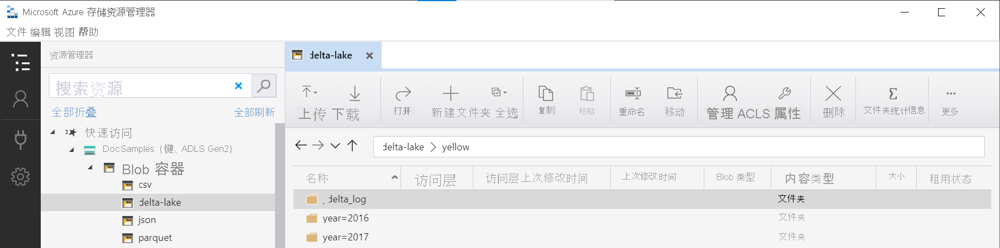

# <a name="create-and-use-views-using-serverless-sql-pool-in-azure-synapse-analytics"></a>在 Azure Synapse Analytics 中通过无服务器 SQL 池创建和使用视图

本部分介绍了如何创建和使用视图，以便包装无服务器 SQL 池查询。 可以通过视图重复使用这些查询。 如果希望将 Power BI 之类的工具与无服务器 SQL 池结合使用，也需使用视图。

## <a name="prerequisites"></a>先决条件

第一步是创建一个数据库，将在该数据库中创建视图，并通过对该数据库执行[安装脚本](https://github.com/Azure-Samples/Synapse/blob/master/SQL/Samples/LdwSample/SampleDB.sql)来初始化在 Azure 存储上进行身份验证所需的对象。 本文中的所有查询将在示例数据库上执行。

## <a name="views-over-external-data"></a>基于外部数据的视图

可以采用与创建常规 SQL Server 视图相同的方式来创建视图。 下面的查询创建一个视图，该视图读取 population.csv 文件。

> [!NOTE]
> 更改查询中的第一行（即 [mydbname]），以便使用你创建的数据库。

```sql
USE [mydbname];
GO

DROP VIEW IF EXISTS populationView;
GO

CREATE VIEW populationView AS
SELECT * 
FROM OPENROWSET(
        BULK 'csv/population/population.csv',
        DATA_SOURCE = 'SqlOnDemandDemo',
        FORMAT = 'CSV', 
        FIELDTERMINATOR =',', 
        ROWTERMINATOR = '\n'
    )
WITH (
    [country_code] VARCHAR (5) COLLATE Latin1_General_BIN2,
    [country_name] VARCHAR (100) COLLATE Latin1_General_BIN2,
    [year] smallint,
    [population] bigint
) AS [r];
```

该视图将 `EXTERNAL DATA SOURCE` 与你的存储的根 URL 一起用作 `DATA_SOURCE`，并添加文件的相对文件路径。

### <a name="delta-lake-views"></a>Delta Lake 视图

如果要基于 Delta Lake 文件夹创建视图，则需要在 `BULK` 选项后指定根文件夹的位置，而不是指定文件路径。

> [!div class="mx-imgBorder"]
>

从 Delta Lake 文件夹读取数据的 `OPENROWSET` 函数会检查文件夹结构并自动识别文件位置。

```sql
create or alter view CovidDeltaLake
as
select *
from openrowset(
           bulk 'covid',
           data_source = 'DeltaLakeStorage',
           format = 'delta'
    ) with (
           date_rep date,
           cases int,
           geo_id varchar(6)
           ) as rows
```

Delta Lake 目前为公共预览版，存在一些已知问题和限制。 在 [Synapse 无服务器 SQL 池自助页](resources-self-help-sql-on-demand.md#delta-lake)上查看已知问题。

## <a name="partitioned-views"></a>分区视图

如果你有一组在分层文件夹结构中分区的文件，则可以在文件路径中使用通配符来描述分区模式。 使用 `FILEPATH` 函数可以将文件夹路径的一部分公开为分区列。

```sql
CREATE VIEW TaxiView
AS SELECT *, nyc.filepath(1) AS [year], nyc.filepath(2) AS [month]
FROM
    OPENROWSET(
        BULK 'parquet/taxi/year=*/month=*/*.parquet',
        DATA_SOURCE = 'sqlondemanddemo',
        FORMAT='PARQUET'
    ) AS nyc
```

如果使用分区列上的筛选器查询此视图，则分区视图会执行文件夹分区排除操作。 这可能会提高查询性能。

### <a name="delta-lake-partitioned-views"></a>Delta Lake 分区视图

如果要基于 Delta Lake 存储创建分区视图，则可以仅指定一个根 Delta Lake 文件夹，而无需使用 `FILEPATH` 函数显式公开分区列：

```sql
CREATE OR ALTER VIEW YellowTaxiView
AS SELECT *
FROM  
    OPENROWSET(
        BULK 'yellow',
        DATA_SOURCE = 'DeltaLakeStorage',
        FORMAT='DELTA'
    ) nyc
```

`OPENROWSET` 函数会检查底层 Delta Lake 文件夹的结构，自动标识并公开分区列。 如果将分区列放在查询的 `WHERE` 子句中，则会自动执行分区排除操作。

`OPENROWSET` 函数中的、与 `DeltaLakeStorage` 数据源中定义的 `LOCATION` URI 连接的文件夹名称（在本示例中为 `yellow`），必须引用包含名为 `_delta_log` 的子文件夹的 Delta Lake 根文件夹。

> [!div class="mx-imgBorder"]
>

Delta Lake 目前为公共预览版，存在一些已知问题和限制。 在 [Synapse 无服务器 SQL 池自助页](resources-self-help-sql-on-demand.md#delta-lake)上查看已知问题。

## <a name="json-views"></a>JSON 视图

如果需要在从文件获取的结果集的基础上进行一些额外的处理，则视图是不错的选择。 例如分析 JSON 文件，我们需要应用 JSON 函数以从 JSON 文档中提取值：

```sql
CREATE OR ALTER VIEW CovidCases
AS 
select
    *
from openrowset(
        bulk 'latest/ecdc_cases.jsonl',
        data_source = 'covid',
        format = 'csv',
        fieldterminator ='0x0b',
        fieldquote = '0x0b'
    ) with (doc nvarchar(max)) as rows
    cross apply openjson (doc)
        with (  date_rep datetime2,
                cases int,
                fatal int '$.deaths',
                country varchar(100) '$.countries_and_territories')
```

`OPENJSON` 函数分析 JSONL 文件的每一行，该文件每行包含一个文本格式的 JSON 文档。

## <a name="cosmosdb-view"></a>CosmosDB 视图

如果在容器上启用了 CosmosDB 分析存储，则可以在 Azure CosmosDB 容器之上创建视图。 CosmosDB 帐户名称、数据库名称和容器名称应添加到视图中，并且只读访问密钥应放置在视图引用的数据库范围凭据中。

```sql
CREATE DATABASE SCOPED CREDENTIAL MyCosmosDbAccountCredential
WITH IDENTITY = 'SHARED ACCESS SIGNATURE', SECRET = 's5zarR2pT0JWH9k8roipnWxUYBegOuFGjJpSjGlR36y86cW0GQ6RaaG8kGjsRAQoWMw1QKTkkX8HQtFpJjC8Hg==';
GO
CREATE OR ALTER VIEW Ecdc
AS SELECT *
FROM OPENROWSET(
      PROVIDER = 'CosmosDB',
      CONNECTION = 'Account=synapselink-cosmosdb-sqlsample;Database=covid',
      OBJECT = 'Ecdc',
      CREDENTIAL = 'MyCosmosDbAccountCredential'
    ) with ( date_rep varchar(20), cases bigint, geo_id varchar(6) ) as rows
```

请在[此处](query-cosmos-db-analytical-store.md)查找有关使用 Synapse Link 查询 CosmosDB 容器的详细信息。

## <a name="use-a-view"></a>使用视图

可以在查询中使用视图，其方式与在 SQL Server 查询中使用视图的方式相同。

以下查询演示了如何使用在[创建视图](#views-over-external-data)中创建的 population_csv 视图。 它按降序返回国家/地区名称及其 2019 年的人口。

> [!NOTE]
> 更改查询中的第一行（即 [mydbname]），以便使用你创建的数据库。

```sql
USE [mydbname];
GO

SELECT
    country_name, population
FROM populationView
WHERE
    [year] = 2019
ORDER BY
    [population] DESC;
```

## <a name="next-steps"></a>后续步骤

若要了解如何查询不同的文件类型，请参阅以下文章：[查询单个 CSV 文件](query-single-csv-file.md)、[查询 Parquet 文件](query-parquet-files.md)和[查询 JSON 文件](query-json-files.md)。
