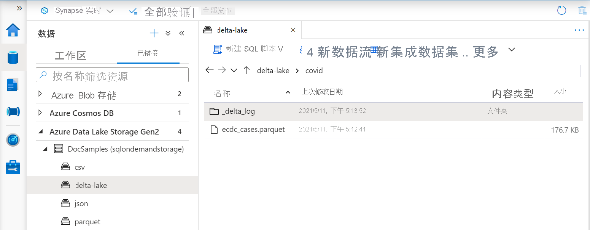
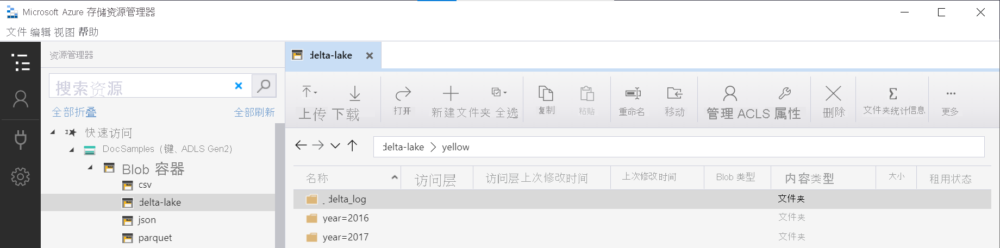

# <a name="query-delta-lake-files-preview-using-serverless-sql-pool-in-azure-synapse-analytics"></a>在 Azure Synapse Analytics 中使用无服务器 SQL 池查询 Delta Lake 文件（预览）

本文介绍如何使用无服务器 Synapse SQL 池编写查询来读取 Apache Delta Lake 文件。
Delta Lake 是开源存储层，可将 ACID（原子性、一致性、隔离性和持续性）事务引入 Apache Spark 和大数据工作负载。

通过 Synapse 工作区中的无服务器 SQL 池，可读取以 Delta Lake 格式存储的数据，并将其提供给报告工具。 无服务器 SQL 池可读取使用 Apache Spark、Azure Databricks 或其他任何 Delta Lake 格式的创建器创建的 Delta Lake 文件。

通过 Azure Synapse 中的 Apache Spark 池，数据工程师可使用 Scala、PySpark 和 .NET 修改 Delta Lake 文件。 无服务器 SQL 池可帮助数据分析师针对数据工程师创建的 Delta Lake 文件创建报表。

[!INCLUDE [synapse-analytics-preview-features](../../../includes/synapse-analytics-preview-features.md)]

## <a name="quickstart-example"></a>快速入门示例

通过 [OPENROWSET](develop-openrowset.md) 函数，可提供根文件夹的 URL 来读取 Delta Lake 文件的内容。

### <a name="read-delta-lake-folder"></a>读取 Delta Lake 文件夹

要查看 `DELTA` 文件的内容，最简单的方法是向 [OPENROWSET](develop-openrowset.md) 函数提供文件 URL，并指定 `DELTA` 格式。 如果文件公开可用，或者你的 Azure AD 标识可访问该文件，则你应该能够使用如下例所示的查询来查看该文件的内容：

```sql
SELECT TOP 10 *
FROM OPENROWSET(
    BULK 'https://sqlondemandstorage.blob.core.windows.net/delta-lake/covid/',
    FORMAT = 'delta') as rows;
```

系统会自动从 Delta Lake 文件中读取列名称和数据类型。 `OPENROWSET` 函数对字符串列使用最佳猜测类型，如 VARCHAR(1000)。

`OPENROWSET` 函数中的 URI 必须引用包含 `_delta_log` 子文件夹的 Delta Lake 根文件夹。

> [!div class="mx-imgBorder"]
>

如果没有此子文件夹，则无法使用 Delta Lake 格式。 可使用以下 Apache Spark Python 脚本将文件夹中的普通 Parquet 文件转换为 Delta Lake 格式：

```python
%%pyspark
from delta.tables import *
deltaTable = DeltaTable.convertToDelta(spark, "parquet.`abfss://delta-lake@sqlondemandstorage.dfs.core.windows.net/covid`")
```

为提高查询性能，请考虑在 [`WITH` 子句](#explicitly-specify-schema)中指定显式类型。

> [!NOTE]
> 无服务器 Synapse SQL 池使用架构推理来自动确定列及其类型。 架构推理的规则与 Parquet 文件所采用的规则相同。
> 对于 Delta Lake 类型到 SQL 本机类型的映射，请查看 [Parquet 的类型映射](develop-openrowset.md#type-mapping-for-parquet)。 

确保可访问文件。 如果文件由 SAS 密钥或自定义 Azure 标识保护，则你需要[为 sql 登录设置服务器级别的凭据](develop-storage-files-storage-access-control.md?tabs=shared-access-signature#server-scoped-credential)。

> [!IMPORTANT]
> 请确保使用 UTF-8 数据库排序规则（例如 `Latin1_General_100_BIN2_UTF8`），因为 Delta Lake 文件中的字符串值使用 UTF-8 编码进行编码。
> Delta Lake 文件中的文本编码与排序规则不匹配可能会导致意外的转换错误。
> 可以使用 T-SQL 语句 `alter database current collate Latin1_General_100_BIN2_UTF8` 轻松地更改当前数据库的默认排序规则

### <a name="data-source-usage"></a>数据源使用情况

上例使用了文件的完整路径。 作为替代方法，你可以创建一个外部数据源，其中包含指向存储根文件夹的位置。 创建外部数据源后，请在 `OPENROWSET` 函数中使用数据源和文件的相对路径。 这样就无需使用文件的完整绝对 URI。 然后，你还可定义自定义凭据来访问存储位置。

> [!IMPORTANT]
> 只能在自定义数据库中创建数据源（不能在主数据库中或从 Apache Spark 池复制的数据库中操作）。 

若要使用以下示例，需完成以下步骤：
1. 创建数据库，其中包含了引用[纽约黄色出租车](https://azure.microsoft.com/services/open-datasets/catalog/nyc-taxi-limousine-commission-yellow-taxi-trip-records/)存储帐户的数据源。 
1. 通过对第 1 步中创建的数据库执行[设置脚本](https://github.com/Azure-Samples/Synapse/blob/master/SQL/Samples/LdwSample/SampleDB.sql)操作来初始化对象。 此安装脚本将创建数据源、数据库范围的凭据以及在这些示例中使用的外部文件格式。

如果已创建数据库，并将上下文切换为该数据库（使用 `USE database_name` 语句或下拉列表在某些查询编辑器中选择数据库），则可创建包含数据集根 URI 的外部数据源，并用它来查询 Delta Lake 文件：

```sql
CREATE EXTERNAL DATA SOURCE DeltaLakeStorage
WITH ( LOCATION = 'https://sqlondemandstorage.blob.core.windows.net/delta-lake/' );
GO

SELECT TOP 10 *
FROM OPENROWSET(
        BULK 'covid',
        DATA_SOURCE = 'DeltaLakeStorage',
        FORMAT = 'delta'
    ) as rows;
```

如果数据源受到 SAS 密钥或自定义标识保护，则可以[使用数据库范围的凭据配置数据源](develop-storage-files-storage-access-control.md?tabs=shared-access-signature#database-scoped-credential)。

### <a name="explicitly-specify-schema"></a>显式指定架构

使用 `OPENROWSET`，你可以使用 `WITH` 子句显式指定要从文件中读取的列：

```sql
SELECT TOP 10 *
FROM OPENROWSET(
        BULK 'covid',
        DATA_SOURCE = 'DeltaLakeStorage',
        FORMAT = 'delta'
    )
    WITH ( date_rep date,
           cases int,
           geo_id varchar(6)
           ) as rows;
```

根据结果集架构的显式规范，可最大程度地缩小类型大小并为字符串列使用更精确的类型 VARCHAR(6)，而不是保守的 VARCHAR(1000)。 最大程度地缩小类型可能会显著提高查询的性能。

> [!IMPORTANT]
> 请确保在 `WITH` 子句中为所有字符串列显式指定某种 UTF-8 排序规则（例如 `Latin1_General_100_BIN2_UTF8`），或者在数据库级别设置某种 UTF-8 排序规则。
> 文件中的文本编码和字符串列排序规则不匹配可能会导致意外的转换错误。
> 可以使用 T-SQL 语句 `alter database current collate Latin1_General_100_BIN2_UTF8` 轻松地更改当前数据库的默认排序规则
> 可以使用以下定义轻松设置列类型的排序规则：`geo_id varchar(6) collate Latin1_General_100_BIN2_UTF8`

## <a name="dataset"></a>数据集

本示例中使用[纽约黄色出租车](https://azure.microsoft.com/services/open-datasets/catalog/nyc-taxi-limousine-commission-yellow-taxi-trip-records/)数据集。 可以使用与[读取 CSV 文件](query-parquet-files.md)相同的方式查询 Parquet 文件。 唯一的区别是 `FILEFORMAT` 参数应设置为 `PARQUET`。 本文中的示例演示了关于读取 Parquet 文件的详细信息。


### <a name="query-partitioned-data"></a>查询分区数据
此示例中提供的数据集划分（分区）为单独的子文件夹。
与 [Parquet](query-parquet-files.md) 不同，无需使用 `FILEPATH` 函数定位特定分区。 `OPENROWSET` 将标识 Delta Lake 文件夹结构中的分区列，并允许使用这些列直接查询数据。 此示例显示 2017 年前三个月的费用金额（按年、月和 payment_type）。

```sql
SELECT
        YEAR(pickup_datetime) AS year,
        passenger_count,
        COUNT(*) AS cnt
FROM  
    OPENROWSET(
        BULK 'yellow',
        DATA_SOURCE = 'DeltaLakeStorage',
        FORMAT='DELTA'
    ) nyc
WHERE
    nyc.year = 2017
    AND nyc.month IN (1, 2, 3)
    AND pickup_datetime BETWEEN CAST('1/1/2017' AS datetime) AND CAST('3/31/2017' AS datetime)
GROUP BY
    passenger_count,
    YEAR(pickup_datetime)
ORDER BY
    YEAR(pickup_datetime),
    passenger_count;
```

`OPENROWSET` 函数将消除与 where 子句中的 `year` 和 `month` 不匹配的分区。 该文件/分区修剪技术将显著减少数据集、提高性能并降低查询成本。

`OPENROWSET` 函数中的文件夹名称（在此示例中为 `yellow`）是使用 `DeltaLakeStorage` 数据源中的 `LOCATION` 连接的，并且必须引用包含 `_delta_log` 子文件夹的 Delta Lake 根文件夹。

> [!div class="mx-imgBorder"]
>

如果没有此子文件夹，则无法使用 Delta Lake 格式。 可使用以下 Apache Spark Python 脚本将文件夹中的普通 Parquet 文件转换为 Delta Lake 格式：

```python
%%pyspark
from delta.tables import *
deltaTable = DeltaTable.convertToDelta(spark, "parquet.`abfss://delta-lake@sqlondemandstorage.dfs.core.windows.net/yellow`", "year INT, month INT")
```

`DeltaTable.convertToDeltaLake` 函数的第二个参数表示文件夹模式（本例中为 `year=*/month=*`）中的分区列（年和月）及其类型。

## <a name="limitations"></a>限制

此功能目前为公共预览版，存在一些已知问题和限制。 在 [Synapse 无服务器 SQL 池自助页](resources-self-help-sql-on-demand.md#delta-lake)上查看已知问题。

## <a name="next-steps"></a>后续步骤

请继续学习下一篇文章，了解如何[查询 Parquet 嵌套类型](query-parquet-nested-types.md)。
如果要继续生成 Delta Lake 解决方案，请了解如何在 Delta Lake 文件夹中创建[视图](create-use-views.md#delta-lake-views)或[外部表](create-use-external-tables.md#delta-lake-external-table)。

## <a name="see-also"></a>另请参阅

- [什么是 Delta Lake](../spark/apache-spark-what-is-delta-lake.md)
- [了解如何在 Azure Synapse Analytics 的 Apache Spark 池中使用 Delta Lake](../spark/apache-spark-delta-lake-overview.md)
- [Azure Databricks Delta Lake 最佳做法](/azure/databricks/best-practices-index)
- [Delta Lake 文档页面](https://docs.delta.io/latest/delta-intro.html)
- [已知问题和限制](resources-self-help-sql-on-demand.md#delta-lake)
