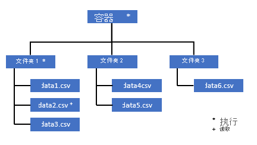
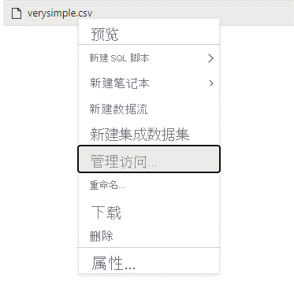
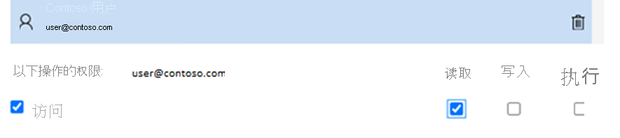

# <a name="self-help-for-serverless-sql-pool"></a>无服务器 SQL 池自助服务

本文介绍如何排查 Azure Synapse Analytics 中的无服务器 SQL 池的最常见问题。

## <a name="synapse-studio"></a>Synapse Studio

### <a name="serverless-sql-pool-is-grayed-out-in-synapse-studio"></a>无服务器 SQL 池在 Synapse Studio 中灰显

如果 Synapse Studio 无法建立到无服务器 SQL 池的连接，你会看到无服务器 SQL 池是灰显的，或者显示“脱机”状态。 通常，当发生下列情况之一时，会出现此问题：

1) 你的网络阻止了与 Azure Synapse 后端的通信。 最常见的情况是端口 1443 被阻止。 若要使无服务器 SQL 池正常工作，请取消阻止此端口。 其他问题可能也会阻止无服务器 SQL 池运行，[请访问完整的故障排除指南了解详细信息](../troubleshoot/troubleshoot-synapse-studio.md)。
2) 你无权登录到无服务器 SQL 池。 若要获取访问权限，可以要求某位 Azure Synapse 工作区管理员将你添加到工作区管理员或 SQL 管理员角色。 [有关详细信息，请参阅关于访问控制的完整指南](../security/synapse-workspace-access-control-overview.md)。

### <a name="query-fails-with-error-websocket-connection-was-closed-unexpectedly"></a>查询失败并出现错误：Websocket 连接意外关闭。

如果查询失败，并出现以下错误消息：“Websocket 连接意外关闭”，这意味着与 Synapse Studio 的浏览器连接被中断，例如由于网络问题。 

若要解决此问题，请重新运行此查询。 如果您的环境中经常出现此消息，请向您的网络管理员咨询帮助，检查防火墙设置，并[访问此故障排除指南以获取详细信息](../troubleshoot/troubleshoot-synapse-studio.md)。 

如果问题仍然存在，请通过 Azure 门户创建一个[支持票证](../../azure-portal/supportability/how-to-create-azure-support-request.md)，并尝试使用 [Azure Data Studio](/sql/azure-data-studio/download-azure-data-studio) 或 [SQL Server Management Studio](/sql/ssms/download-sql-server-management-studio-ssms) 处理相同的查询，而不必使用 Synapse Studio 进行进一步调查。

## <a name="query-execution"></a>查询执行

### <a name="query-fails-because-file-cannot-be-opened"></a>查询失败，因为无法打开文件

如果查询失败并出现“无法打开文件，因为该文件不存在或正被另一个进程使用”错误，但你确定文件存在且未被其他进程使用，则表明无服务器 SQL 池无法访问该文件。 出现此问题的原因通常是 Azure Active Directory 标识无权访问该文件或防火墙阻止访问该文件。 默认情况下，无服务器 SQL 池尝试使用 Azure Active Directory 标识来访问文件。 若要解决此问题，你需要有访问该文件的适当权限。 最简单的方法是在要查询的存储帐户上向自己授予“存储 Blob 数据参与者”角色。 
- [有关详细信息，请参阅关于 Azure Active Directory 访问控制（针对存储）的完整指南](../../storage/blobs/assign-azure-role-data-access.md)。 
- [请访问“在 Azure Synapse Analytics 中控制无服务器 SQL 池对存储帐户的访问”](develop-storage-files-storage-access-control.md)

#### <a name="alternative-to-storage-blob-data-contributor-role"></a>存储 Blob 数据参与者角色的替代选项

你还可以授予对文件子集的更细化权限，而不是授予存储 Blob 数据参与者。 

* 需要访问此容器中某些数据的所有用户还需要对所有父文件夹（直至根目录，即容器）具有“执行”权限。 详细了解[如何在 Azure Data Lake Storage Gen2 中设置 ACL](../../storage/blobs/data-lake-storage-explorer-acl.md)。 

> [!NOTE]
> 需要在 Azure Data Lake Gen2 内设置容器级别的“执行”权限。
> 可以在 Azure Synapse 中设置对文件夹的权限。 


如果要在此示例中查询 data2.csv，则需要以下权限： 
   - 对容器的“执行”权限
   - 对 folder1 的“执行”权限 
   - 对 data2.csv 的“读取”权限



* 以管理用户身份（需对你要访问的数据拥有完整权限）登录 Azure Synapse。

* 在数据窗格中，右键单击该文件，然后选择“管理访问权限”。



* 至少选择“读取”权限，键入用户 UPN 或对象 ID（例如，user@contoso.com），然后单击“添加”

* 为此用户授予“读取”权限。


> [!NOTE]
> 对于来宾用户，这需要直接通过 Azure Data Lake 服务来完成，因为不能直接通过 Azure Synapse 完成此操作。 

### <a name="query-fails-because-it-cannot-be-executed-due-to-current-resource-constraints"></a>查询失败，原因是当前的资源约束导致查询无法执行 

如果查询失败并出现错误消息“由于当前的资源约束，无法执行此查询”，则表示由于资源约束，无服务器 SQL 池此时无法执行该查询： 

- 请确保使用大小合理的数据类型。  

- 如果查询的目标是 Parquet 文件，请考虑为字符串列定义显式类型，因为它们将默认为 VARCHAR(8000)。 [查看推理数据类型](./best-practices-serverless-sql-pool.md#check-inferred-data-types)。

- 如果你的查询针对 CSV 文件，请考虑[创建统计信息](develop-tables-statistics.md#statistics-in-serverless-sql-pool)。 

- 请访问[适用于无服务器 SQL 池的性能最佳做法](./best-practices-serverless-sql-pool.md)以优化查询。  

### <a name="could-not-allocate-tempdb-space-while-transferring-data-from-one-distribution-to-another"></a>将数据从一个分布区传输到另一个分布区时无法分配 tempdb 空间

此错误是一般性的[查询失败，原因是当前资源约束导致查询无法执行](#query-fails-because-it-cannot-be-executed-due-to-current-resource-constraints)错误的一种特殊情况。 如果分配给 `tempdb` 数据库的资源不足以运行该查询，则会返回此错误。 

在提交支持票证之前，请运用相同的缓解措施和最佳做法。

### <a name="query-fails-with-error-while-handling-an-external-file"></a>处理外部文件时，查询失败并出错。 

如果查询失败并出现错误消息“处理外部文件时出错：已达到最大错误计数”，则表示指定的列类型与需要加载的数据不匹配。 若要获取有关错误以及要查看的行和列的详细信息，请将分析器版本从“2.0”更改为“1.0”。 

#### <a name="example"></a>示例
如果想用查询 1 来查询文件“names.csv”，Azure Synapse SQL Serverless 将返回这样的错误。 

names.csv
```csv
Id,first name, 
1,Adam
2,Bob
3,Charles
4,David
5,Eva
```

查询 1:
```sql
SELECT
    TOP 100 *
FROM
    OPENROWSET(
        BULK '[FILE-PATH OF CSV FILE]',
        FORMAT = 'CSV',
        PARSER_VERSION='2.0',
       FIELDTERMINATOR =';',
       FIRSTROW = 2
    ) 
    WITH (
    [ID] SMALLINT, 
    [Text] VARCHAR (1) COLLATE Latin1_General_BIN2 
)

    AS [result]
```
原因：

`Error handling external file: ‘Max error count reached’. File/External table name: [filepath].`

分析器版本从版本 2.0 更改为版本 1.0 后，错误消息将有助于识别问题。 现在，新的错误消息是： 

`Bulk load data conversion error (truncation) for row 1, column 2 (Text) in data file [filepath]`

截断会告诉我们列类型太小，无法容纳数据。 此“names.csv”文件中的最长名字包含七个字符。 因此，要使用的对应数据类型应至少为 VARCHAR(7)。 此错误是由下面这行代码引起的： 

```sql 
    [Text] VARCHAR (1) COLLATE Latin1_General_BIN2
```
相应地更改查询便可以解决错误：调试之后，请再次将分析器版本更改为 2.0 以获得最高性能。 有关在不同情况下使用哪种解析器版本的详细信息，请参阅[此处](develop-openrowset.md)。 

```sql 
SELECT
    TOP 100 *
FROM
    OPENROWSET(
        BULK '[FILE-PATH OF CSV FILE]',
        FORMAT = 'CSV',
        PARSER_VERSION='2.0',
        FIELDTERMINATOR =';',
        FIRSTROW = 2
    ) 
    WITH (
    [ID] SMALLINT, 
    [Text] VARCHAR (7) COLLATE Latin1_General_BIN2 
)

    AS [result]
```

### <a name="query-fails-with-conversion-error"></a>查询失败，出现转换错误
如果查询失败，并出现错误消息“数据文件 [filepath] 中的第 n 行，第 m 列 [columnname] 出现大容量加载数据转换错误（类型不匹配或者指定代码页的字符无效）”，这意味着你的数据类型与行号 n 和 列 m 的实际数据不匹配。 

例如，如果你只需要数据中的整数，但第 n 行中可能存在字符串，则您会收到这样的错误消息。 若要解决此问题，请检查文件和所选的数据类型。 另外，还要检查行分隔符和字段终止符设置是否正确。 下面的示例演示如何使用 VARCHAR 作为列类型来完成检查。 可在[此处](query-single-csv-file.md)详细了解字段终止符、行分隔符和转义引用字符。 

#### <a name="example"></a>示例 
如果想用查询 1 来查询文件“names.csv”，Azure Synapse SQL Serverless 将返回这样的错误。 

names.csv
```csv
Id, first name, 
1,Adam
2,Bob
3,Charles
4,David
five,Eva
```

查询 1:
```sql 
SELECT
    TOP 100 *
FROM
    OPENROWSET(
        BULK '[FILE-PATH OF CSV FILE]',
        FORMAT = 'CSV',
        PARSER_VERSION='1.0',
       FIELDTERMINATOR =',',
       FIRSTROW = 2
    ) 
    WITH (
    [ID] SMALLINT, 
    [Firstname] VARCHAR (25) COLLATE Latin1_General_BIN2 
)

    AS [result]
```

导致以下错误：`Bulk load data conversion error (type mismatch or invalid character for the specified codepage) for row 6, column 1 (ID) in data file [filepath]`

需要浏览数据并作出明智的决策来处理此问题。 若要查看导致此问题的数据，需要先更改数据类型。 现在使用 VARCHAR(100) 来分析此问题，而不是查询数据类型为“SMALLINT”的“ID”列。 使用这个经过小幅修改的查询 2，现在可以处理数据，并显示名称列表。 

查询 2： 
```sql
SELECT
    TOP 100 *
FROM
    OPENROWSET(
        BULK '[FILE-PATH OF CSV FILE]',
        FORMAT = 'CSV',
        PARSER_VERSION='1.0',
       FIELDTERMINATOR =',',
       FIRSTROW = 2
    ) 
    WITH (
    [ID] VARCHAR(100), 
    [Firstname] VARCHAR (25) COLLATE Latin1_General_BIN2 
)

    AS [result]
```

names.csv
```csv
Id, first name, 
1,Adam
2,Bob
3,Charles
4,David
five,Eva
```

数据似乎是在第五行中的 ID 具有意外值。 在这种情况下，请务必与数据的业务所有者保持一致，了解如何避免损坏数据。 如果无法在应用程序级别进行预防并且需要针对 ID 处理所有数据类型，则这里只能选择合理大小的 VARCHAR。

> [!Tip]
> 尝试使 VARCHAR () 尽可能简短。 请尽可能避免 VARCHAR (MAX)，因为这样可能会影响性能。 

### <a name="the-result-table-does-not-look-like-expected-result-columns-are-empty-or-unexpected-loaded"></a>结果表与预期不符。 结果列为空或未按预期加载。 

如果查询未失败，但是你发现结果表没有按预期加载，则很可能是因为选择了错误的行分隔符或字段终止符。 若要解决此问题，需要再次查看数据并更改这些设置。 由于显示了结果表，所以调试这个查询很容易，就像下面的示例一样。 

#### <a name="example"></a>示例
如果想用查询 1 来查询文件“names.csv”，Azure Synapse SQL Serverless 将返回一个看起来有点奇怪的结果表。 

names.csv
```csv
Id,first name, 
1,Adam
2,Bob
3,Charles
4,David
5,Eva
```

```sql
SELECT
    TOP 100 *
FROM
    OPENROWSET(
        BULK '[FILE-PATH OF CSV FILE]',
        FORMAT = 'CSV',
        PARSER_VERSION='1.0',
       FIELDTERMINATOR =';',
       FIRSTROW = 2
    ) 
    WITH (
    [ID] VARCHAR(100), 
    [Firstname] VARCHAR (25) COLLATE Latin1_General_BIN2 
)

    AS [result]
```

生成以下结果表

| ID            |   名   | 
| ------------- |-------------  | 
| 1,Adam        | Null | 
| 2,Bob         | Null | 
| 3,Charles     | Null | 
| 4,David       | Null | 
| 5,Eva         | Null | 

“firstname”列中似乎没有任何值。 相反，所有值最终都出现在“ID”列中。 这些值以逗号分隔。 这个问题是由以下代码行引起的，因为需要选择逗号作为字段终止符，而不是分号符号：

```sql
FIELDTERMINATOR =';',
```

只需更改这个字符便可解决问题：

```sql
FIELDTERMINATOR =',',
```

查询 2 创建的结果表现在看起来与预期一样。 

查询 2：
```sql
SELECT
    TOP 100 *
FROM
    OPENROWSET(
        BULK '[FILE-PATH OF CSV FILE]',
        FORMAT = 'CSV',
        PARSER_VERSION='1.0',
       FIELDTERMINATOR =',',
       FIRSTROW = 2
    ) 
    WITH (
    [ID] VARCHAR(100), 
    [Firstname] VARCHAR (25) COLLATE Latin1_General_BIN2 
)

    AS [result]
``` 

返回

| ID            |   名   | 
| ------------- |-------------  | 
| 1        | Adam | 
| 2         | Bob | 
| 3     | Charles | 
| 4       | David | 
| 5         | Eva | 


### <a name="query-fails-with-error-column-column-name-of-type-type-name-is--not-compatible-with-external-data-type-external-data-type-name"></a>查询失败并出现错误：[type-name] 类型的 [column-name] 列与外部数据类型 [external-data-type-name] 不兼容 

如果查询失败，并出现错误消息“[type-name] 类型的 [column-name] 列与外部数据类型 [external-data-type-name] 不兼容”，则很可能是用户试图将 PARQUET 数据类型映射到错误的 SQL 数据类型。 例如，如果 parquet 文件的“价格”列采用浮点数（例如 12.89），而你尝试将该文件映射到 INT，则会遇到这条错误消息。 

若要解决此问题，请检查文件和所选的数据类型。 此[映射表](develop-openrowset.md#type-mapping-for-parquet)有助于选择 SQL 数据类型。 最佳做法提示：只能为将会解析为 VARCHAR 数据类型的列指定映射。 请尽可能避免使用 VARCHAR，从而在查询中提高性能。 

#### <a name="example"></a>示例
如果想用查询 1 来查询文件“taxi-data.parquet”，Azure Synapse SQL Serverless 将返回这样的错误。

taxi-data.parquet:

|PassengerCount |SumTripDistance|AvgTripDistance |
|---------------|---------------|----------------|
| 1 | 2635668.66000064 | 6.72731710678951 |
| 2 | 172174.330000005 | 2.97915543404919 |
| 3 | 296384.390000011 | 2.8991352022851  |
| 4 | 12544348.58999806| 6.30581582240281 |
| 5 | 13091570.2799993 | 111.065989028627 |

查询 1:
```sql
SELECT
    *
FROM
    OPENROWSET(
        BULK '<filepath>taxi-data.parquet',
        FORMAT='PARQUET'
    )  WITh
        (
        PassengerCount INT, 
        SumTripDistance INT, 
        AVGTripDistance FLOAT
        )

    AS [result]
```

导致以下错误： 

`Column 'SumTripDistance' of type 'INT' is not compatible with external data type 'Parquet physical type: DOUBLE', please try with 'FLOAT'. File/External table name: '<filepath>taxi-data.parquet'.`

此错误消息告诉我们数据类型不兼容，并且还会建议你使用 FLOAT 来代替 INT。 此错误是由下面这行代码引起的： 

```sql
SumTripDistance INT, 
```

使用这个经过小幅修改的查询 2，现在可以处理数据，并显示全部三列。 

查询 2： 
```sql
SELECT
    *
FROM
    OPENROWSET(
        BULK '<filepath>taxi-data.parquet',
        FORMAT='PARQUET'
    )  WITh
        (
        PassengerCount INT, 
        SumTripDistance FLOAT, 
        AVGTripDistance FLOAT
        )

    AS [result]
```

## <a name="configuration"></a>配置

### <a name="query-fails-with-please-create-a-master-key-in-the-database-or-open-the-master-key-in-the-session-before-performing-this-operation"></a>查询失败，并包含以下消息：在执行此操作之前，请在数据库中创建一个主密钥或在会话中打开该主密钥。

如果查询失败并出现错误消息“在执行此操作之前，请在数据库中创建一个主密钥或在会话中打开该主密钥”，这意味着你的用户数据库目前无法访问主密钥。 

最有可能的是，你刚刚创建了一个新的用户数据库，但尚未创建主密钥。 

若要解决此问题，请通过以下查询创建主密钥：

```sql
CREATE MASTER KEY [ ENCRYPTION BY PASSWORD ='password' ];
```

> [!NOTE]
> 在此处将“password”替换为其他机密。 

### <a name="create-statement-is-not-supported-in-master-database"></a>主数据库不支持 CREATE STATEMENT

如果查询失败并显示以下错误消息：

> “未能执行查询。 错误：主数据不支持 CREATE EXTERNAL TABLE/DATA SOURCE/DATABASE SCOPED CREDENTIAL/FILE FORMAT。” 

这意味着无服务器 SQL 池的主数据库不支持创建以下内容：
  - 外部表
  - 外部数据源
  - 数据库范围的凭据
  - 外部文件格式

解决方案：

  1. 创建用户数据库：

```sql
CREATE DATABASE <DATABASE_NAME>
```

  2. 在 <DATABASE_NAME> 的上下文中执行 create 语句，该语句之前针对 master 数据库执行失败。 
  
  创建外部文件格式的示例：
    
```sql
USE <DATABASE_NAME>
CREATE EXTERNAL FILE FORMAT [SynapseParquetFormat] 
WITH ( FORMAT_TYPE = PARQUET)
```

### <a name="operation-is-not-allowed-for-a-replicated-database"></a>复制的数据库不允许操作。
   
如果尝试在数据库中创建某些 SQL 对象、用户或变更权限，可能会遇到诸如“复制的数据库不允许 CREATE USER 操作”之类的错误。 当您尝试在[与 Spark 池共享](../metadata/database.md)的数据库中创建某些对象时，将返回此错误。 从 Apache Spark 池复制的数据库是只读的。 不能使用 T-SQL 在复制的数据库中创建新对象。

创建一个单独的数据库，并使用由三部分组成的名称和跨数据库查询来引用同步后的[表](../metadata/table.md)。

## <a name="cosmos-db"></a>Cosmos DB

下表列出了可能的错误和故障排除操作。

| 错误 | 根本原因 |
| --- | --- |
| 语法错误：<br/> - `Openrowset` 附近有语法错误<br/> - `...` 不是可以识别的 `BULK OPENROWSET` 提供程序选项。<br/> - `...` 附近有语法错误 | 可能的根本原因：<br/> - 未使用 CosmosDB 作为第一个参数。<br/> - 在第三个参数中使用字符串字面量而不是标识符。<br/> - 未指定第三个参数（容器名称）。 |
| CosmosDB 连接字符串中出错。 | - 未指定帐户、数据库或密钥。 <br/> - 连接字符串中存在某个无法识别的选项。<br/> - 在连接字符串的末尾放置了一个分号 (`;`)。 |
| 解析 CosmosDB 路径失败，出现“帐户名称不正确”或“数据库名称不正确”错误。 | 找不到指定的帐户名称、数据库名称或容器，或者没有为指定的集合启用分析存储。|
| 解析 CosmosDB 路径失败，出现“机密值不正确”或“机密为 Null 或为空”错误。 | 帐户密钥无效或缺失。 |
| 类型为 `type name` 的列 `column name` 与外部数据类型 `type name` 不兼容。 | `WITH` 子句中指定的列类型与 Azure Cosmos DB 容器中的类型不匹配。 请尝试更改列类型，如 [Azure Cosmos DB 到 SQL 类型的映射](query-cosmos-db-analytical-store.md#azure-cosmos-db-to-sql-type-mappings)部分所述，或使用 `VARCHAR` 类型。 |
| 在所有单元格中，列包含 `NULL` 值。 | `WITH` 子句中可能出现错误的列名称或路径表达式。 `WITH` 子句中的列名称（或列类型后的路径表达式）必须与 Azure Cosmos DB 集合中的某些属性名称匹配。 比较区分大小写。 例如，`productCode` 和 `ProductCode` 是不同的属性。 |

你可以在 [Azure Synapse Analytics 反馈页](https://feedback.azure.com/forums/307516-azure-synapse-analytics?category_id=387862)上报告建议和问题。

### <a name="utf-8-collation-warning-is-returned-while-reading-cosmosdb-string-types"></a>读取 CosmosDB 字符串类型时返回了 UTF-8 排序规则警告

如果 `OPENROWSET` 列排序规则没有 UTF-8 编码，则无服务器 SQL 池会返回编译时警告。 可以使用 T-SQL 语句 `alter database current collate Latin1_General_100_CI_AS_SC_UTF8` 轻松更改当前数据库中运行的所有 `OPENROWSET` 函数的默认排序规则。

使用字符串谓词筛选数据时，[Latin1_General_100_BIN2_UTF8 排序规则](best-practices-serverless-sql-pool.md#use-proper-collation-to-utilize-predicate-pushdown-for-character-columns)可提供最佳性能。

### <a name="some-rows-are-not-returned"></a>不返回某些行

- 事务存储和分析存储之间存在同步延迟。 在 Cosmos DB 事务存储中输入的文档可能在 2 到 3 分钟后才会出现在分析存储中。
- 该文档可能会违反某些[架构约束](../../cosmos-db/analytical-store-introduction.md#schema-constraints)。 

### <a name="query-returns-null-values"></a>查询返回 `NULL` 值

在以下情况下，Azure Synapse SQL 将返回 `NULL`，而不是你在事务存储中看到的值：
- 事务存储和分析存储之间存在同步延迟。 在 Cosmos DB 事务存储中输入的值可能在 2 到 3 分钟后才会出现在分析存储中。
- `WITH` 子句中包含可能有错误的列名或路径表达式。 `WITH` 子句中的列名（或列类型后的路径表达式）必须与 Cosmos DB 集合中的属性名称匹配。 比较时区分大小写（例如，`productCode` 和 `ProductCode` 是不同的属性）。 请确保列名称与 Cosmos DB 属性名称完全匹配。
- 此属性可能不会移动到分析存储，因为此属性违反了某些[架构约束](../../cosmos-db/analytical-store-introduction.md#schema-constraints)，例如超过 1000 个属性，或超过 127 个嵌套级别。
- 如果使用定义完善的[架构表示形式](../../cosmos-db/analytical-store-introduction.md#schema-representation)，则事务存储中的值可能具有错误的类型。 定义完善的架构通过对文档进行采样来锁定每个属性的类型。 在事务存储中添加的任何与类型不匹配的值都将被视为错误的值，并且不会迁移到分析存储中。 
- 如果您使用的是完全真[架构表示形式](../../cosmos-db/analytical-store-introduction.md#schema-representation)，请确保在属性名后面添加类型后缀，如 `$.price.int64`。 如果看不到引用的路径的值，值可能是存储在不同的类型路径下面，例如 `$.price.float64`。 请参阅[如何在全真架构中查询 Cosmos Db 集合](query-cosmos-db-analytical-store.md#query-items-with-full-fidelity-schema)。

### <a name="column-is-not-compatible-with-external-data-type"></a>列与外部数据类型不兼容

`WITH` 子句中指定的值与分析存储中的基础 Cosmos DB 类型不匹配，因此无法进行隐式转换。 使用架构中的 `VARCHAR` 类型。

### <a name="cosmosdb-performance-issues"></a>CosmosDB 性能问题

如果你遇到一些意外的性能问题，请确保应用了最佳做法，例如：
- 确保已将客户端应用程序、无服务器池和 Cosmos DB 分析存储置于[同一区域](best-practices-serverless-sql-pool.md#colocate-your-azure-cosmos-db-analytical-storage-and-serverless-sql-pool)。
- 确保你使用的是具有[最优数据类型](best-practices-serverless-sql-pool.md#use-appropriate-data-types)的 `WITH` 子句。
- 当你使用字符串谓词筛选数据时，请确保使用 [Latin1_General_100_BIN2_UTF8 排序规则](best-practices-serverless-sql-pool.md#use-proper-collation-to-utilize-predicate-pushdown-for-character-columns)。
- 如果有可能缓存了重复的查询，请尝试[使用 CETAS 将查询结果存储在 Azure Data Lake Storage 中](best-practices-serverless-sql-pool.md#use-cetas-to-enhance-query-performance-and-joins)。

## <a name="delta-lake"></a>Delta Lake

在无服务器 SQL 池中，对 Delta Lake 的支持目前处于公共预览版。 在使用预览版期间，你可能会遇到一些已知问题。
- 请确保在 [OPENROWSET](./develop-openrowset.md) 函数或外部表位置中引用 Delta Lake 根文件夹。
  - 根文件夹必须有一个名为 `_delta_log` 的子文件夹。 如果没有 `_delta_log` 文件夹，则查询将失败。 如果看不到该文件夹，表明你正在引用纯 Parquet 文件，必须使用 Apache Spark 池将其[转换为 Delta Lake](../spark/apache-spark-delta-lake-overview.md?pivots=programming-language-python#convert-parquet-to-delta)。
  - 不要指定用于描述分区架构的通配符。 Delta Lake 查询会自动标识 Delta Lake 分区。 
- 在 Apache Spark 池中创建的 Delta Lake 表在无服务器 SQL 池中不会自动可用。 若要使用 T-SQL 语言查询此类 Delta Lake 表，请运行 [CREATE EXTERNAL TABLE](./create-use-external-tables.md#delta-lake-external-table) 语句并指定 Delta 作为格式。
- 外部表不支持分区。 使用 Delta Lake 文件夹的[分区视图](create-use-views.md#delta-lake-partitioned-views)来利用分区消除。 请参阅下面的已知问题和解决方法。
- 无服务器 SQL 池不支持按时间顺序查看的查询。 你可以在 [Azure 反馈网站](https://feedback.azure.com/forums/307516-azure-synapse-analytics/suggestions/43656111-add-time-travel-feature-in-delta-lake)上对此功能进行投票。 使用 Azure Synapse Analytics 中的 Apache Spark 池[读取历史数据](../spark/apache-spark-delta-lake-overview.md?pivots=programming-language-python#read-older-versions-of-data-using-time-travel)。
- 无服务器 SQL 池不支持更新 Delta Lake 文件。 可以使用无服务器 SQL 池来查询最新版本的 Delta Lake。 使用 Azure Synapse Analytics 中的 Apache Spark 池[更新 Delta Lake](../spark/apache-spark-delta-lake-overview.md?pivots=programming-language-python#update-table-data)。
- Azure Synapse Analytics 中的无服务器 SQL 池不支持带有 [BLOOM 筛选器](/azure/databricks/delta/optimizations/bloom-filters)的数据集。
- 专用 SQL 池中不支持 Delta Lake。 请确保使用无服务器池来查询 Delta Lake 文件。

### <a name="content-of-directory-on-path-cannot-be-listed"></a>无法列出路径上目录的内容

当无服务器 SQL 池无法读取 Delta Lake 事务日志文件夹时，将返回以下错误。

```
Msg 13807, Level 16, State 1, Line 6
Content of directory on path 'https://.....core.windows.net/.../_delta_log/*.json' cannot be listed.
```

确保 `_delta_log` 文件夹存在（可能你正在查询未转换为 Delta Lake 格式的普通 Parquet 文件）。

如果该 `_delta_log` 文件夹存在，请确保对底层 Delta Lake 文件夹具有“读取”和“列示”权限。
尝试使用 FORMAT='CSV' 直接读取 \*.json 文件（将 URI 置于 BULK 参数中）：

```sql
select top 10 * 
from openrowset(BULK 'https://.....core.windows.net/.../_delta_log/*.json', 
FORMAT='csv', FIELDQUOTE = '0x0b', FIELDTERMINATOR ='0x0b', ROWTERMINATOR = '0x0b') with (line varchar(max)) as logs
```

如果此查询失败，则调用方没有读取基础存储文件的权限。 

最简单的方法是在要查询的存储帐户上向自己授予“存储 Blob 数据参与者”角色。 
- [有关详细信息，请参阅关于 Azure Active Directory 访问控制（针对存储）的完整指南](../../storage/blobs/assign-azure-role-data-access.md)。 
- [请访问“在 Azure Synapse Analytics 中控制无服务器 SQL 池对存储帐户的访问”](develop-storage-files-storage-access-control.md)

### <a name="partitioning-column-returns-null-values"></a>分区列返回 NULL 值

状态：已解决

发布日期：2021 年 8 月

### <a name="query-failed-because-of-a-topology-change-or-compute-container-failure"></a>由于拓扑变更或计算容器故障，查询失败

状态：已解决

发布日期：2021 年 8 月

### <a name="column-of-type-varchar-is-not-compatible-with-external-data-type-parquet-column-is-of-nested-type"></a>“VARCHAR”类型的列与外部数据类型不兼容，“Parquet 列不是嵌套类型”

你正在尝试读取包含某些嵌套类型列的 Delta Lake 文件，但未指定 WITH 子句（使用自动架构推理）。

```sql
SELECT TOP 10 *
FROM OPENROWSET(
    BULK 'https://sqlondemandstorage.blob.core.windows.net/delta-lake/data-set-with-complex-type/',
    FORMAT = 'delta') as rows;
```

自动架构推理不适用于 Delta Lake 中的嵌套列。 如果指定 FORMAT='parquet' 并将 ** 追加到路径，请验证查询是否返回一些结果。

解决方法：使用 `WITH` 子句并将 `VARCHAR` 类型显式分配给嵌套列。 请注意，由于另一个已知问题（`WITH` 子句为分区列返回 `NULL`），如果数据集已分区，则此方法不起作用。 目前不支持包含复杂类型列的分区数据集。

### <a name="cannot-parse-field-type-in-json-object"></a>无法分析 JSON 对象中的字段“类型”

你正在尝试读取包含某些嵌套类型列的 Delta Lake 文件，但未指定 WITH 子句（使用自动架构推理）。 

```sql
SELECT TOP 10 *
FROM OPENROWSET(
    BULK 'https://sqlondemandstorage.blob.core.windows.net/delta-lake/data-set-with-complex-type/',
    FORMAT = 'delta') as rows;
```

自动架构推理不适用于 Delta Lake 中的嵌套列。 如果指定 FORMAT='parquet' 并将 ** 追加到路径，请验证查询是否返回一些结果。

解决方法：使用 `WITH` 子句并将 `VARCHAR` 类型显式分配给嵌套列。 请注意，由于另一个已知问题（`WITH` 子句为分区列返回 `NULL`），如果数据集已分区，则此方法不起作用。 目前不支持包含复杂类型列的分区数据集。

### <a name="cannot-find-value-of-partitioning-column-in-file"></a>在文件中找不到分区列的值 

Delta Lake 数据集在分区列中可能具有 `NULL` 值。 这些分区存储在 `HIVE_DEFAULT_PARTITION` 文件夹中。 无服务器 SQL 池目前不支持此功能。 在这种情况下，你将收到如下所示的错误：

```
Resolving Delta logs on path 'https://....core.windows.net/.../' failed with error:
Cannot find value of partitioning column '<column name>' in file 
'https://......core.windows.net/...../<column name>=__HIVE_DEFAULT_PARTITION__/part-00042-2c0d5c0e-8e89-4ab8-b514-207dcfd6fe13.c000.snappy.parquet'.
```

解决方法：尝试使用 Apache Spark 池更新 Delta Lake 数据集，并在分区列中使用某些值（空字符串或 `"null"`）代替 `null`。

### <a name="json-text-is-not-properly-formatted"></a>JSON 文本的格式不正确

此错误表示无服务器 SQL 池无法读取 Delta Lake 事务日志。 可能会出现如下所示的错误：

```
Msg 13609, Level 16, State 4, Line 1
JSON text is not properly formatted. Unexpected character '{' is found at position 263934.
Msg 16513, Level 16, State 0, Line 1
Error reading external metadata.
```
首先，请确保 Delta Lake 数据集未损坏。
- 验证是否能够使用 Synapse 或 Databricks 群集中的 Apache Spark 池读取 Delta Lake 文件夹的内容。 这可以确保文件 `_delta_log` 未损坏。
- 通过指定 `FORMAT='PARQUET'` 并在 URI 路径末尾使用递归通配符 `/**`，验证是否可以读取数据文件的内容。 如果可以读取所有 Parquet 文件，则问题与 `_delta_log` 事务日志文件夹有关。

一些常见错误和变通方法：

- `JSON text is not properly formatted. Unexpected character '.'` - 基础 parquet 文件可能包含无服务器 SQL 池不支持的数据类型。

变通方法：尝试使用 WITH 架构来排除不受支持的类型。

- `JSON text is not properly formatted. Unexpected character '{'` - 你可能正在使用某些 `_UTF8` 数据库排序规则。 

变通方法：尝试对 `master` 数据库或任何具有非 UTF8 排序规则的其他数据库运行查询。 如果这种方法解决了你的问题，请使用不采用 `_UTF8` 排序规则的数据库。 在 `WITH` 子句的列定义中指定 `_UTF8` 排序规则。

常规变通方法 - 尝试使用 Apache Spark 池在 Delta Lake 数据集上创建检查点，然后重新运行查询。 检查点将聚合事务 JSON 日志文件，并可能解决此问题。

如果数据集有效，但该解决方法不起作用，请提交支持工单并向 Azure 支持人员再现遇到的问题：
- 请不要进行添加/删除列或优化表之类的任何更改，因为这可能会更改 Delta Lake 事务日志文件的状态。
- 将 `_delta_log` 文件夹的内容复制到新的空文件夹中。 切勿复制 `.parquet data` 文件。
- 尝试读取已复制到新文件夹中的内容，并验证是否收到相同的错误。
- 现在，可以继续将 Delta Lake 文件夹与 Spark 池配合使用。 将复制的数据提供给 Microsoft 支持人员（如果允许你共享这些数据的话）。
- 将复制的 `_delta_log` 文件的内容发送给 Azure 支持人员。

Azure 团队将调查 `delta_log` 文件的内容，并提供有关可能的错误和解决方法的详细信息。

### <a name="resolving-delta-log-on-path--failed-with-error-cannot-parse-json-object-from-log-file"></a>未能解析路径 ... 上的增量日志，出现以下错误：无法分析日志文件中的 JSON 对象

此错误可能是以下原因/不支持的功能造成的：
- Delta Lake 数据集上的 [BLOOM 筛选器](/azure/databricks/delta/optimizations/bloom-filters)。 Azure Synapse Analytics 中的无服务器 SQL 池不支持带有 [BLOOM 筛选器](/azure/databricks/delta/optimizations/bloom-filters)的数据集。
- Delta Lake 数据集中的具有统计信息的浮动列。
- 在浮动列上进行分区的数据集。

变通方法：如果要使用无服务器 SQL 池读取 Delta Lake 文件夹，请[删除 BLOOM 筛选器](/azure/databricks/delta/optimizations/bloom-filters#drop-a-bloom-filter-index)。 如果有导致此问题的 `float` 列，则需要对数据集重新分区或删除统计信息。

## <a name="performance"></a>性能

无服务器 SQL 池根据数据集的大小和查询复杂程度将资源分配给查询。 不能影响或限制向查询提供的资源。 在某些情况下，可能会遇到意外的查询性能下降并需要确定根本原因。

### <a name="query-duration-is-very-long"></a>查询持续时间很长 

如果使用的是 Synapse Studio，请尝试使用某些桌面客户端，例如 SQL Server Management Studio 或 Azure Data Studio。 Synapse Studio 是使用 HTTP 协议连接到无服务器池的 Web 客户端，它的速度通常比 SQL Server Management Studio 或 Azure Data Studio 中使用的本机 SQL 连接慢。

如果查询持续时间超过 30 分钟，则表明将结果返回到客户端的速度较慢。 无服务器 SQL 池的执行限制为 30 分钟，任何额外的时间都花费在结果流式处理上。

如果查询执行速度缓慢，请检查以下问题：
-   请确保客户端应用程序与无服务器 SQL 池终结点并置。 跨区域执行查询可能会导致额外的延迟和结果集的流式处理速度变慢。
-   请确保没有可能导致结果集流式处理速度缓慢的网络问题 
-   确保客户端应用程序有足够的资源（例如 CPU 使用率未达到 100%）。 
-   确保存储帐户或 cosmosDB 分析存储与无服务器 SQL 终结点位于同一区域。

请参阅有关[并置资源](best-practices-serverless-sql-pool.md#client-applications-and-network-connections)的最佳做法。

### <a name="high-variations-in-query-durations"></a>查询持续时间变化大

如果执行相同的查询并观察到查询持续时间有变化，则可能有多种原因导致此行为：  
- 检查是否为首次执行查询。 首次执行查询会收集创建计划所需的统计信息。 统计信息是通过扫描基础文件进行收集的，此收集过程可能会延长查询持续时间。 在 Synapse Studio 中，你将在 SQL 请求列表中看到其他“全局统计信息创建”查询，这些查询会在你的查询之前执行。
- 统计信息可能会在一段时间后过期，因此你可能会定期观察到对性能的影响，因为无服务器池必须扫描并重新生成统计信息。 你可能会注意到 SQL 请求列表中出现“全局统计信息创建”查询，这些查询会在你的查询之前执行。
- 执行查询的持续时间较长时，请检查是否在同一终结点上运行了一些额外的工作负载。 无服务器 SQL 终结点将平等地将资源分配给并行执行的所有查询，并且查询可能会延迟。

## <a name="connections"></a>连接

### <a name="sql-on-demand-is-currently-unavailable"></a>SQL 按需服务当前不可用

无服务器 SQL 池终结点在未使用时自动停用。 从任何客户端收到下一个 SQL 请求时，会自动激活终结点。 在某些情况下，执行首个查询时，终结点可能无法正确启动。 在大多数情况下，这都是暂时性的错误。 重试查询将激活实例。

如果长时间看到此消息，请通过 Azure 门户提交支持票证。

### <a name="cannot-connect-from-synapse-studio"></a>无法从 Synapse Studio 进行连接

请参阅 [Synapse Studio 部分](#synapse-studio)。

## <a name="security"></a>安全性

### <a name="aad-service-principal-login-failures-when-spi-is-creating-a-role-assignment"></a>当 SPI 创建角色分配时，AAD 服务主体登录失败
如果要使用另一个 SPI 为服务主体标识符/AAD 应用创建角色分配，或已创建了一个但无法登录，则可能会收到以下错误：
```
Login error: Login failed for user '<token-identified principal>'.
```
就服务主体登录而言，应使用应用程序 ID 作为 SID（而不是对象 ID）创建。 服务主体存在一个已知限制，即在为另一个 SPI/应用创建角色分配时，它会阻止 Azure Synapse 服务从 Azure AD Graph 提取应用程序 ID。  

#### <a name="solution-1"></a>解决方案 #1
导航到“Azure 门户”>“Synapse Studio”>“管理”>“访问控制”，然后手动为所需的服务主体添加 Synapse 管理员或 Synapse SQL 管理员。

#### <a name="solution-2"></a>解决方法 #2
需要使用 SQL 代码手动创建正确的登录名：
```sql
use master
go
CREATE LOGIN [<service_principal_name>] FROM EXTERNAL PROVIDER;
go
ALTER SERVER ROLE sysadmin ADD MEMBER [<service_principal_name>];
go
```

#### <a name="solution-3"></a>解决方案 #3
还可以使用 PowerShell 设置服务主体 Synapse 管理员。 需安装 [Az.Synapse 模块](/powershell/module/az.synapse)。
解决方案是结合使用 cmdlet New-AzSynapseRoleAssignment 和 `-ObjectId "parameter"`，并在该参数字段中使用工作区管理员 Azure 服务主体凭据提供应用程序ID（而不是对象 ID）。 PowerShell 脚本：
```azurepowershell
$spAppId = "<app_id_which_is_already_an_admin_on_the_workspace>"
$SPPassword = "<application_secret>"
$tenantId = "<tenant_id>"
$secpasswd = ConvertTo-SecureString -String $SPPassword -AsPlainText -Force
$cred = New-Object -TypeName System.Management.Automation.PSCredential -ArgumentList $spAppId, $secpasswd

Connect-AzAccount -ServicePrincipal -Credential $cred -Tenant $tenantId

New-AzSynapseRoleAssignment -WorkspaceName "<workspaceName>" -RoleDefinitionName "Synapse Administrator" -ObjectId "<app_id_to_add_as_admin>" [-Debug]
```

#### <a name="validation"></a>验证
连接无服务器 SQL 终结点，并验证是否创建了具有 SID `app_id_to_add_as_admin` 的外部登录名：
```sql
select name, convert(uniqueidentifier, sid) as sid, create_date
from sys.server_principals where type in ('E', 'X')
```
或者仅尝试使用刚刚设置的管理员应用在无服务器 SQL 终结点登录。

## <a name="constraints"></a>约束

有一些常规系统约束可能会影响工作负载：

| 属性 | 限制 |
|---|---|
| 每个订阅的 Synapse 工作区最大数目 | 20 |
| 每个无服务器池的数据库最大数目 | 20（不包括从 Apache Spark 池同步的数据库） |
| 从 Apache Spark 池同步的数据库最大数目 | 无限制 |
| 每个数据库的数据库对象最大数目 | 数据库中所有对象数量总和不能超过 2,147,483,647（请参阅 [SQL Server 数据库引擎中的限制](/sql/sql-server/maximum-capacity-specifications-for-sql-server#objects)） |
| 最大标识符长度（以字符计） | 128（请参阅 [SQL Server 数据库引擎中的限制](/sql/sql-server/maximum-capacity-specifications-for-sql-server#objects)）|
| 查询最长持续时间 | 30 分钟 |
| 结果集的最大大小 | 80 GB（在所有当前正在执行的并发查询之间共享） |
| 最大并发度 | 不受限制，具体取决于查询复杂性和扫描的数据量。 一个无服务器 SQL 池可以同时处理 1000 个执行轻型查询的活动会话，但是，如果查询更复杂或扫描的数据量更大，则该数量会减少。 |

## <a name="next-steps"></a>后续步骤

若要详细了解如何使用无服务器 SQL 池，请参阅以下文章：

- [查询单个 CSV 文件](query-single-csv-file.md)

- [查询文件夹和多个 CSV 文件](query-folders-multiple-csv-files.md)

- [查询特定的文件](query-specific-files.md)

- [查询 Parquet 文件](query-parquet-files.md)

- [查询 Parquet 嵌套类型](query-parquet-nested-types.md)

- [查询 JSON 文件](query-json-files.md)

- [创建和使用视图](create-use-views.md)

- [创建和使用外部表](create-use-external-tables.md)

- [将查询结果存储到存储中](create-external-table-as-select.md)
