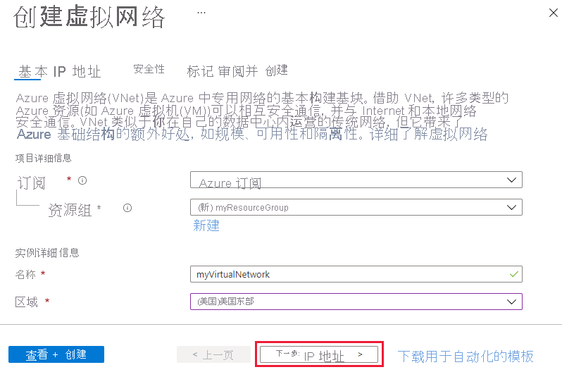
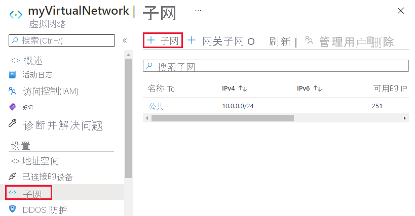
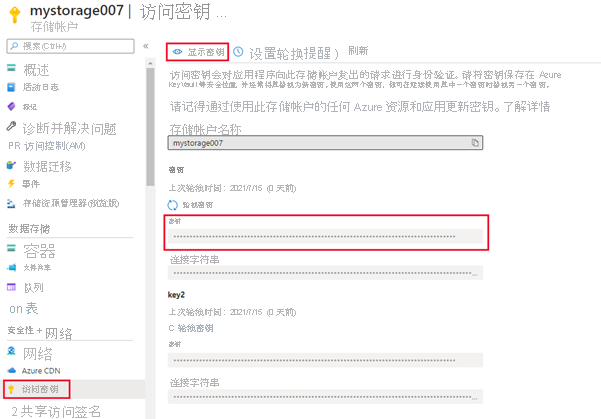
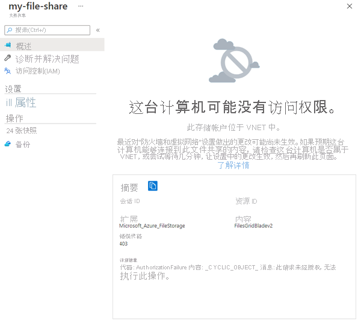

# <a name="tutorial-restrict-network-access-to-paas-resources-with-virtual-network-service-endpoints-using-the-azure-portal"></a>教程：使用 Azure 门户通过虚拟网络服务终结点限制对 PaaS 资源的网络访问

通过虚拟网络服务终结点，可将某些 Azure 服务资源限制为仅允许某个虚拟网络子网通过网络进行访问。 还可以删除对资源的 Internet 访问。 服务终结点提供从虚拟网络到受支持 Azure 服务的直接连接，使你能够使用虚拟网络的专用地址空间访问 Azure 服务。 通过服务终结点发往 Azure 资源的流量始终保留在 Microsoft Azure 主干网络上。 本教程介绍如何执行下列操作：

> [!div class="checklist"]
> * 创建包含一个子网的虚拟网络
> * 添加子网并启用服务终结点
> * 创建 Azure 资源并且仅允许从一个子网对其进行网络访问
> * 将虚拟机 (VM) 部署到每个子网
> * 确认从某个子网对资源的访问
> * 确认已拒绝从某个子网和 Internet 来访问资源

如果你愿意，可以使用 [Azure CLI](tutorial-restrict-network-access-to-resources-cli.md) 或 [Azure PowerShell](tutorial-restrict-network-access-to-resources-powershell.md) 完成本教程中的步骤。

如果没有 Azure 订阅，请在开始之前创建一个[免费帐户](https://azure.microsoft.com/free/?WT.mc_id=A261C142F)。

## <a name="log-in-to-azure"></a>登录 Azure

在 https://portal.azure.com 登录 Azure 门户。

## <a name="create-a-virtual-network"></a>创建虚拟网络

1. 选择 Azure 门户左上角的“+ 创建资源”。
2. 选择“网络”，然后选择“虚拟网络” 。
3. 单击“+ 添加”，然后输入以下信息： 

   |设置|Value|
   |----|----|
   |订阅| 选择订阅|
   |资源组 | 选择“新建”，并输入 myResourceGroup|
   |名称| 输入“myVirtualNetwork” |
   |区域| 选择“(US)美国东部” |

   

4. 单击“下一步:IP 地址 >”
   
   |设置|值|
   |----|----|
   |IPv4Address 空间| 保留为默认值 |
   |子网名称| 单击“默认”并将名称从“默认”更改为“公共”|
   |子网地址范围| 保留为默认值|

5. 单击“下一步:安全性 >” 
   
   |设置|值|
   |----|----|   
   |BastionHost| 禁用|
   |DDOS 保护| 禁用|
   |防火墙| 禁用|

6. 完成后，单击“查看并创建”。
7. 如果验证检查通过，请单击“创建”。
8. 等待部署完成，然后单击“转到资源”或转到下一节。 

## <a name="enable-a-service-endpoint"></a>启用服务终结点

每个服务、每个子网均启用服务终结点。 创建子网并为该子网启用服务终结点：

1. 如果你尚未进入虚拟网络资源页，可在门户顶部的“搜索资源、服务和文档”框中搜索新创建的网络，输入“myVirtualNetwork”并从列表中选择它。
2. 在“设置”菜单（左侧）中选择“子网”，然后选择“+ 子网”，如下所示  ：

     

3. 在“添加子网”下，选择或输入以下信息，然后选择“确定”：

    |设置|Value|
    |----|----|
    |名称| 专用 |
    |地址范围| 保留为默认值|
    |服务终结点| 选择“Microsoft.Storage”|
    |服务终结点策略 | 保留默认值为 0 |

> [!CAUTION]
> 在为其中有资源的现有子网启用服务终结点之前，请参阅[更改子网设置](virtual-network-manage-subnet.md#change-subnet-settings)。

4. 单击“保存”，然后关闭右侧的“子网”窗口。 新创建的子网应会显示在列表中。

## <a name="restrict-network-access-for-a-subnet"></a>限制子网的网络访问

默认情况下，子网中的所有虚拟机实例均可与所有资源通信。 可以通过创建网络安全组并将其关联到子网来限制与子网中所有资源的通信：

1. 选择 Azure 门户左上角的“所有服务”。
2. 选择“网络”，然后选择（或搜索）“网络安全组” 。
3. 在“网络安全组”页中，单击“+ 添加” 。
4. 输入以下信息 

    |设置|Value|
    |----|----|
    |订阅| 选择订阅|
    |资源组 | 从列表中选择“myResourceGroup”|
    |名称| 输入“myNsgPrivate” |
    |位置| 选择“美国东部” |

5. 单击“查看 + 创建”，并在验证检查通过后单击“创建” 。
6. 创建网络安全组后，单击“转到资源”或搜索 myNsgPrivate。
7. 在左侧的“设置”下，选择“出站安全规则” 。
8. 选择“+ 添加”。
9. 创建一条允许出站通信到 Azure 存储服务的规则。 输入或选择以下信息，然后选择“添加”：

    |设置|Value|
    |----|----|
    |Source| 选择“VirtualNetwork” |
    |源端口范围| * |
    |目标 | 选择“服务标记”|
    |目标服务标记 | 选择“存储”|
    |目标端口范围| 保留默认值为 8080 |
    |协议|任意|
    |操作|允许|
    |优先级|100|
    |名称|重命名为 Allow-Storage-All|

10. 创建另一条出站安全规则，拒绝到 Internet 的通信。 此规则将覆盖所有网络安全组中允许出站 Internet 通信的默认规则。 使用以下值完成上述步骤 6-9：

    |设置|Value|
    |----|----|
    |Source| 选择“VirtualNetwork” |
    |源端口范围| * |
    |目标 | 选择“服务标记”|
    |目标服务标记| 选择“Internet”|
    |目标端口范围| * |
    |协议|任意|
    |操作|将默认值更改为“拒绝” |
    |优先级|110|
    |名称|更改为 Deny-Internet-All|

11. 创建一个允许从任何位置向该子网发送远程桌面协议 (RDP) 流量的入站安全规则。 该规则将替代拒绝来自 Internet 的所有入站流量的默认安全规则。 允许与子网建立远程桌面连接，以便可以在后续步骤中测试连接。 
12. 在“设置”下，选择“入站安全规则”。 
13. 选择“+ 添加”，然后使用以下值：

    |设置|Value|
    |----|----|
    |Source| 任意 |
    |源端口范围| * |
    |目标 | 选择“VirtualNetwork”|
    |目标端口范围| 更改为 3389 |
    |协议|任意|
    |操作|允许|
    |优先级|120|
    |名称|更改为 Allow-RDP-All|

   >[!WARNING] 
   > RDP 端口 3389 公开给 Internet。 建议仅用于测试。 对于生产环境，建议使用 VPN 或专用连接。

1.  在“设置”下，选择“子网”。
2.  单击“+ 关联”。
3.  在“虚拟网络”下，选择“myVirtualNetwork” 。
4.  在“子网”下选择“专用”，然后选择“确定”  。

## <a name="restrict-network-access-to-a-resource"></a>限制对资源的网络访问

对于通过为服务终结点启用的 Azure 服务创建的资源，限制对其的网络访问时所需的步骤因服务而异。 请参阅各个服务的文档来了解适用于每个服务的具体步骤。 作为示例，本教程的剩余部分包括了针对 Azure 存储帐户限制网络访问的步骤。

### <a name="create-a-storage-account"></a>创建存储帐户

1. 选择 Azure 门户左上角的“+ 创建资源”。
2. 在搜索栏中输入“存储帐户”，然后从下拉菜单中选择它。
3. 单击“+ 添加”。
4. 输入以下信息：

    |设置|Value|
    |----|----|
    |订阅| 选择订阅|
    |资源组| 选择“myResourceGroup”|
    |存储帐户名称| 输入在所有 Azure 位置中唯一的、长度为 3-24 个字符且仅使用数字和小写字母的名称。|
    |位置| 选择“(US)美国东部” |
    |性能|标准|
    |帐户种类| StorageV2（常规用途 v2）|
    |复制| 本地冗余存储 (LRS)|

5. 选择“创建 + 查看”，并在验证检查通过后单击“创建” 。 

>[!NOTE] 
> 部署可能需要几分钟时间完成。

6. 创建存储帐户后，单击“转到资源”

### <a name="create-a-file-share-in-the-storage-account"></a>在存储帐户中创建文件共享

1. 转到存储帐户的“概述”页。
2. 选择“文件共享”应用图标，然后单击“+ 文件共享” 。

    |设置|Value|
    |----|----|
    |名称| my-file-share|
    |Quota| “设置为最大值” |

    

3. 单击“创建”。
4. 如果不单击“刷新”，文件共享应显示在 Azure 窗口中

### <a name="restrict-network-access-to-a-subnet"></a>限制对子网的网络访问

默认情况下，存储帐户接受来自任何网络（包括 Internet）中的客户端的网络连接。 可限制来自 Internet 以及所有虚拟网络中的所有其他子网的网络访问（除 myVirtualNetwork 虚拟网络中的“专用”子网外） 。限制对子网的网络访问：

1. 在你的（唯一命名）存储帐户的“设置”下，选择“网络” 。
2. 选择“所选网络”。
3. 选择“+ 添加现有虚拟网络”。
4. 在“添加网络”下选择以下值，然后选择“添加”： 

    |设置|Value|
    |----|----|
    |订阅| 选择订阅|
    |虚拟网络| **myVirtualNetwork**|
    |子网| **专用**|

    

5. 单击“添加”，随后立即单击“保存”图标以保存更改 。
6. 在存储帐户的“设置”下，选择“访问密钥”，如下图所示： 

      

7. 单击“显示密钥”并记下“密钥”值，因为在后续步骤中将文件共享映射到 VM 中的驱动器号时，需要手动输入 key1。 

## <a name="create-virtual-machines"></a>创建虚拟机

若要测试对存储帐户的网络访问，请向每个子网部署 VM。

### <a name="create-the-first-virtual-machine"></a>创建第一个虚拟机

1. 在“搜索资源. . ." 栏中，搜索“虚拟机”。
2. 选择“+ 添加”>“虚拟机”。 
3. 输入以下信息：

   |设置|Value|
   |----|----|
   |订阅| 选择订阅|
   |资源组| 选择之前创建的 **myResourceGroup。|
   |虚拟机名称| 输入“myVmPublic”|
   |区域 | （美国）美国东部
   |可用性选项| 可用性区域|
   |可用性区域 | 1 |
   |图像 | Windows Server 2019 Datacenter - Gen1 |
   |大小 | 选择要使用的 VM 实例大小 |
   |用户名|输入所选用户名。|
   |密码| 输入所选密码。 密码必须至少 12 个字符长，且符合[定义的复杂性要求](../virtual-machines/windows/faq.yml?toc=%2fazure%2fvirtual-network%2ftoc.json#what-are-the-password-requirements-when-creating-a-vm-)。|
   |公共入站端口 | 允许所选端口 |
   |选择入站端口 | 保留默认设置为“RDP (3389)” |

   
  
4. 选择“网络”选项卡，然后选择“myVirtualNetwork” 。 
5. 选择“公共”子网。
6. 在“NIC 网络安全组”下，选择“高级”。  门户会自动为你创建一个网络安全组，该组允许端口 3389。此端口需保持打开状态，然后才能在后面的步骤中连接到虚拟机。 

   

7. 依次选择“查看并创建”、“创建”，然后等待部署完成 。
8. 单击“转到资源”，或打开“主页”>“虚拟机”页，然后选择刚刚创建的 VM“myVmPublic”，应会启动该 VM 。

### <a name="create-the-second-virtual-machine"></a>创建第二个虚拟机

1. 再次完成步骤 1-8，但在步骤 3 中，请将虚拟机命名为 myVmPrivate，并将“公共入站端口”设置为“无”。 
2. 在步骤 4-5 中，选择“专用”子网。

>[!NOTE]
> “NIC 网络安全组”和“公共入站端口”设置应按照如下所示进行设置，包括指示“默认阻止所有公共 Internet 流量”的蓝色确认窗口 。

   

3. 依次选择“查看并创建”、“创建”，然后等待部署完成 。 

>[!WARNING]
> 在部署完成之前，请勿转到下一步。

4. 等待下面显示的确认窗口，然后单击“转到资源”。

   

## <a name="confirm-access-to-storage-account"></a>确认对存储帐户的访问

1. 创建完“myVmPrivate”VM 后，单击“转到资源”。 
2. 选择“连接”>“RDP”以连接到 VM。
3. 选择“连接”按钮后将创建一个远程桌面协议 (.rdp) 文件。 单击“下载 RDP 文件”以下载到计算机中。  
4. 打开下载的 rdp 文件。 出现提示时，选择“连接”。 输入在创建 VM 时指定的用户名和密码。 可能需要选择“更多选择”，然后选择“使用其他帐户”，以指定在创建 VM 时输入的凭据 。 对于电子邮件字段，请输入前面指定的“管理员帐户: 用户名”凭据。 
5. 选择“确定”  。
6. 你可能会在登录过程中收到证书警告。 如果收到警告，请选择“是”或“继续”以继续连接。  你应会看到 VM 启动，如下所示：

   

7. 在 VM 窗口中，打开 PowerShell CLI 实例。
8. 使用下面的脚本，通过 PowerShell 将 Azure 文件共享映射到驱动器 Z。 在运行以下命令之前，请将 `<storage-account-key>` 和 `<storage-account-name>` 字段替换为之前在[创建存储帐户](#create-a-storage-account)中提供或检索的值。

   ```powershell
   $acctKey = ConvertTo-SecureString -String "<storage-account-key>" -AsPlainText -Force
   $credential = New-Object System.Management.Automation.PSCredential -ArgumentList "Azure\<storage-account-name>", $acctKey
   New-PSDrive -Name Z -PSProvider FileSystem -Root "\\<storage-account-name>.file.core.windows.net\my-file-share" -Credential $credential
   ```

   PowerShell 将返回类似于以下示例的输出：

   ```powershell
   Name           Used (GB)     Free (GB) Provider      Root
   ----           ---------     --------- --------      ----
   Z                                      FileSystem    \\vnt.file.core.windows.net\my-f...
   ```

   Azure 文件共享已成功映射到驱动器 Z。

9.   关闭与 *myVmPrivate* VM 建立的远程桌面会话。

## <a name="confirm-access-is-denied-to-storage-account"></a>确认已拒绝对存储帐户的访问

1. 在门户顶部的“搜索资源、服务和文档”框中，输入 *myVmPublic*。
2. 当“myVmPublic”出现在搜索结果中时，将其选中。
3. 针对 myVmPublic VM 完成以上[确认对存储帐户的访问权限](#confirm-access-to-storage-account)中的步骤 1-8。

   稍等片刻，你会收到 `New-PSDrive : Access is denied` 错误。 访问被拒绝，因为 *myVmPublic* VM 部署在“公共”子网中。 “公共”子网没有为 Azure 存储启用服务终结点。 存储帐户仅允许从“专用”子网访问网络，而不允许从“公共”子网访问。

4. 关闭与 *myVmPublic* VM 建立的远程桌面会话。
5. 返回 Azure 门户，转到之前创建的唯一命名的存储帐户。
6. 在“文件服务”下，选择“文件共享”然后选择之前创建的 my-file-share。
7. 会收到以下错误信息：

   
   
>[!NOTE] 
> 访问被拒绝，因为计算机不在 *MyVirtualNetwork* 虚拟网络的“专用”子网中。

## <a name="clean-up-resources"></a>清理资源

不再需要资源组时，可将资源组及其包含的所有资源一并删除：

1. 在门户顶部的“搜索”框中输入“myResourceGroup”。 当在搜索结果中看到“myResourceGroup”时，将其选中。
2. 选择“删除资源组”。
3. 对于“键入资源组名称:”，输入“myResourceGroup”，然后选择“删除”。 

## <a name="next-steps"></a>后续步骤

在本教程中，我们为虚拟网络子网启用了服务终结点。 我们已了解，可为通过多个 Azure 服务部署的资源启用服务终结点。 已创建了一个 Azure 存储帐户并将该存储帐户限制为仅可供某个虚拟网络子网中的资源进行网络访问。 若要详细了解服务终结点，请参阅[服务终结点概述](virtual-network-service-endpoints-overview.md)和[管理子网](virtual-network-manage-subnet.md)。

如果帐户中有多个虚拟网络，可将两个虚拟网络连接到一起，使每个虚拟网络中的资源可以相互通信。 若要了解如何连接虚拟网络，请继续学习下一教程。

> [!div class="nextstepaction"]
> [连接虚拟网络](./tutorial-connect-virtual-networks-portal.md)
