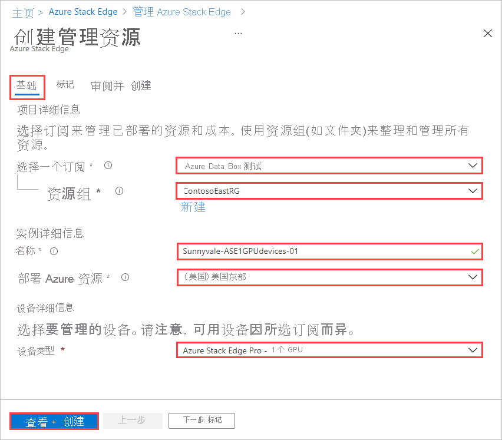

若要为通过 Azure Edge Hardware Center 订购的设备创建管理资源，请执行以下步骤：

1. 使用 Microsoft Azure 凭据通过以下 URL 登录到 Azure 门户：[https://portal.azure.com](https://portal.azure.com)。

1. 可通过两种方式开始创建新的管理资源：

    - 通过 Azure Edge Hardware Center：搜索并选择“Azure Edge Hardware Center”。 在 Hardware Center 中，显示“所有订单项”。 单击“名称”项。 在“概述”项中，选择“配置硬件”。
    
       设备发货后会出现“配置硬件”选项。 

        
    
    - 在 Azure Stack Edge 中：搜索并选择“Azure Stack Edge”。 选择“+ 新建”。  然后选择“创建管理资源”。
    
        

    “创建管理资源”向导随即打开。

1. 在“基本信息”选项卡上，输入以下设置：

    |设置                                  |值                                                                                       |
    |-----------------------------------------|--------------------------------------------------------------------------------------------|
    |**选择订阅**1    |选择要用于管理资源的订阅。                                 |
    |**资源组**1           |选择要用于管理资源的资源组。 |
    |**名称**                                 |提供管理资源的名称。                                                 |
    |**Azure 资源部署位置**             |选择管理资源的元数据所在的国家或地区。 元数据可以存储在与物理设备不同的位置。 |
    |**设备类型**2              |选择设备类型。 此选项对应于为 Azure Edge Hardware Center 订单中的硬件产品选择的配置。 例如，对于 Azure Stack Edge Pro - GPU 设备，设备类型为“Azure Stack Edge Pro - 1 GPU”或“Azure Stack Edge Pro - 1 GPU”。|       

    1 组织订购设备时使用的订阅和资源组与管理设备时使用的订阅和资源组可能不同。

    2 当你从订单项使用“配置硬件”时，设备类型取自订单项，并且不显示“设备详细信息”。 

    

    选择“查看 + 创建”以继续。

5. 在“查看 + 创建”选项卡上，查看管理资源的基本设置和使用条款。 然后选择“创建”。

    - 如果通过为 Azure Edge Hardware Center 订单中已交付的项单击“配置硬件”来启动此过程，设备、订单资源名称和订单状态将列在屏幕顶部。 

      

    - 如果是在 Azure Stack Edge 中启动的，你将看到“基本信息”中列出的设备类型，而不是设备订单信息。 

        

    在通过所有验证检查之前，“创建”按钮不可用。

6. 该过程完成后，将打开新资源的“概述”窗格。

     
