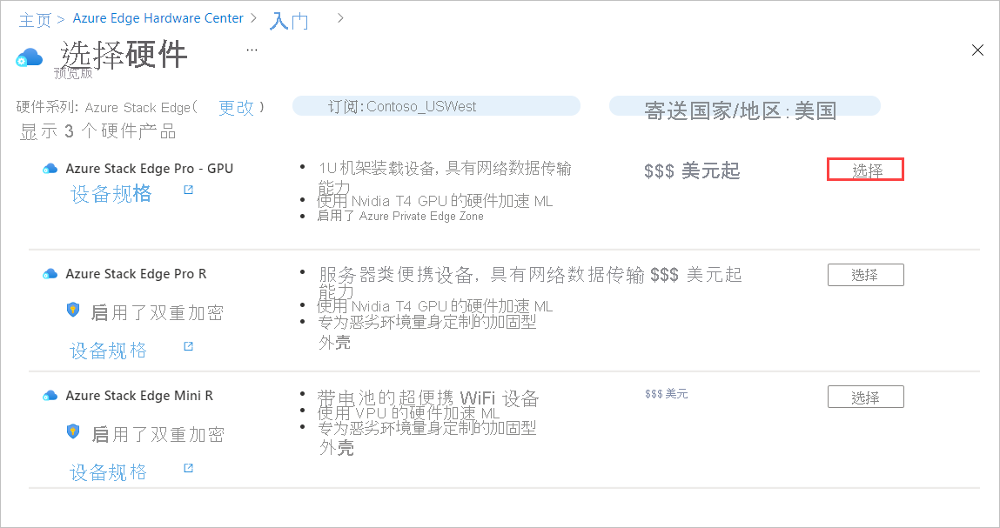

若要通过 Azure Edge Hardware Center 下订单，请执行以下步骤：

1. 使用 Microsoft Azure 凭据通过以下 URL 登录到 Azure 门户：[https://portal.azure.com](https://portal.azure.com)。

2. 选择“+ 创建资源”。  搜索并选择“Azure Edge Hardware Center”。 在 Azure Edge Hardware Center 中，选择“创建”。

    

3. 选择一个订阅，然后选择“下一步”。

    

4. 若要开始订购，请在想要订购的产品系列旁边选择“订购”（例如，Azure Stack Edge） 。 如果看不到产品系列，可能需要使用不同的订阅；选择“尝试选择不同的订阅”。 

     

5. 选择订单的运送目的地。

    

6. 在“选择硬件”页上，使用“选择”按钮来选择要订购的硬件产品 。 例如，选择 Azure Stack Edge Pro - GPU。 

    

    选择硬件产品后，你将选择要订购的设备配置。 Azure Edge Hardware Center（预览版）中提供了以下硬件产品和设备配置。

    |硬件产品              |配置                                                                                              |
    |------------------------------|------------------------------------------------------------------------------------------------------------|
    |Azure Stack Edge Pro - GPU    |<ul><li>Azure Stack Edge Pro - 1 个 GPU</li><li>Azure Stack Edge Pro - 2 个 GPU</li><ul>                          |
    |Azure Stack Edge Pro R        |<ul><li>Azure Stack Edge Pro R - 单节点</li><li>Azure Stack Edge Pro R - 包含 UPS 的单节点</li></ul>|
    |Azure Stack Edge Mini R       |一种配置（自动选择）。                 |

7. 选择设备配置，然后选择“选择”。 下图显示了“Azure Stack Edge Pro - GPU”设备的可用配置。

    如果要订购均具有相同配置的 Azure Stack Edge Mini R 设备，则不会看到此屏幕。 

    

    此时将打开“创建订单”向导。

8.  在“基本信息”选项卡上，提供“订单名称”、“资源组”和“区域”   。 然后选择“下一步: 运送 + 数量 >”。

    
  
    下一步，添加要将设备送到的每个送货地址，然后指定发送到每个地址的设备数量。 每个订单最多可订购 20 个单位（设备）。

9. 在“运送 + 数量”选项卡上，添加要将设备送到的每个送货地址： 

    - 若要添加新的送货地址，请选择“添加新地址”。 

       “新建地址”屏幕上的必填“地址别名”字段会识别地址以稍后使用 。 填写完地址字段后，选择“添加”。 然后使用“选择地址”，将地址添加到你的订单中。

       

    - 若要使用以前的订单中的送货地址，或使用刚刚添加的地址，请选择“选择地址”。 然后，在“选择地址”屏幕上，选择一个或多个地址，并选择“选择” 。

       

    “运送 + 数量”选项卡每个送货地址现有一个单独的项。

    每个订单项名称都包含一个名称前缀（订单名称后跟地址别名），以及一个发送到该地址的每个设备的项编号。

    

10. 对于每个地址，在“运送 + 数量”选项卡上输入要运送的设备数量 。

    输入一个以上的数量时，订单项名称之后会出现“再加 n 个”的标签。

     

11. 如果要更改订单项的名称，请选择并单击订单项名称以打开“重命名订单项”窗格。 如果要将多个项目运送到一个地址，请选择“再加 n 个”。

    可以进行两种类型的名称更改：
 
    * 要对所有订单项使用不同的名称前缀，请编辑“名称前缀”，然后选择“应用”，如以下屏幕所示 。

    * 你还可以单独编辑每个订单项的名称。 

    完成后，选择“完成”。

    

    选择“下一步: 通知 >”以继续。

12. 如果希望在订单处理过程中接收状态通知，请在“通知”选项卡上输入每个收件人的电子邮件地址。 

    若要添加电子邮件地址，请输入地址，然后选择“添加”。 最多可以添加 20 个电子邮件地址。

    

    完成操作后，选择“查看 + 创建”以继续。

13. 在“查看 + 创建”选项卡上：

    1. 查看订单。 打开此屏幕时，将自动验证订单。 如果看见“验证失败”的横幅，必须修复问题后才能创建订单。
    
    1. 查看“隐私条款”，并选中复选框以同意条款。
 
    1. 选择“创建”。

    

    在部署期间，会在门户中打开订单，并显示每个订单项的状态。 部署完成后，可能需要单击“部署详细信息”旁的向下箭头，以查看各个项目的状态。

    

14. 若要查看订单项的详细信息（如下所示），请在“部署详细信息”的“资源”列选择该项。

    

15. 设备发货后（“已发货”标记为绿色），将在项详细信息中添加“配置硬件”选项 。 选择该选项为 Azure Stack Edge 中的设备创建管理资源。    

    <!--Requested from Anam: Screenshot of an Azure Edge Hardware Center resource with Shipped status, with the Configure hardware option displayed. Graphical display of tags.-->

    按照订单填写了订阅、资源组和部署区域，但可以对它们进行更改。

    

    激活设备后，你将能够从该项打开管理资源，并从管理资源打开订单项。<!--Detailed procedure to be provided in an article on managing Hardware Center orders.-->
