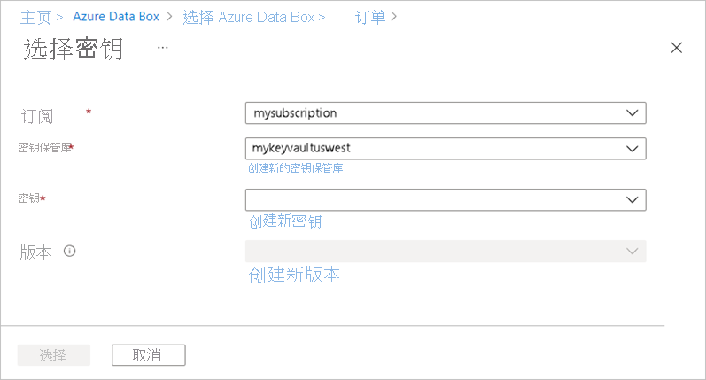

要订购设备，请在 Azure 门户中执行以下步骤：

1. 使用 Microsoft Azure 凭据在以下 URL 登录：[https://portal.azure.com](https://portal.azure.com)。
2. 选择“+ 创建资源”并搜索 *Azure Data Box*。 选择“Azure Data Box”。

   

3. 选择“创建”。  

   

4. 检查你所在区域是否可使用 Data Box 服务。 输入或选择以下信息，然后选择“应用”。

    |设置  |值  |
    |---------|---------|
    |传输类型     | 选择“导入到 Azure”。        |
    |订阅     | 对于 Data Box 服务，选择一个 EA、CSP 或 Azure 赞助订阅。   该订阅将链接到计费帐户。       |
    |资源组 | 选择现有资源组。 资源组是可以统一管理或部署的资源的逻辑容器。 |
    |源国家/地区    |    选择数据当前所在的国家/地区。         |
    |目标 Azure 区域     |     选择要在其中传输数据的 Azure 区域。   有关详细信息，请参阅 [Data Box 的上市区域](../articles/databox/data-box-overview.md#region-availability)或 [Data Box Heavy 的上市区域](../articles/databox/data-box-heavy-overview.md#region-availability)。  |

    

5. 选择要订购的 Data Box 产品，是 Data Box（如下所示）还是 Data Box Heavy。 

    

    对于 Data Box，单次最多可订购的容量是 80 TB。 对于 Data Box Heavy，单次最多可订购的容量是 770 TB。 可以创建多个订单，以增加数据大小。

    如果选择“Data Box Heavy”，则 Data Box 团队会检查你的区域中的设备可用性。 他们将通知你何时可以继续处理你的订单。

6. 在“订单”中，转到“基本信息”选项卡，输入或选择以下信息 。 然后，选择“下一步: 数据目标>”。

    |设置  |值  |
    |---------|---------|
    |订阅      | 系统会根据前面所做的选择自动填充此订阅。|
    |资源组    | 之前选择的资源组。 |
    |导入订单名称 | 提供友好名称用于跟踪订单。 <ul><li>名称可包含 3 到 24 个字符，可以是字母、数字或连字符。</li><li>名称必须以字母或数字开头和结尾。</li></ul>    |

    

7. 在“数据目标”屏幕上，选择“数据目标”（存储帐户或托管磁盘） 。

    如果使用“存储帐户”作为存储目标，则会看到以下屏幕：

    

    根据指定的 Azure 区域，从现有存储帐户的筛选列表中选择一个或多个存储帐户。 Data Box 可以与最多 10 个存储帐户链接。 也可以创建新的 **常规用途 v1**、**常规用途 v2** 或 **Blob 存储帐户**。

   > [!NOTE]
   > - 如果选择 Azure Premium FileStorage 帐户，则存储帐户共享上的预配配额将增加到要复制到文件共享的数据的大小。 配额增加后，就不会再进行调整，例如，如果出于某种原因 Data Box 无法复制你的数据。
   > - 此配额用于计费。 将数据上传到数据中心后，应调整配额以满足需求。 有关详细信息，请参阅[了解计费](../articles/storage/files/understanding-billing.md)。

    支持使用虚拟网络的存储帐户。 若要允许 Data Box 服务使用受保护的存储帐户，请在存储帐户网络防火墙设置中启用受信任的服务。 有关详细信息，请了解如何[将 Azure Data Box 添加为受信任的服务](../articles/storage/common/storage-network-security.md#exceptions)。

    如果使用 Data Box 从本地虚拟硬盘 (VHD) 创建“托管磁盘”，则还需提供以下信息：

    |设置  |值  |
    |---------|---------|
    |资源组     | 若要从本地 VHD 创建托管磁盘，请创建新的资源组。 使用现有资源组的前提是，资源组是在以前由 Data Box 服务为托管磁盘创建 Data Box 订单时创建的。   指定多个用分号分隔的资源组。 最多支持 10 个资源组。|

    

    为托管磁盘指定的存储帐户用作临时存储帐户。 Data Box 服务将 VHD 作为页 Blob 上传到临时存储帐户，然后将其转换为托管磁盘并移到资源组。 有关详细信息，请参阅[验证 Azure 中的数据上传](../articles/databox/data-box-deploy-picked-up.md#verify-data-upload-to-azure-8)。

   > [!NOTE]
   > 如果页 blob 未成功转换为托管磁盘，它将保留在存储帐户中，你需为存储付费。

8. 选择“下一步: 安全性>”继续操作。

    通过“安全性”屏幕，可使用自己的加密密钥和设备并共享密码，还可选择使用双重加密。

    “安全性”屏幕上的所有设置都是可选的。 如果不更改任何设置，则将应用默认设置。

    

9. 如果要使用自己的客户管理的密钥来保护新资源的解锁密钥，请展开“加密类型”。

    可选择性地为 Azure Data Box 配置客户管理的密钥。 默认情况下，Data Box 使用 Microsoft 管理的密钥来保护解锁密钥。

    客户管理的密钥不影响设备上数据的加密方式。 该密钥仅用于加密设备解锁密钥。

    如果不想使用客户管理的密钥，请跳到步骤 15。

   

10. 若要使用客户管理的密钥，请选择“客户管理的密钥”作为密钥类型。 然后，选中“选择密钥保管库和密钥”。
   
    

11. 在“从 Azure Key Vault 中选择密钥”边栏选项卡中：

    - 会自动填充“订阅”字段。

    - 对于“密钥保管库”，可以从下拉列表中选择现有的密钥保管库。

      

      如果要创建新的密钥保管库，请选择“新建密钥保管库”。 
    
            

      然后，在“创建密钥保管库”屏幕上，输入资源组和密钥保管库名称。 确保已启用软删除和清除保护 。 接受其他所有默认值，然后选择“查看 + 创建”。

      

      查看密钥保管库的信息，然后选择“创建”。 等待几分钟，直到密钥保管库创建完成。

      

12. “选择密钥”边栏选项卡将显示所选的密钥保管库。

    

    如果要创建新密钥，请选择“创建新密钥”。 必须使用 RSA 密钥。 大小可以是 2048 或更大。 输入新密钥的名称，接受其他默认值，然后选择“创建”。

      

      在密钥保管库中创建密钥后，你将收到通知。 新密钥将被选中并显示在“选择密钥”边栏选项卡上。

13. 选择要使用的密钥的版本，然后选中“选择” 。

      

    如果要创建新的密钥版本，请选择“创建新版本”。

    

    选择新密钥版本的设置，然后选择“创建”。

    

    “安全性”屏幕上的“加密类型”设置将显示密钥保管库和密钥 。

    

14. 选择将用于管理对此资源的访问权限的用户标识。 选中“选择用户标识”。 在右侧面板中，选择要使用的订阅和托管标识。 然后选取“选择”  。

    用户分配的托管标识是一个可用于管理多个资源的独立 Azure 资源。 有关详细信息，请参阅[托管标识类型](../articles/active-directory/managed-identities-azure-resources/overview.md)。  

    如果需要创建新的托管标识，请按照[使用 Azure 门户创建、列出和删除用户分配的托管标识以及如何为其分配角色](../articles/active-directory/managed-identities-azure-resources/how-to-manage-ua-identity-portal.md)中的指南操作。
    
    

    用户标识显示在“加密类型”设置中。

    

15. 如果不想采用 Azure Data Box 默认使用的系统生成的密码，请在“安全性”屏幕上展开“创建自己的密码” 。

    系统生成的密码很安全，建议使用该密码，除非贵组织另有要求。

     

   - 要对新设备使用自己的密码，请在“设置设备密码的首选项”中选择“使用自己的密码”，然后键入符合安全要求的密码 。
     
     密码必须是字母和数字，且包含 12 到 15 个字符，至少有一个大写字母、一个小写字母、一个特殊字符和一个数字。

     - 允许使用的特殊字符：@ # - $ % ^ ! + = ; : _ ( )
     - 不允许使用的字符：I i L o O 0
   
     

 - 使用自己的共享密码：

   1. 在“设置共享密码的首选项”中，依次选择“使用自己的密码”和“选择共享密码”  。
     
       

    1. 为订单中的每个存储帐户键入一个密码。 该密码将用于存储帐户的所有共享。
    
       密码必须是字母和数字，且包含 12 到 64 个字符，至少有一个大写字母、一个小写字母、一个特殊字符和一个数字。

       - 允许使用的特殊字符：@ # - $ % ^ ! + = ; : _ ( )
       - 不允许使用的字符：I i L o O 0
     
    1. 要对所有存储帐户使用同一密码，请选择“复制到全部”。 

    1. 完成后，选择“保存”。
     
       

    在“安全性”屏幕上，可以使用“查看或更改密码”来更改密码 。

16. 在“安全性”中，如果要启用基于软件的双重加密，请展开“双重加密(适用于高度安全的环境)”，然后选择“为订单启用双重加密”  。

    

    除了对 Data Box 上的数据进行 AES-256 位加密，还可执行基于软件的加密。

    > [!NOTE]
    > 启用此选项可能会导致订单处理和数据复制耗时较长。 创建订单后，不能更改此选项。

    选择“下一步: 联系人详细信息>”来继续操作。

17. 在“联系人详细信息”中，选择“+ 添加地址” 。

    

18. 在“添加地址”屏幕中，提供你的姓名、公司的名称和邮政地址，以及有效的电话号码。 选择“验证地址”。 服务会验证该地址是否可使用该服务，并将能否使用的结果通知你。

    

    如果你选择了自我托管交付，则在成功下单后，你将收到一封电子邮件通知。 有关自托管寄送的详细信息，请参阅[使用自托管寄送](../articles/databox/data-box-portal-customer-managed-shipping.md)。

19. 成功验证送货详细信息后，选择“**添加送货地址**”。 你将返回“联系人详细信息”选项卡。

20. 在“电子邮件”旁边，添加一个或多个电子邮件地址。 服务会将有关任何订单状态更新的电子邮件通知发送到指定的电子邮件地址。

    我们建议使用组电子邮件，以便在组中的管理员离任后，可以持续收到通知。

    

21. 查看“查看 + 订购”中与订单、联系人、通知和隐私条款相关的信息。 选中对应于同意隐私条款的复选框。

22. 选择“订单”。 创建订单需要几分钟时间。

    