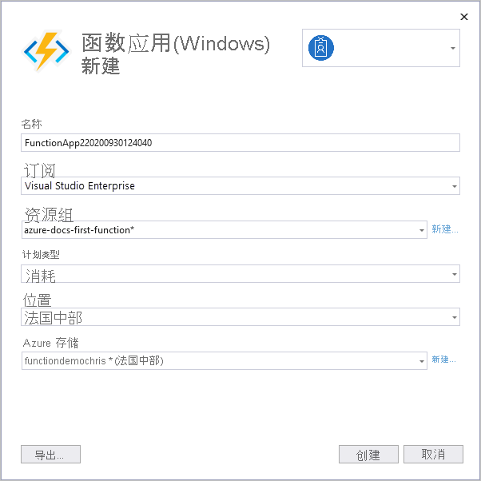

1. 在解决方案资源管理器中，右键单击项目，选择“发布”，然后在“目标”中选择“Azure”，接着选择“下一步”    。

1. 对于特定目标，请选择“Azure 函数应用(Windows)”，它会创建一个在 Windows 上运行的函数应用 。

1. 在“函数实例”中，选择“创建新的 Azure 函数…”  

    :::image type="content" source="media/functions-vstools-publish/functions-visual-studio-publish-new-resource.png" alt-text="创建新的函数应用实例":::

1. 使用下表中指定的值创建新的实例：

    | 设置      | “值”  | 描述                                |
    | ------------ |  ------- | -------------------------------------------------- |
    | **名称** | 全局唯一名称 | 用于唯一标识新 Function App 的名称。 接受此名称或输入新名称。 有效的字符是 `a-z`、`0-9` 和 `-`。 |
    | **订阅** | 你的订阅 | 要使用的 Azure 订阅。 接受此订阅，或从下拉列表中选择一个新订阅。 |
    | **[资源组](../articles/azure-resource-manager/management/overview.md)** | 资源组的名称 |  要在其中创建函数应用的资源组。 从下拉列表中选择现有资源组，或者选择“新建”来创建新的资源组。|
    | **[计划类型](../articles/azure-functions/functions-scale.md)** | 消耗 | 将项目发布到在[消耗计划](../articles/azure-functions/consumption-plan.md)中运行的函数应用时，只需为函数应用的执行付费。 其他托管计划会产生更高的成本。 |
    | **位置** | 应用服务的位置 | 在靠近你或者靠近函数访问的其他服务的 [区域](https://azure.microsoft.com/regions/)中选择一个 **位置**。 |
    | **[Azure 存储](../articles/azure-functions/storage-considerations.md)** | 常规用途存储帐户 | Functions 运行时需要 Azure 存储帐户。 选择“新建”即可配置常规用途存储帐户。 也可选择一个符合[存储帐户要求](../articles/azure-functions/storage-considerations.md#storage-account-requirements)的现有帐户。  |

    

1. 选择“创建”，在 Azure 中创建一个函数应用及其相关资源。 资源创建的状态如窗口左下角所示。 

1. 回到“函数实例”，确保已选中“从包文件运行” 。 启用[从包运行](../articles/azure-functions/run-functions-from-deployment-package.md)模式，函数应用将使用 [Zip 部署](../articles/azure-functions/functions-deployment-technologies.md#zip-deploy)进行部署。 建议对你的函数项目使用此部署方法，因为它可提高性能。 

    :::image type="content" source="media/functions-vstools-publish/functions-visual-studio-publish-profile-step-4.png" alt-text="完成配置文件的创建":::

1. 选择“完成”，然后在“发布”页面上选择“发布”，将包含项目文件的包部署到 Azure 中的新函数应用 。 

    部署完成后，Azure 中函数应用的根 URL 将显示在“发布”选项卡中。 
    
1.  在“发布”选项卡中，请选择“在 Cloud Explorer 中管理”。 此操作会在 Cloud Explorer 中打开新的函数应用 Azure 资源。 
    
    :::image type="content" source="media/functions-vstools-publish/functions-visual-studio-publish-complete.png" alt-text="发布成功消息":::
    
    借助 Cloud Explorer，可使用 Visual Studio 来查看网站的内容，启动和停止函数应用，并直接浏览到 Azure 上和 Azure 门户中的函数应用资源。 
