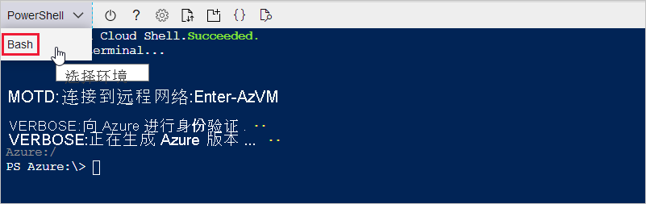

在以下部分中，你将设置终端并使用 Azure CLI 来创建 IoT 中心。 若要配置运行 Azure CLI 命令的终端，可以使用基于浏览器的 Azure Cloud Shell，也可以使用本地终端。
* 若要使用 Cloud Shell，请转到下一部分：[启动 Cloud Shell](#launch-the-cloud-shell)。 
* 若要使用本地终端，请跳过下一部分，然后转到[打开本地终端](#open-a-local-terminal)。

## <a name="launch-the-cloud-shell"></a>启动 Cloud Shell
在本部分中，你将创建 Cloud Shell 会话并配置终端环境。

通过 https://portal.azure.com 登录到 Azure 门户。  

若要启动 Cloud Shell，请执行以下操作：

1. 选择 Azure 门户右上方菜单栏中的“Cloud Shell”  按钮。 

    

    > [!NOTE]
    > 如果这是你第一次使用 Cloud Shell，系统会提示你创建使用 Cloud Shell 所需的存储。  选择用于创建存储帐户和 Microsoft Azure 文件共享的订阅。 

2. 在“选择环境”下拉列表中选择首选 CLI 环境  。 本快速入门使用 Bash 环境  。 还可在 PowerShell 环境中使用下列所有 CLI 命令。 

    

3. 跳过下一部分，然后转到[安装 Azure IoT 扩展](#install-the-azure-iot-extension)。 

## <a name="open-a-local-terminal"></a>打开本地终端
如果选择使用本地终端而不是 Cloud Shell，请完成本部分。  

1. 打开本地终端。
1. 运行 [az login](/cli/azure/reference-index#az_login) 命令：

   ```azurecli
   az login
   ```

    如果 CLI 可以打开默认浏览器，它将这样做并加载 Azure 登录页。

    否则，请在 https://aka.ms/devicelogin 处打开浏览器页，然后输入终端中显示的授权代码。

    如果没有可用的 Web 浏览器或 Web 浏览器无法打开，请通过 `az login --use-device-code` 使用设备代码流。

1. 在浏览器中使用帐户凭据登录。

    若要详细了解不同的身份验证方法，请参阅[使用 Azure CLI 登录]( /cli/azure/authenticate-azure-cli )。

1. 转到下一部分：[安装 Azure IoT 扩展](#install-the-azure-iot-extension)。 

## <a name="install-the-azure-iot-extension"></a>安装 Azure IoT 扩展
在本部分中，将用于 Azure CLI 的 Microsoft Azure IoT 扩展安装到 CLI shell。 IoT 扩展会将 IoT 中心、IoT Edge 和 IoT 设备预配服务 (DPS) 特定的命令添加到 Azure CLI。

> [!IMPORTANT]
> 此快速入门的其余部分中的终端命令在 Cloud Shell 和本地终端中的工作方式相同。 若要运行命令，请选择“复制”以复制本快速入门中的代码块。 然后将它粘贴到 CLI shell 中，然后运行它。

运行 [az extension add](/cli/azure/extension#az_extension_add) 命令。 

   ```azurecli
   az extension add --name azure-iot
   ```
[!INCLUDE [iot-hub-cli-version-info](iot-hub-cli-version-info.md)]

## <a name="create-an-iot-hub"></a>创建 IoT 中心
在本部分中，使用 Azure CLI 创建 IoT 中心和资源组。  Azure 资源组是在其中部署和管理 Azure 资源的逻辑容器。 IoT 中心充当中央消息中心，用于 IoT 应用程序与设备之间的双向通信。 

创建 IoT 中心和资源组：

1. 运行 [az group create](/cli/azure/group#az_group_create) 命令创建资源组。 以下命令在“eastus”  位置创建名为“MyResourceGroup”的资源组  。 
    >[!NOTE]
    > 可以选择设置备用位置。 若要查看可用位置，请运行 `az account list-locations`。 本教程使用示例命令中所示的 eastus。 

    ```azurecli
    az group create --name MyResourceGroup --location eastus
    ```

1. 运行 [az iot hub create](/cli/azure/iot/hub#az_iot_hub_create) 命令创建 IoT 中心。 创建 IoT 中心可能需要数分钟的时间。 

    *YourIotHubName*。 使用你为 IoT 中心选择的名称，在以下命令中替换此占位符和周围的大括号。 IoT 中心名称必须在 Azure 中全局唯一。 无论你在何处看到占位符，都请使用本快速入门的其余部分中的 IoT 中心名称。

    ```azurecli
    az iot hub create --resource-group MyResourceGroup --name {YourIoTHubName}
    ```

## <a name="create-a-simulated-device"></a>创建模拟设备
在本部分中，你将创建一个连接到 IoT 中心的模拟 IoT 设备。 

要创建模拟设备：
1. 在 CLI shell 中运行 [az iot hub device-identity create](/cli/azure/iot/hub/device-identity#az_iot_hub_device_identity_create) 命令。 这会创建模拟设备标识。 

    *YourIotHubName*。 将下面的占位符替换为你为 IoT 中心选择的名称。 

    myDevice。 在本文的其余部分中，可以直接将此名称用于模拟设备 ID。 或者，也可使用其他名称。 

    ```azurecli
    az iot hub device-identity create --device-id myDevice --hub-name {YourIoTHubName} 
    ```

1.  运行 [az iot hub device-identity connection-string show](/cli/azure/iot/hub/device-identity/connection-string#az_iot_hub_device_identity_connection_string_show) 命令。 

    ```azurecli
    az iot hub device-identity connection-string show --device-id myDevice --hub-name {YourIoTHubName}
    ```

    连接字符串输出采用以下格式：

    ```Output
    HostName=<your IoT Hub name>.azure-devices.net;DeviceId=<your device id>;SharedAccessKey=<some value>
    ```

1. 在安全位置保存连接字符串。 

> [!NOTE]
> 保持 CLI shell 打开。 因为在稍后的步骤中需要用到。