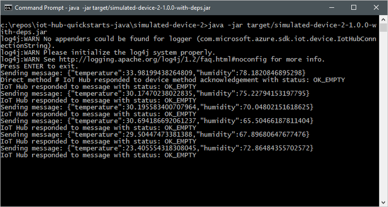
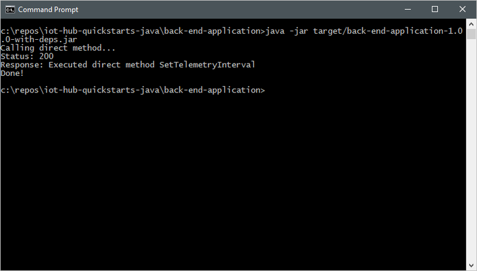
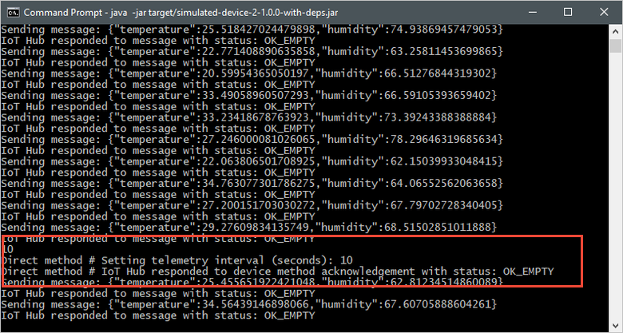

本快速入门使用两个 Java 应用程序：一个是模拟设备应用程序，用于响应从后端应用程序调用的直接方法；另一个是服务应用程序，用于在模拟设备上调用直接方法。

## <a name="prerequisites"></a>先决条件

* 具有活动订阅的 Azure 帐户。 [免费创建一个](https://azure.microsoft.com/free/?ref=microsoft.com&utm_source=microsoft.com&utm_medium=docs&utm_campaign=visualstudio)。

* Java SE 开发工具包 8。 在[针对 Azure 和 Azure Stack 的 Java 长期支持](/java/azure/jdk/)中的“长期支持”下选择“Java 8”。

    可以使用以下命令验证开发计算机上 Java 的当前版本：

    ```cmd/sh
    java -version
    ```

* [Apache Maven 3](https://maven.apache.org/download.cgi)。

    可以使用以下命令验证开发计算机上 Maven 的当前版本：

    ```cmd/sh
    mvn --version
    ```

* [一个示例 Java 项目](https://github.com/Azure-Samples/azure-iot-samples-java/archive/master.zip)。

* 端口 8883 在防火墙中处于打开状态。 本快速入门中的设备示例使用 MQTT 协议，该协议通过端口 8883 进行通信。 在某些公司和教育网络环境中，此端口可能被阻止。 有关解决此问题的更多信息和方法，请参阅[连接到 IoT 中心(MQTT)](../articles/iot-hub/iot-hub-mqtt-support.md#connecting-to-iot-hub)。

[!INCLUDE [azure-cli-prepare-your-environment.md](azure-cli-prepare-your-environment-no-header.md)]

[!INCLUDE [iot-hub-cli-version-info](iot-hub-cli-version-info.md)]

## <a name="create-an-iot-hub"></a>创建 IoT 中心

如果已完成上一[快速入门：将遥测数据从设备发送到 IoT 中心](../articles/iot-develop/quickstart-send-telemetry-iot-hub.md?pivots=programming-language-java)，则可以跳过此步骤。

[!INCLUDE [iot-hub-include-create-hub](iot-hub-include-create-hub.md)]

## <a name="register-a-device"></a>注册设备

如果已完成上一[快速入门：将遥测数据从设备发送到 IoT 中心](../articles/iot-develop/quickstart-send-telemetry-iot-hub.md?pivots=programming-language-java)，则可以跳过此步骤。

必须先将设备注册到 IoT 中心，然后该设备才能进行连接。 在本快速入门中，将使用 Azure Cloud Shell 来注册模拟设备。

1. 在 Azure Cloud Shell 中运行以下命令，以创建设备标识。

   **YourIoTHubName**：将下面的占位符替换为你为 IoT 中心选择的名称。

   **MyJavaDevice**：这是所注册的设备的名称。 建议使用 **MyJavaDevice**，如图所示。 如果为设备选择不同名称，则可能还需要在本文中从头至尾使用该名称，并在运行示例应用程序之前在其中更新设备名称。

    ```azurecli-interactive
    az iot hub device-identity create \
      --hub-name {YourIoTHubName} --device-id MyJavaDevice
    ```

2. 在 Azure Cloud Shell 中运行以下命令，以获取刚注册设备的 _设备连接字符串_：

   **YourIoTHubName**：将下面的占位符替换为你为 IoT 中心选择的名称。

    ```azurecli-interactive
    az iot hub device-identity connection-string show\
      --hub-name {YourIoTHubName} \
      --device-id MyJavaDevice \
      --output table
    ```

    记下如下所示的设备连接字符串：

   `HostName={YourIoTHubName}.azure-devices.net;DeviceId=MyNodeDevice;SharedAccessKey={YourSharedAccessKey}`

    稍后会在快速入门中用到此值。

## <a name="retrieve-the-service-connection-string"></a>检索服务连接字符串

还需一个服务连接字符串，以便后端应用程序能够连接到 IoT 中心并检索消息  。 以下命令检索 IoT 中心的服务连接字符串：

**YourIoTHubName**：将下面的占位符替换为你为 IoT 中心选择的名称。

```azurecli-interactive
az iot hub connection-string show --policy-name service --name {YourIoTHubName} --output table
```

记下如下所示的服务连接字符串：

`HostName={YourIoTHubName}.azure-devices.net;SharedAccessKeyName=service;SharedAccessKey={YourSharedAccessKey}`

稍后会在快速入门中用到此值。 此服务连接字符串与你在上一步中记录的设备连接字符串不同。

## <a name="listen-for-direct-method-calls"></a>侦听直接方法调用

模拟设备应用程序会连接到 IoT 中心上特定于设备的终结点，发送模拟遥测数据，并侦听中心的直接方法调用。 在本快速入门中，中心的直接方法调用告知设备对其发送遥测的间隔进行更改。 执行直接方法后，模拟设备会将确认发送回中心。

1. 在本地终端窗口中，导航到示例 Java 项目的根文件夹。 然后导航到 **iot-hub\Quickstarts\simulated-device-2** 文件夹。

2. 在所选文本编辑器中打开 src/main/java/com/microsoft/docs/iothub/samples/SimulatedDevice.java 文件  。

    将 `connString` 变量的值替换为之前记下的设备连接字符串。 然后将更改保存到 **SimulatedDevice.java**。

3. 在本地终端窗口中，运行以下命令以安装所需的库，并生成模拟设备应用程序：

    ```cmd/sh
    mvn clean package
    ```

4. 在本地终端窗口中，运行以下命令，以便运行模拟设备应用程序：

    ```cmd/sh
    java -jar target/simulated-device-2-1.0.0-with-deps.jar
    ```

    以下屏幕截图显示了模拟设备应用程序将遥测数据发送到 IoT 中心后的输出：

    

## <a name="call-the-direct-method"></a>调用直接方法

后端应用程序会连接到 IoT 中心上的服务端终结点。 应用程序通过 IoT 中心对设备进行直接方法调用，并侦听确认。 IoT 中心后端应用程序通常在云中运行。

1. 在另一个本地终端窗口中，导航到示例 Java 项目的根文件夹。 然后导航到 iot-hub\Quickstarts\back-end-application 文件夹  。

2. 在所选文本编辑器中打开 src/main/java/com/microsoft/docs/iothub/samples/BackEndApplication.java 文件  。

    将 `iotHubConnectionString` 变量的值替换为以前记下的服务连接字符串。 然后将更改保存到 **BackEndApplication.java**。

3. 在本地终端窗口中运行以下命令，以安装所需的库并生成后端应用程序：

    ```cmd/sh
    mvn clean package
    ```

4. 在本地终端窗口中，运行以下命令，以便运行终端应用程序：

    ```cmd/sh
    java -jar target/back-end-application-1.0.0-with-deps.jar
    ```

    以下屏幕截图显示了应用程序对设备进行直接方法调用并接收确认后的输出：

    

    运行后端应用程序后，在运行模拟设备的控制台窗口中会出现一条消息，且其发送消息的速率也会发生变化：

    
