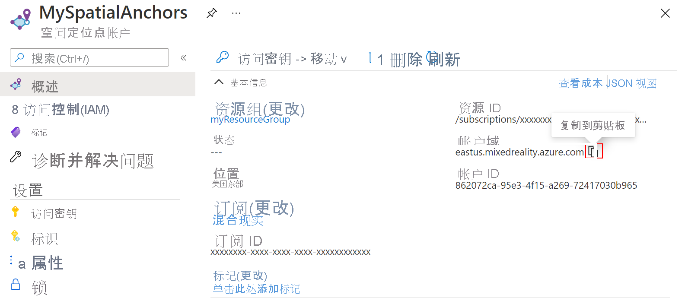

## <a name="create-a-spatial-anchors-resource"></a>创建空间定位点资源

### <a name="portal"></a>[门户](#tab/azure-portal)

转到 <a href="https://portal.azure.com" target="_blank">Azure 门户</a>。

在左窗格中，选择“创建资源”。

使用搜索框以搜索“空间定位点”。


选择“空间定位点”，然后选择“创建” 。

在“空间定位点帐户”窗格中，执行以下操作：

* 使用常规字母数字字符输入唯一的资源名称。  
* 选择想要将资源附加到的订阅。  
* 选择“新建”可创建资源组。 将其命名为 myResourceGroup，然后选择“确定” 。  

  [!INCLUDE [resource group intro text](resource-group.md)]
  
* 选择可在其中放置资源的位置（区域）。  
* 选择“新建”开始创建资源。


创建资源后，Azure 门户显示部署已完成。 
   


选择“转到资源”。  你现在可以查看资源属性。 
   
将资源的“帐户 ID”值复制到文本编辑器中，供稍后使用。


另外，将资源的“帐户域”值复制到文本编辑器中，供稍后使用。



在“设置”下，选择“密钥” 。 将“帐户密钥”的“主密钥”值复制到文本编辑器中，供稍后使用 。


### <a name="azure-cli"></a>[Azure CLI](#tab/azure-cli)

首先为 Azure CLI 准备环境：

[!INCLUDE [azure-cli-prepare-your-environment-no-header.md](azure-cli-prepare-your-environment-no-header.md)]

1. 登录后，请使用 [az account set](/cli/azure/account#az_account_set) 命令来选择要在其中设置空间定位点帐户的订阅：

   ```azurecli
   az account set --subscription 00000000-0000-0000-0000-000000000000
   ```

1. 运行 [az group create](/cli/azure/group#az_group_create) 命令创建资源组或使用现有资源组：

   ```azurecli
   az group create --name myResourceGroup --location eastus2
   ```

   [!INCLUDE [resource group intro text](resource-group.md)]

   可使用 [az spatial-anchors-account list](/cli/azure/ext/mixed-reality/spatial-anchors-account#ext_mixed_reality_az_spatial_anchors_account_list) 命令查看资源组的当前空间定位点帐户：

   ```azurecli
   az spatial-anchors-account list --resource-group myResourceGroup
   ```

   还可查看订阅的空间定位点帐户：

   ```azurecli
   az spatial-anchors-account list
   ```

1. 运行 [az spatial-anchors-account create](/cli/azure/ext/mixed-reality/spatial-anchors-account#ext_mixed_reality_az_spatial_anchors_account_create) 命令来创建空间定位点帐户：

   ```azurecli
   az spatial-anchors-account create --resource-group myResourceGroup --name MySpatialAnchorsQuickStart --location eastus2
   ```

1. 使用 [az spatial-anchors-account show](/cli/azure/ext/mixed-reality/spatial-anchors-account#ext_mixed_reality_az_spatial_anchors_account_show) 命令查看资源属性：

   ```azurecli
   az spatial-anchors-account show --resource-group myResourceGroup --name MySpatialAnchorsQuickStart
   ```

   将资源的“帐户 ID”值和资源的“帐户域”值复制到文本编辑器中，供稍后使用 。

1. 运行 [az spatial-anchors-account key show](/cli/azure/ext/mixed-reality/spatial-anchors-account/key#ext_mixed_reality_az_spatial_anchors_account_key_show) 命令来获取主密钥和辅助密钥：

   ```azurecli
   az spatial-anchors-account key show --resource-group myResourceGroup --name MySpatialAnchorsQuickStart
   ```

   将密钥值复制到文本编辑器供稍后使用。

   如需重新生成密钥，请使用 [az spatial-anchors-account key renew](/cli/azure/ext/mixed-reality/spatial-anchors-account/key#ext_mixed_reality_az_spatial_anchors_account_key_renew) 命令：

   ```azurecli
   az spatial-anchors-account key renew --resource-group myResourceGroup --name example --key primary
   az spatial-anchors-account key renew --resource-group myResourceGroup --name example --key secondary
   ```

可使用 [az spatial-anchors-account delete](/cli/azure/ext/mixed-reality/spatial-anchors-account#ext_mixed_reality_az_spatial_anchors_account_delete) 命令来删除帐户：

```azurecli
az spatial-anchors-account delete --resource-group myResourceGroup --name MySpatialAnchorsQuickStart
```

---
