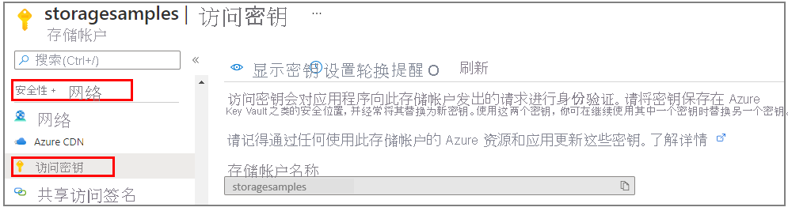

### <a name="copy-your-credentials-from-the-azure-portal"></a>从 Azure 门户复制凭据

当示例应用程序向 Azure 存储发出请求时，必须对其进行授权。 若要对请求进行授权，请将存储帐户凭据以连接字符串形式添加到应用程序中。 若要查看存储帐户凭据，请按以下步骤操作：

1. 登录 [Azure 门户](https://portal.azure.com)。
2. 找到自己的存储帐户。
3. 在存储帐户菜单窗格中的“安全性 + 网络”下，选择“访问密钥” 。 在这里，可以查看帐户访问密钥以及每个密钥的完整连接字符串。

    
 
1. 在“访问密钥”窗格中，选择“显示密钥” 。
1. 在“key1”部分，找到“连接字符串”值 。 选择“复制到剪贴板”图标来复制该连接字符串。 在下一部分，需将此连接字符串值添加到某个环境变量。

    

### <a name="configure-your-storage-connection-string"></a>配置存储连接字符串

在复制连接字符串后，请将其写入到运行该应用程序的本地计算机上的新环境变量。 若要设置环境变量，请打开控制台窗口，并遵照适用于操作系统的说明。 将 `<yourconnectionstring>` 替换为实际的连接字符串。

#### <a name="windows"></a>Windows

```cmd
setx AZURE_STORAGE_CONNECTION_STRING "<yourconnectionstring>"
```

在 Windows 中添加环境变量后，必须启动命令窗口的新实例。

#### <a name="linux"></a>Linux

```bash
export AZURE_STORAGE_CONNECTION_STRING="<yourconnectionstring>"
```

#### <a name="macos"></a>macOS

```bash
export AZURE_STORAGE_CONNECTION_STRING="<yourconnectionstring>"
```

#### <a name="restart-programs"></a>重新启动程序

添加环境变量后，重启需要读取环境变量的任何正在运行的程序。 例如，先重启开发环境或编辑器，然后再继续操作。
