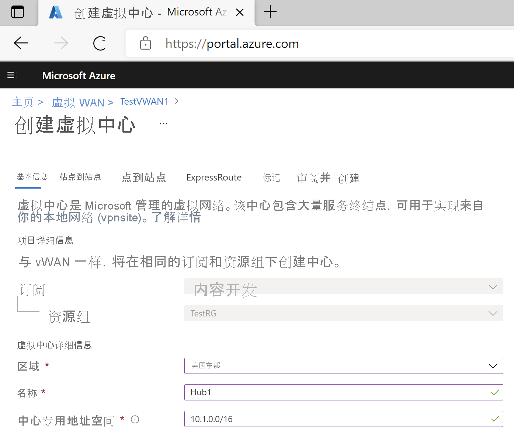
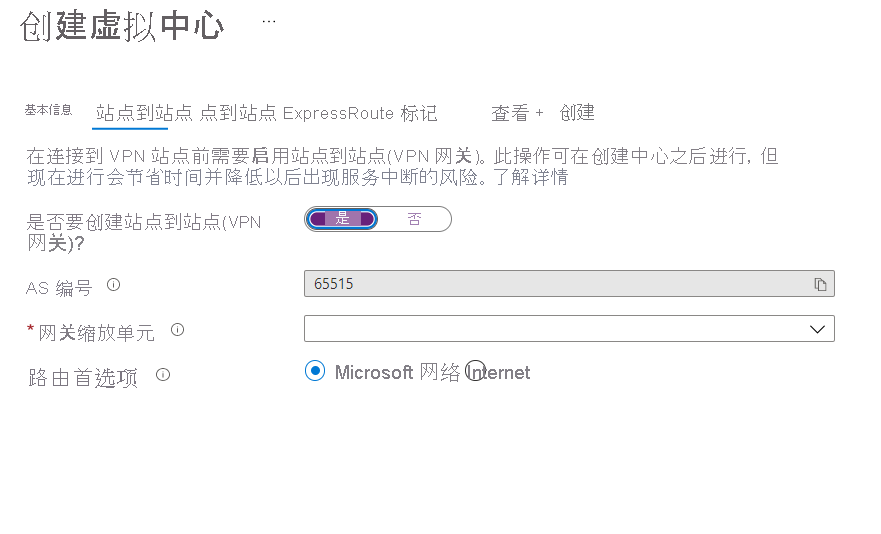

1. 找到你已创建的虚拟 WAN。 在虚拟 WAN 页上的“连接性”部分下，选择“中心” 。
2. 在“中心”页上，选择“+ 新建中心”以打开“创建虚拟中心”页  。

    
3. 在“创建虚拟中心”页上的“基本”选项卡上，请填写以下字段 ：

   * 区域（以前称为“位置”）
   * 名称
   * 中心专用地址空间 - 用于创建中心的最小地址空间为 /24。 如果使用从 /25 到 /32 的范围中的任何空间，则该空间会在创建过程中产生错误。 无需为虚拟中心内的服务显式计划子网地址空间。 由于 Azure 虚拟 WAN 是一项托管服务，因此它在虚拟中心为不同的网关/服务（例如，VPN 网关、ExpressRoute 网关、用户 VPN 点到站点网关、防火墙、路由，等等）创建相应的子网。
4. 在完成时选择“下一步:站点到站点”。

    

5. 在“站点到站点”选项卡上填写以下字段：

   * 选择“是”以创建站点到站点 VPN。
   * “AS 编号”字段是无法编辑的。
   * 从下拉列表中选择“网关缩放单元”。 缩放单元允许选择在虚拟中心内创建的、要将站点连接到的 VPN 网关的聚合吞吐量。 如果选择 1 个 500 Mbps 的缩放单元，则表示会创建两个实例以实现冗余，每个实例的最大吞吐量为 500 Mbps。 例如，如果你有 5 个分支，每个分支执行 10 Mbps 的 IO，则前端的聚合吞吐量需要达到 50 Mbps。 应在评估支持中心的分支数量所需的容量后，再规划 Azure VPN 网关的聚合容量。
6. 选择“查看 + 创建”以进行验证。
7. 选择“创建”以创建中心。 30 分钟后，“刷新”以在“中心”页上查看该中心 。 选择“转到资源”导航到资源。
